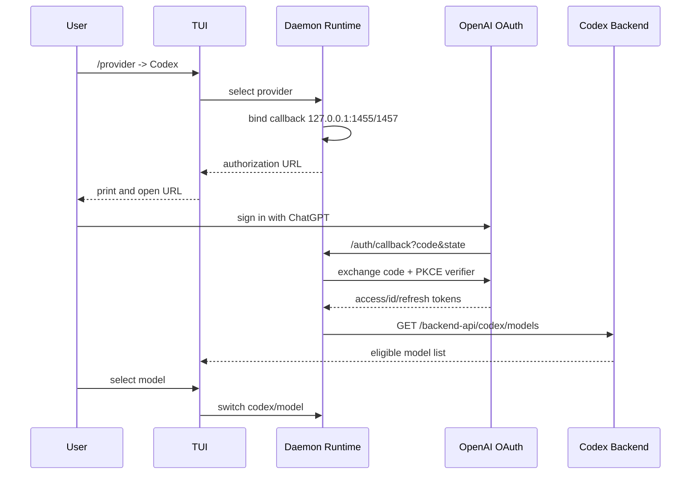

# Codex OAuth Provider 设计

> 由 GPT-5.6 于 2026-08-04 阅读 `internal/llm`、`internal/runtime`、`internal/systemd`、`internal/tui` 及 OpenAI Codex 官方认证源码后生成。
> 范围：TUI provider/model 选择、ChatGPT OAuth、Codex Responses 调用和用户级持久化。

## 目标

用户不需要顶层 `codex` 子命令或外部 proxy。在 TUI 输入 `/provider`，选择 `openai`，并使用 ChatGPT OAuth 认证方式；随后 `/model` 只展示该 ChatGPT 账号可用的模型。这里 Codex 是套餐/后端能力名，不是本机 `codex` 程序依赖。



拓扑事实源见 [`codex-oauth-provider.json`](codex-oauth-provider.json)。

## 用户交互

```text
/provider
  Codex   ChatGPT account   Not signed in
  Ollama  Local             Ready
```

选择 Codex 后，TUI 输出可复制的登录链接并尝试打开浏览器。登录完成后自动切换 provider，并打开模型选择器：

```text
/model
  gpt-5.4
  gpt-5.3-codex
  ...当前账号目录返回的其他模型
```

仍保留直接输入：`/provider codex`、`/model gpt-5.4`。状态行显示完整引用 `codex/<model>`。

## OAuth

- Authorization endpoint：`https://auth.openai.com/oauth/authorize`
- Token endpoint：`https://auth.openai.com/oauth/token`
- Client ID：沿用官方 Codex CLI 公共客户端 ID。
- Scope：`openid profile email offline_access api.connectors.read api.connectors.invoke`
- 回调端口优先 `1455`，占用时使用官方允许的 `1457`。
- 使用 PKCE S256 和随机 `state`；回调必须校验 state。
- 浏览器打不开不影响流程，TUI 始终保留可复制 URL。

凭据原子写入 `~/.5hAgent/auth/codex.json`，权限 `0600`。token 不进入项目 `.5hagent/`、session、report 或 debug log。access token 即将过期时使用 refresh token 刷新；401 最多刷新并重试一次。

## 模型与请求

模型目录来自 `GET https://chatgpt.com/backend-api/codex/models?client_version=<version>`。对话调用 `POST https://chatgpt.com/backend-api/codex/responses`，携带 bearer token 和 `ChatGPT-Account-ID`。

Codex model 直接实现 Eino `ToolCallingChatModel`：

- `Generate` 聚合 `Stream`。
- `Stream` 解析 Responses SSE。
- system messages 合并为 instructions。
- function call 使用 Responses `call_id` 映射 Eino `ToolCall.ID`。
- tool result 转 `function_call_output`。
- 工具名中的 `.` 使用可逆别名发送给上游。
- reasoning encrypted item 保存在 message extra，下一轮原样回放。

## 持久化

provider/model 非敏感选择写入 `~/.5hAgent/state.json`。启动优先级：

```text
--model > saved provider/model > LLM_MODEL
```

## 最小范围

第一版包括浏览器 OAuth、刷新、模型目录、文本/推理流、工具调用和 TUI picker。不实现 logout、多账号轮换、额度仪表盘或外部 proxy。

现有错误方向 `5hagent codex` 诊断子命令和 proxy 主方案在实现时移除。
