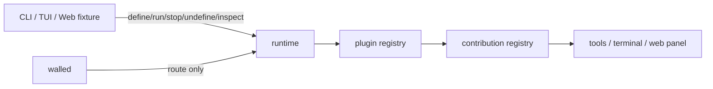

# Cordis-like 插件系统设计

一句话：复刻插件系统机制；示例插件只作为验收 fixture，不进入 core。

## 目标

- runtime 持有自己的插件注册表。
- 插件生命周期固定为 `define -> run -> stop -> undefine`。
- 插件贡献通过统一 registry 挂载和撤回。
- `inspect` 能看到定义、运行态、贡献和错误。
- daemon 只路由到 runtime，不持有插件业务状态。

## 拓扑事实源

```json
{
  "name": "cordis-like-plugin-system",
  "principle": "简单就是美",
  "scope": "plugin system mechanism",
  "nodes": [
    {"id": "runtime", "path": "internal/runtime", "role": "独立工作实例；持有插件注册表"},
    {"id": "plugin_registry", "path": "internal/plugin", "role": "定义、运行态、贡献索引"},
    {"id": "contribution_registry", "path": "internal/tools 或后续轻量 adapter", "role": "把贡献挂到 runtime 可见能力"},
    {"id": "client_surface", "path": "TUI/CLI/Web fixture", "role": "输入、展示、验收；不保存插件状态"},
    {"id": "daemon", "path": "cmd/walle daemon", "role": "可选 supervisor；只做路由和生命周期"}
  ],
  "edges": [
    ["client_surface", "runtime", "define/run/stop/undefine/inspect"],
    ["runtime", "plugin_registry", "own"],
    ["plugin_registry", "contribution_registry", "mount/unmount"],
    ["daemon", "runtime", "route"]
  ],
  "defer": [
    "复制 DeepSeek Harness 插件源码",
    "内置 web-cordis 示例插件",
    "TS/JS 任意代码执行",
    "node:vm 沙箱",
    "插件市场",
    "跨 runtime 自动同步",
    "完整权限框架"
  ]
}
```

## 一图流



## 核心模型

| 对象 | 含义 |
| --- | --- |
| `PluginDef` | 插件定义；只登记元数据和贡献声明。 |
| `PluginRun` | 一次运行实例；记录 run id、状态、挂载结果。 |
| `Contribution` | 插件贡献；第一阶段只做少数明确类型。 |
| `Inspect` | 当前 runtime 的插件视图和错误视图。 |

第一阶段贡献类型：

| 类型 | 用途 | 说明 |
| --- | --- | --- |
| `tool` | 给 Agent 增加可调用能力 | 需要安全重绑定 LLM tool schema。 |
| `terminal` | 注册 `terminal.xxx` 命令 | 复用动态终端工具设计。 |
| `web_panel` | 给 Web fixture 展示面板 | 只做验收入口，不进默认启动链路。 |

## 生命周期

| 操作 | 行为 |
| --- | --- |
| `define` | 只保存 `PluginDef`，不挂载贡献。 |
| `run` | 校验贡献，生成 `PluginRun`，挂载贡献。 |
| `stop` | 按 `PluginRun` 撤回本次挂载的贡献。 |
| `undefine` | 删除定义；如果正在运行，先执行 `stop`。 |
| `inspect` | 返回定义、运行态、贡献、最近错误。 |

## 接口形态

LLM 可见工具保持拆分，减少误填：

```text
plugin.inspect
plugin.define
plugin.run
plugin.stop
plugin.undefine
```

`plugin.define` 输入第一版使用声明式 JSON：

```json
{
  "name": "example.toolpack",
  "description": "示例插件包",
  "contributions": [
    {"type": "terminal", "name": "repo_diff_check", "command": "git diff --check -- {{paths}}"}
  ]
}
```

## Runtime 边界

- 插件注册表归 runtime 实例所有。
- headless 任务中的插件随本次 runtime 结束消失。
- TUI/daemon interactive 插件随对应 runtime 生命周期存在。
- daemon process table 不保存插件定义。
- Web 示例只连接某个 runtime 做验收。

## 最小实现顺序

1. 只实现内存态 `PluginDef / PluginRun / Inspect`。
2. 实现 `define/run/stop/undefine/inspect` 的 Go API。
3. 先接一个贡献类型：`terminal` 或 `tool`，二选一。
4. 贡献挂载和撤回必须成对记录。
5. Web fixture 只用于验收：能加载一个外部示例插件并观察贡献。

## 验收标准

- `define` 后 `inspect` 能看到定义，runtime 工具集合不变。
- `run` 后贡献可用，`inspect` 能看到 run id 和贡献。
- `stop` 后贡献不可用，定义仍存在。
- `undefine` 后定义消失。
- 同名贡献冲突时拒绝，并返回可修正错误。
- Web fixture 能证明插件系统可承载浏览器示例；示例代码不进入 core。
