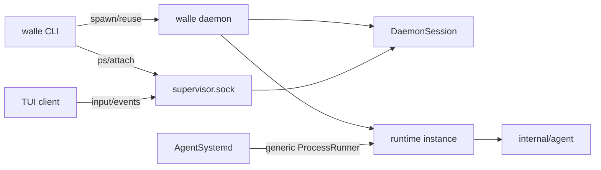

# Runtime 与 daemon 边界

一句话：`runtime` 是 Agent 工作实例；`walle daemon` 固定托管一个可 attach 的交互实例，`internal/systemd` 保留通用 process 能力。

## 一图流

## 边界

| 对象 | 只负责 |
| --- | --- |
| `runtime` | 装配 Agent/Context/LLM/Tools，执行交互或通用 AgentProcess |
| `walle daemon` | 创建 Runtime、DaemonSession 和 control server |
| `internal/systemd` | 通用 process.start 调度、进程表和 socket 控制 |
| `CLI/TUI` | 启动或选择目标、输入、展示事件 |

当前控制协议是 `list / attach / input / stop`，另有客户端断开的内部 `detach`。

## 当前事实

- 默认 `walle` 先 attach `interactive`，缺失时启动 `walle daemon`。
- daemon 没有 `--poll` 或 `--interactive` 模式。
- `ProcessStartPayload` 只包含 `ProcessSpec`；进程展示使用 `ProcessSnapshot.Name`。
- Runtime 不内置 TaskList、任务 watcher、任务状态或 task report。
- 任务管理可由 Skill、MCP 或外置动态工具提供。
