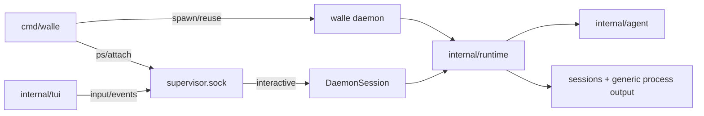

# Runtime 接入

一句话：`internal/runtime` 装配和运行交互 Agent，也实现通用 `ProcessRunner`；CLI/TUI 默认经 daemon 控制面接入。

## 一图流

## 接口表

| 接口 | 用途 |
| --- | --- |
| `runtime.New(ctx, Options)` | 创建可工作的 Runtime |
| `Runtime.SwitchModel(ctx, modelRef)` | 切 provider/model，不改默认配置 |
| `Runtime.RunProcess(ctx, *systemd.AgentProcess)` | 执行通用 AgentProcess |
| `runtime.NewDaemonSession(ctx, rt)` | 包装 attachable interactive Agent |
| `Runtime.RecordToolEvent(event)` | 记录交互工具事件 |

Runtime 对外接口不包含固定任务管理协议。

## 边界

- Runtime 不写 TUI 渲染。
- Runtime 不实现具体工具逻辑。
- Runtime 不维护 daemon process table。
- Daemon control 暴露 `list / attach / input / stop`，客户端断开另有内部 `detach`。
- 任务管理由 Skill、MCP 或外置动态工具提供。
