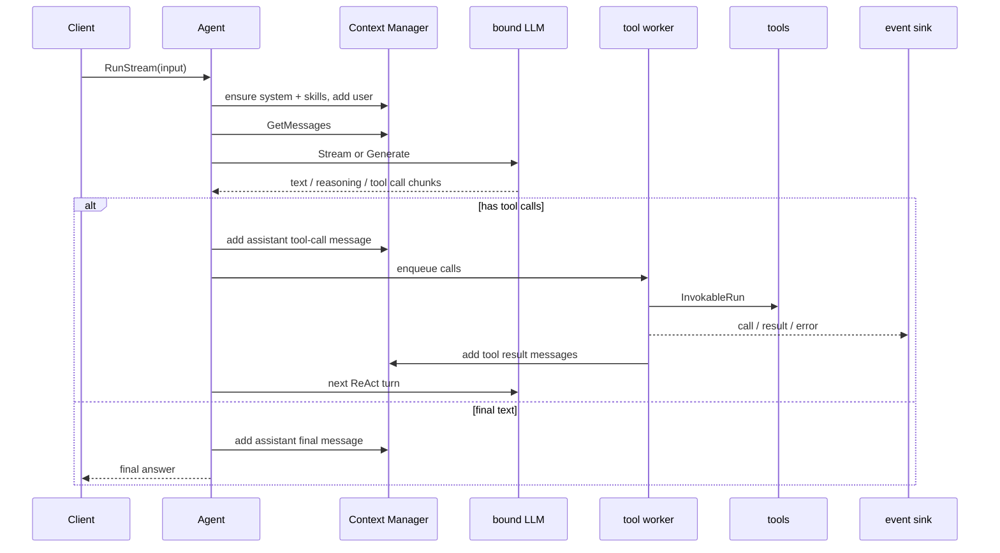

# Agent Spec

> 由 Claude Fable 5 于 2026-08-24 阅读 `internal/agent/*.go`、`internal/context/*.go`、`internal/tools/*.go` 后重构。
> 覆盖范围：ReAct 主循环、流式/非流式模型调用、ToolCall 收集执行、消息写回和 token 统计。

## 职责边界

`internal/agent` 只管一轮 Agent 执行：读写 Context、调用已绑定 LLM、执行已注册工具、把 assistant/tool result 写回。它不管 daemon、TUI、provider 配置、process report 或任务系统。

源文件图：[`diagrams/walle-agent-turn.mmd`](diagrams/walle-agent-turn.mmd)。

## 关键文件

| 文件 | 责任 |
| --- | --- |
| `agent.go` | `Agent` 状态、`RunStreamWithOptions`、skill 注入、token budget、模型/工具替换。 |
| `tool_use.go` | ToolCall chunk 合并、重复调用保护、工具执行和 tool result 写回。 |
| `callbacks.go` | LLM/tool debug callback、usage 统计。 |
| `debug_request.go` | `--debug` 下记录发给 LLM 的请求并掩码 secret。 |

## 运行规则

- 空 context 时才注入 system prompt 和 skill snapshot。
- 每轮先写 user message，再按 `ContextAutoCompress` 判断是否压缩。
> TODO: 这块是啥情况，这个AutoCompress做了啥？我不记得了
- 流式路径走 `model.Stream`；`DisableStream=true` 走 `model.Generate`，两条路径语义必须一致。
- 有 ToolCall 时先写 assistant tool-call message，再写每个 tool result message，然后进入下一 turn。
- **ReAct终止条件：**没有 ToolCall 且有正文时写 assistant final message 并返回。
- 空响应最多追加两次 user reminder，第三次返回错误。

## ToolCall 边界

- `toolCollector` 按 ToolCall `Index` 合并分片；缺 index 归到 0。
- 空 ID 且工具名存在时生成 `call_local_<index>`。
- 只有工具名非空、参数为合法 JSON 的调用会执行；EOF 后空参数归一化为 `{}`。
- 当前只有一个工具 worker；多个工具调用按队列顺序执行。
- `exeToolCall` 的 `concurrent` 参数目前只影响事件展示，主路径传 `false`。

## 不要做

- 不在 Agent 里读写 session 文件，必须走 Context Manager。
- 不在 Agent 里实现 daemon、TUI、provider 登录或任务管理。
- 不丢弃工具名、原始参数或错误信息。
- 不把工具 worker 扩成无界 goroutine；并发工具调用需要先定义顺序、取消和副作用边界。

## 验收

- 改主循环：同时检查流式和非流式路径。
- 改工具写回：检查 `tool_call_id`、消息顺序、重复调用保护和取消传播。
- 改 debug：确认 API key、token、account id 不进日志。
- 最低验证：`go vet ./...`；行为改动加 `go build -o walle ./cmd/walle`。
