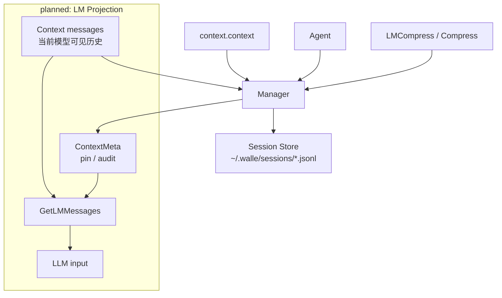

# Context Spec

> 由 Claude Fable 5 于 2026-08-24 阅读 `internal/context/*.go`、`internal/tools/context_tool.go`、`internal/commands/compress.go` 后重构。
> 覆盖范围：消息上下文、session JSONL、压缩、pin/edit/audit 元数据，以及 planned LM Projection。

## 职责边界

`internal/context` 是模型可见消息的唯一读写入口。Agent、commands 和 context tool 都必须通过 `Manager` 操作消息；不要直接改 `Context.messages`。

Projection 草图见：[`diagrams/walle-context-projection.mmd`](diagrams/walle-context-projection.mmd)。

## 关键文件

| 文件 | 责任 |
| --- | --- |
| `ctx.go` | `Context`、`Manager`、inspect/pin/edit/audit/compress、tool runtime 注入。 |
| `session.go` | session JSONL 创建、读取、追加、整体替换和列表。 |
| `internal/tools/context_tool.go` | 把 context 操作暴露为 `context.context` 工具。 |
| `internal/commands/compress.go` | 手动 `/compress` 命令。 |

## 稳定接口

| 接口 | 要点 |
| --- | --- |
| `NewManager(sessionDir...)` | 有目录时启用 session 自动绑定。 |
| `NewMemoryManagerWithStore(sessionDir)` | 默认内存 context，保留显式 session 操作。 |
| `CreateContext(sessionID)` / `SwitchSession` | 创建、恢复或切换 message context。 |
| `GetMessages` | 返回消息副本，调用方不能改内部切片。 |
| `AddMessage` / `ReplaceMessages` | 先改内存，再同步 Store；错误要返回给调用方。 |
| `Inspect` / `PinRange` / `EditMessage` / `Audit` | 当前 metadata 只在内存。 |
| `Compress` / `LMCompress` / `ManualCompress` | fallback 保留 system 和最近历史；手动压缩先归档再替换。 |

## Session JSONL

- 路径：`~/.walle/sessions/<id>.jsonl`。
- 第一行是 session header，后续每行一条 message。
- message 保存 role、content、reasoning、tool calls、tool result 关联和 `extra`。
- `saveToFile` 写临时文件后 `os.Rename`，避免半写入。
- 解析旧文件时忽略未知字段，跳过缺 role 的行。

## `context.context` actions

| action | 行为 |
| --- | --- |
| `inspect` | 返回索引、role、字符数、预览、flags。 |
| `pin` | 标记闭区间，写 audit；当前只在内存。 |
| `edit` | 替换普通 user/assistant 消息并重写 Store。 |
| `audit` | 返回最近审计事件。 |
| `compress` | `mode=lm` 走 LLM 摘要，`mode=truncate` 走 fallback。 |

Planned：`mask`、`unmask`、`unpin`，第一版只做整条 message 的 projection metadata。

## 不要做

- 不在 Context 层解析 slash command、daemon、task 或工具业务。
- 不在压缩时丢 system prompt。
- 不把 planned mask/projection 写进用户文档，直到实现。
- 不引入 paragraph/range sidecar 等复杂可见性策略。

## 验收

- 改消息写入：检查内存、Store cache、JSONL 文件三者一致。
- 改压缩：检查 system、最近消息、摘要 message、归档文件。
- 改 pin/edit：检查 protected/pinned 保护和非法 index 错误。
- 改 projection：检查 `GetLMMessages`、session `Extra` 和压缩输入。
