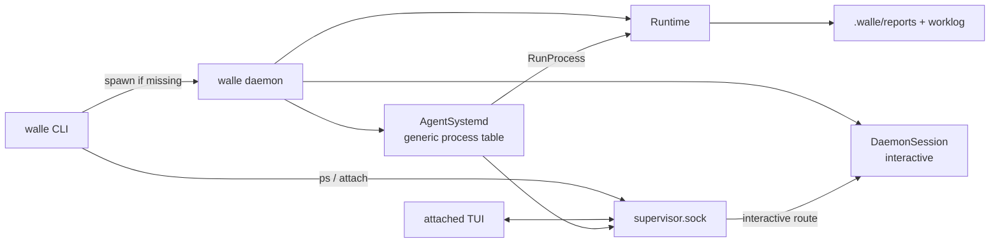

# Daemon / Systemd Spec

> 由 Claude Fable 5 于 2026-08-24 阅读 `internal/systemd/*.go`、`internal/runtime/daemon_session.go`、`cmd/walle/*.go` 后重构。
> 覆盖范围：process 调度核心、supervisor socket、`DaemonSession` interactive adapter。

## 职责边界

`internal/systemd` 是纯标准库的本机调度和 IPC 核心；`walle daemon` 在它旁边托管一个固定 `interactive` Runtime。systemd 不导入 Runtime，不理解 task。



控制面图见：[`diagrams/walle-daemon-control.mmd`](diagrams/walle-daemon-control.mmd)。

## 关键文件

| 文件 | 责任 |
| --- | --- |
| `internal/systemd/systemd.go` | `AgentProcess`、`ProcessSpec`、事件队列、去重、调度循环。 |
| `internal/systemd/control.go` | `supervisor.sock`、NDJSON 协议、`ProcessClient`。 |
| `internal/runtime/daemon_session.go` | interactive process adapter、事件历史、订阅者、slash command。 |
| `cmd/walle/main.go` | `daemon` 子命令创建 Runtime、DaemonSession 和 control server。 |

## 数据和协议

- Socket：`~/.walle/run/supervisor.sock`。
- 短连接：`list`。
- 长连接：`attach`，之后可发送 `input`、`stop`、`detach`。
- Attach 握手固定：`attached` -> history `event` -> `ready` -> live `event`。
- `ProcessSpec` 只有 `SystemPrompt`、`ExitCondition`。
- `ProcessSnapshot` 用 `Name` 展示；不定义 `SourceTask`、`TaskID`、`TaskTitle`。

## 调度流程

```text
EventSource.Next
  -> AgentSystemd.Emit
  -> Run.nextEvent
  -> dispatch(process.start)
  -> goroutine ProcessRunner.RunProcess
  -> Emit(process.exited/process.failed)
  -> applyEvent 更新状态
```

`process.start` payload 使用 `ProcessStartPayload` 严格解析；非空事件 ID 会进入 seen 表去重。

## Interactive session

- `Snapshot` 返回固定 ID/Name `interactive`，并带上 workspace、model、session、turn、busy。
- `Attach` 在锁内复制历史并注册订阅者，避免 replay/live event 缺口。
- 普通输入要求 idle；run 期间临时接管 Agent tool event sink。
- `/model`、`/provider`、`/skill`、`/mcp`、`/compress`、`/session` 在 daemon session 内分派。
- provider/model picker、OAuth 登录、模型列表查询和 `Runtime.SwitchModel` 都由 daemon session 触发；TUI 只收发控制帧和事件。
- socket 断开只是解除订阅；只有 `stop` 取消当前 run。

## 不要做

- 不在 `internal/systemd` 引入 Runtime、agentctx、skill、task 等业务包。
- 不恢复 `.walle/task.md` watcher、`task.created` 或源任务状态回写。
- 不恢复多个 `daemon-*.sock` 的发现式扫描。
- 不把 `detach` 当成 `stop`。

## 验收

- 改 control 协议：检查 list、attach、input、stop、detach。
- 改 daemon session：检查 replay 顺序、并发订阅、busy 和 cancel。
- 改通用 process：检查 `process.exited/process.failed` 和 report/worklog 路径。
