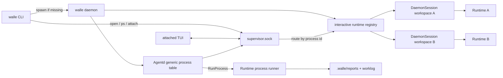

# Daemon / Agentd Spec

> 由 Claude Fable 5 于 2026-08-26 阅读 `internal/agentd/*.go`、`internal/runtime/daemon_session.go`、`cmd/walle/*.go` 后更新。
> 覆盖范围：process 调度核心、supervisor socket、workspace interactive Runtime 托管、`DaemonSession` interactive adapter。

## 职责边界

`walle daemon` 是用户级 supervisor：负责监听 `~/.walle/run/supervisor.sock`、托管多个 interactive Runtime、列出 process、处理 attach/input/stop/detach。daemon 不是某一个固定 Runtime。

`internal/agentd` 是纯标准库的本机调度和 IPC 核心；它不导入 Runtime，不理解 task，不读取模型配置。Runtime 创建由 daemon 层完成，并以 `InteractiveProcess` 接口暴露给 control server。



控制面图见：[`diagrams/walle-daemon-control.mmd`](diagrams/walle-daemon-control.mmd)。

## 关键文件

| 文件 | 责任 |
| --- | --- |
| `internal/agentd/agentd.go` | `AgentProcess`、`ProcessSpec`、事件队列、去重、通用 process 调度循环。 |
| `internal/agentd/control.go` | `supervisor.sock`、NDJSON 协议、`ProcessClient`。 |
| `internal/runtime/daemon_session.go` | 单个 interactive Runtime 的 adapter、事件历史、订阅者、slash command。 |
| `cmd/walle/main.go` | Cobra root、`daemon` 子命令、进程级参数。 |
| `cmd/walle/interactive_command.go` | CLI open/attach 意图，启动 daemon 并等待 control server。 |

## 控制协议

Socket：`~/.walle/run/supervisor.sock`。

短连接：

- `list`：列出所有 process snapshot，包括多个 interactive Runtime 和通用 process。
- `open`：为当前 workspace 创建或打开 interactive Runtime，并返回可 attach 的 process id。

长连接：

- `attach`：连接指定 process，之后可发送 `input`、`stop`、`detach`。

Attach 握手固定：`attached` -> history `event` -> `ready` -> live `event`。

## 无头客户端

TUI 不是唯一客户端。任何本地脚本都可以通过 `supervisor.sock` 的 NDJSON 协议无头操纵 Runtime；例如 bash 里用 `nc -U`、Python 里用 Unix socket。

无头客户端必须遵守同一套协议边界：

- `list` 是只读查询，不创建 Runtime。
- `open` 表达“打开 workspace Runtime”的用户意图；默认 `continue=false` 时创建新 Runtime。
- `attach` 只连接已有 process，不创建 Runtime。
- `input` 只能在 `attached` + `ready` 之后发送。
- `stop` 只取消目标 Runtime 当前 run。
- `detach` 只断开当前 socket 订阅，不停止 Runtime。

最小 NDJSON 形态：

```jsonl
{"type":"list"}
{"type":"open","workspace":"/path/to/project","continue":false,"prompt_base":"tui"}
{"type":"input","id":1,"text":"说明当前项目"}
{"type":"detach"}
```

长期用户接口可以再包一层 `walle send` / `walle exec`，但底层能力仍应落在 control 协议上；不要让脚本客户端绕过 daemon 直接持有 Runtime。

## `open` 请求语义

`open` 是默认 `walle` 的入口协议，不是 `attach` 的别名。

请求字段必须表达用户意图：

| 字段 | 含义 |
| --- | --- |
| `workspace` | CLI 当前工作目录，用于 Runtime.ProjectDir 和 workspace 归属。 |
| `continue` | 是否续接当前 workspace 最近 Runtime / 最近 session；只有 `-c/--continue` 为 true。 |
| `session_id` | 显式 session；有值时使用该 session。 |
| `model_ref` | 本次打开的 provider/model 覆盖。 |
| `llm_format` / `llm_model` | 临时覆盖当前 provider 的协议或模型名。 |
| `debug` | 本次 Runtime debug 开关。 |

行为规则：

- 默认 `walle` 发送 `continue=false`，daemon 必须创建新的 interactive Runtime；即使已有 idle Runtime 也不能自动 attach。
- `walle -c` 发送 `continue=true`，daemon 才能复用当前 workspace 最近的 idle interactive Runtime；没有可复用 Runtime 时创建新 Runtime，并让 Runtime 用最近 session。
- `--session <id>` 是显式选择；daemon 创建或打开该 session 对应 Runtime，不等同于默认续接。
- `attach <id>` 不走 `open`，只 attach 已存在 process。

## Interactive process 标识

固定 ID `interactive` 只能作为兼容 alias 或单进程过渡实现，不得作为长期唯一真源。

多 Runtime 实现必须满足：

- 每个 interactive Runtime 有稳定唯一 process id，例如 `interactive-1` 或基于 workspace/session 的安全 id。
- `ProcessSnapshot.Name` 可展示 workspace basename 或用户可读名称。
- `ProcessSnapshot.Workspace` 必须是该 Runtime 的 `ProjectDir`。
- `ProcessSnapshot.SessionID` 必须是该 Runtime 当前 session。
- `ProcessSnapshot.Interactive=true` 用于 TUI attach 路由。

## 通用 Process 调度流程

```text
Agentd.Emit(process.start)
  -> Run.nextEvent
  -> dispatch(process.start)
  -> goroutine ProcessRunner.RunProcess
  -> Emit(process.exited/process.failed)
  -> applyEvent 更新状态
```

`process.start` payload 使用 `ProcessStartPayload` 严格解析；非空事件 ID 会进入 seen 表去重。

## Interactive session

- `DaemonSession` 只代表一个 Runtime，不代表整个 daemon。
- `Snapshot` 返回该 Runtime 的 id/name/workspace/model/session/turn/busy。
- `Attach` 在锁内复制历史并注册订阅者，避免 replay/live event 缺口。
- 普通输入要求 idle；run 期间临时接管 Agent tool event sink。
- `/model`、`/provider`、`/skill`、`/mcp`、`/compress`、`/session` 在 daemon session 内分派。
- provider/model picker、OAuth 登录、模型列表查询和 `Runtime.SwitchModel` 都由 daemon session 触发；TUI 只收发控制帧和事件。
- socket 断开只是解除订阅；只有 `stop` 取消当前 run。

## 不要做

- 不在 `internal/agentd` 引入 Runtime、agentctx、skill、task 等业务包。
- 不恢复 `.walle/task.md` watcher、`task.created` 或源任务状态回写。
- 不恢复多个 `daemon-*.sock` 的发现式扫描；用户级 control socket 仍是唯一入口。
- 不把 daemon 实现成启动即创建一个固定 `interactive` Runtime。
- 不让默认 `walle` 自动 attach 上一次 Runtime；续接必须由 `-c/--continue`、`--session` 或显式 `attach` 表达。
- 不把 `detach` 当成 `stop`。

## 验收

- `walle` 默认新建：同一 workspace 连续打开两次，应出现两个 interactive process，session id 不同。
- `walle -c` 续接：应回到当前 workspace 最近的 idle Runtime；没有 Runtime 时继续最近 session 创建。
- 跨 workspace：两个目录分别 `walle` 后，`ps` 显示不同 workspace。
- `ps`：列出所有 interactive Runtime 和通用 process，包含 id/name/state/workspace/model/session。
- `attach`：只连接指定 process，不创建 Runtime。
- `detach`：只断开客户端，不停止 Runtime。
- `stop`：只停止目标 Runtime 当前 run。
- 改 control 协议：检查 list、open、attach、input、stop、detach。
- 改 daemon session：检查 replay 顺序、并发订阅、busy 和 cancel。
- 改通用 process：检查 `process.exited/process.failed` 和 report/worklog 路径。
