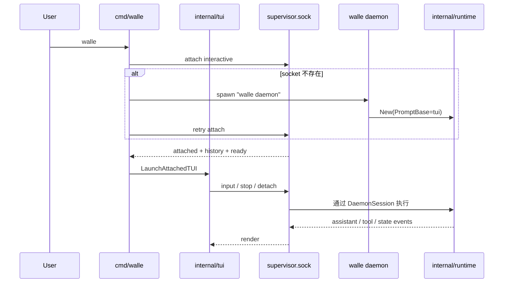

# Entry / TUI Spec

> 由 Claude Fable 5 于 2026-08-24 阅读 `cmd/walle/*.go`、`internal/tui/*.go`、`internal/systemd/control.go` 后重构。
> 覆盖范围：CLI 入口、daemon 启动/复用、attach TUI、TUI 本地命令和远端事件映射。

## 职责边界

入口层是 interactive client：只表达用户意图、渲染 daemon 事件和维护本地 UI 状态，不实现 Agent、工具、session、provider 或模型切换业务。

完整图：[`diagrams/walle-interactive-runtime.mmd`](diagrams/walle-interactive-runtime.mmd)。

## 关键文件

| 文件 | 责任 |
| --- | --- |
| `cmd/walle/main.go` | Cobra root、全局 flag、`daemon`、默认 TUI 入口。 |
| `cmd/walle/interactive_command.go` | 启动/复用 daemon，转发全局 flag，等待 socket。 |
| `cmd/walle/process_commands.go` | `ps`、`attach` 和 completion。 |
| `internal/tui/app.go` | Bubble Tea 状态机、消息分派和按键。 |
| `internal/tui/app_view.go` | `AppModel` 视图、宽度处理、输入清洗和 slash hint。 |
| `internal/tui/commands.go` | 本地命令分派；attached 模式只直接处理 `/detach`、`/stop`。 |
| `internal/tui/remote.go` | `ProcessClient` 到 Bubble Tea msg 的适配。 |
| `internal/tui/render.go`、`tool_render.go`、`markdown.go` | 终端渲染。 |

## 入口契约

- `walle`：调用 `startInteractiveClient`；如 `interactive` daemon 不存在则启动当前二进制的 `daemon` 子命令。
- `walle daemon`：固定创建 daemon-hosted interactive Runtime。
- `walle ps`：通过 `supervisor.sock` 列出 `ProcessSnapshot.Name`。
- `walle attach <id>`：attach interactive 或通用 process。

`interactiveDaemonArgs` 必须继续传递：`--debug`、`--session`、`--continue`、`--llm-format`、`--llm-model`、`--model`，最后追加 `daemon`。

## TUI 命令边界

- attached TUI 本地只截获 `/detach` 和 `/stop`：`/detach` 只退出界面；`/stop` 通过 socket 取消当前 daemon run。
- `/skill`、`/compress`、`/mcp`、`/session`、`/provider`、`/model` 等 slash command 统一发给 daemon session。
- provider 选择、OAuth 登录、模型列表、模型切换和工具重绑都在 daemon/runtime 侧完成；TUI 只展示 picker/model 事件并回传用户选择。
- 未知 slash command 由 daemon session 返回命令错误，不进入 LLM，也不写 context message。
- `Ctrl+C` 第一次清空输入框并提示二次退出，短时间内第二次 `Ctrl+C` 退出 attached TUI；`Ctrl+D` 直接 detach。
- Agent 忙碌时普通 Enter 不丢输入，而是在 TUI 本地保存一条 pending input；daemon 发出 idle state 后自动提交下一轮。当前不做 ReAct 循环中途插入，避免破坏 assistant tool call 与 tool result 的消息顺序。

## 事件映射

`ProcessEvent.Type` 的稳定值由 `internal/systemd/control.go` 的 `ProcessEvent*` 常量定义：`user`、`assistant`、`thinking`、`tool`、`system`、`error`、`done`、`state`、`picker`、`model`。

Attach 握手顺序必须保持：`attached` snapshot -> 历史 `event` -> `ready` -> 实时 `event`。

## 不要做

- 不在入口层创建第二套 Runtime 状态。
- 不在 TUI 保存 provider/model 真源、读取 provider 配置、发起 OAuth 或直接调用 `Runtime.SwitchModel`。
- 不把 `/detach` 实现成停止 Agent。
- 不恢复 `walle run`、固定 `/task`、`daemon --poll` 或 `daemon --interactive`。
- 不在 `View` 里做 IO、网络、模型调用或 shell 执行。

## 验收

- Go 代码改动：`gofmt` + `go vet ./...` + 必要时 `go build -o walle ./cmd/walle`。
- TUI 改动：用 tmux 或 attached TUI 看真实画面，尤其是 slash command、tool event、窄屏布局。
