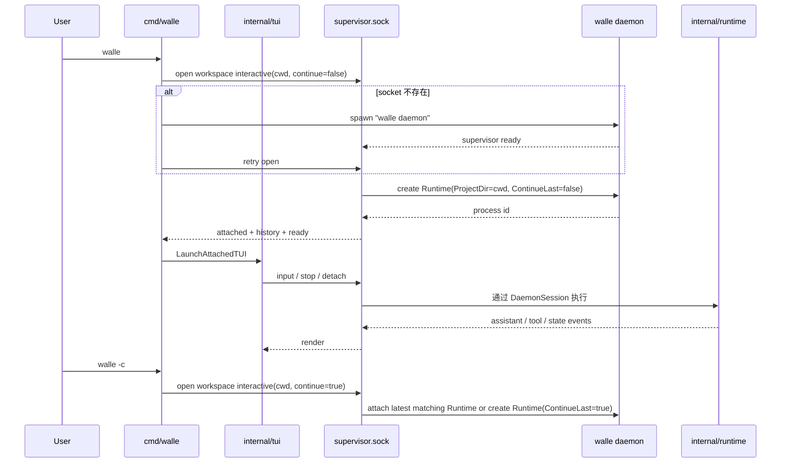

# Entry / TUI Spec

> 由 Claude Fable 5 于 2026-08-26 阅读 `cmd/walle/*.go`、`internal/tui/*.go`、`internal/agentd/control.go` 后更新。
> 覆盖范围：CLI 入口、daemon 启动/复用、workspace interactive 打开语义、attach TUI、TUI 本地命令和远端事件映射。

## 职责边界

入口层是 daemon client：只表达用户意图、连接 control socket、渲染或转发 daemon 事件，不实现 Agent、工具、session、provider 或模型切换业务。

客户端分两类：

- TUI client：默认 `walle` 打开 Runtime 后启动 Bubble Tea 界面，负责输入和渲染。
- 无头 client：bash/Python/CI 通过 `supervisor.sock` 发送 NDJSON `open/list/attach/input/stop/detach`，用于脚本化测试和自动化。

两类客户端都必须走 daemon control 协议，不直接创建或持有 Runtime。

用户语义必须从命令行入口出发：

- `walle`：在当前工作目录打开一个新的交互 Runtime；**不自动续接上一次会话**。
- `walle -c` / `walle --continue`：明确要求续接；此时才允许 daemon 找到当前 workspace 最近的 interactive Runtime 或最近 session。
- `walle attach <id>`：只连接指定 process；不创建新 Runtime。
- `walle ps`：只观察当前 daemon 托管的 process 列表；不创建 Runtime。

完整图：[`diagrams/walle-interactive-runtime.mmd`](diagrams/walle-interactive-runtime.mmd)。

## 关键文件

| 文件 | 责任 |
| --- | --- |
| `cmd/walle/main.go` | Cobra root、全局 flag、`daemon`、默认 TUI 入口。 |
| `cmd/walle/interactive_command.go` | 启动/复用 daemon，发送 open/attach 意图，等待 socket。 |
| `cmd/walle/process_commands.go` | `ps`、`attach` 和 completion。 |
| `internal/tui/app.go` | Bubble Tea 状态机、消息分派和按键。 |
| `internal/tui/app_view.go` | `AppModel` 视图、宽度处理、输入清洗和 slash hint。 |
| `internal/tui/commands.go` | 本地命令分派；attached 模式只直接处理 `/detach`、`/stop`。 |
| `internal/tui/remote.go` | `ProcessClient` 到 Bubble Tea msg 的适配。 |
| `internal/tui/render.go`、`tool_render.go`、`markdown.go` | 终端渲染。 |

## 入口契约

- `walle`：先确保用户级 `walle daemon` 存在，再向 `supervisor.sock` 发送 `open` 请求；请求必须包含当前 `cwd`、模型覆盖参数和 `continue=false`。
- `walle -c` / `walle --continue`：同样走 `open`，但 `continue=true`；这是唯一可以自动续接最近 workspace Runtime 或最近 session 的默认入口参数。
- `walle --session <id>`：创建或打开指定 session 对应的 Runtime；它是显式选择，不等同于默认续接。
- `walle daemon`：只启动 supervisor/control server；不应在启动时预先创建固定 `interactive` Runtime。
- `walle ps`：通过 `supervisor.sock` 列出 `ProcessSnapshot`，包括多个 workspace interactive Runtime 和通用 process。
- `walle attach <id>`：attach 指定 interactive 或通用 process；不存在时返回错误，不隐式创建。

`interactiveDaemonArgs` 只负责把 daemon 启动所需的进程级参数传给 `daemon`。默认 `walle` 的 `cwd`、`continue`、`session`、模型覆盖等交互打开意图，应通过 control 协议的 `open` 请求发送给已运行 daemon；不要依赖 daemon 启动时的一次性参数表达每个客户端的意图。

## Runtime 创建语义

| 用户命令 | Runtime 行为 | Session 行为 |
| --- | --- | --- |
| `walle` | 为当前 `cwd` 创建新的 interactive Runtime。 | 创建新 session。 |
| `walle -c` | 优先复用当前 `cwd` 最近的 idle interactive Runtime；没有则创建 Runtime。 | 优先继续最近 session。 |
| `walle --session <id>` | 创建或打开指定 session 对应 Runtime。 | 使用显式 session id。 |
| `walle attach <id>` | 不创建 Runtime，只 attach 已存在 process。 | 保持目标 process 原 session。 |

默认 `walle` 禁止因为 daemon 中已经有 idle interactive Runtime 就自动 attach。自动续接只属于 `-c/--continue`、`--session` 或显式 `attach`。

## TUI 命令边界

- attached TUI 本地只截获 `/detach` 和 `/stop`：`/detach` 只退出界面；`/stop` 通过 socket 取消当前 daemon run。
- `/skill`、`/compress`、`/mcp`、`/session`、`/provider`、`/model` 等 slash command 统一发给 daemon session。
- provider 选择、OAuth 登录、模型列表、模型切换和工具重绑都在 daemon/runtime 侧完成；TUI 只展示 picker/model 事件并回传用户选择。
- 未知 slash command 由 daemon session 返回命令错误，不进入 LLM，也不写 context message。
- `Ctrl+C` 第一次清空输入框并提示二次退出，短时间内第二次 `Ctrl+C` 退出 attached TUI；`Ctrl+D` 直接 detach。
- Agent 忙碌时普通 Enter 不丢输入，而是在 TUI 本地保存一条 pending input；daemon 发出 idle state 后自动提交下一轮。当前不做 ReAct 循环中途插入，避免破坏 assistant tool call 与 tool result 的消息顺序。

## 事件映射

`ProcessEvent.Type` 的稳定值由 `internal/agentd/control.go` 的 `ProcessEvent*` 常量定义：`user`、`assistant`、`thinking`、`tool`、`system`、`error`、`done`、`state`、`picker`、`model`。

Attach 握手顺序必须保持：`attached` snapshot -> 历史 `event` -> `ready` -> 实时 `event`。

## 不要做

- 不在入口层创建第二套 Runtime 状态；Runtime 创建必须由 daemon supervisor 统一托管。
- 不让默认 `walle` 自动 attach 上一次 `interactive`；续接必须由 `-c/--continue`、`--session` 或 `attach` 显式表达。
- 不在 TUI 保存 provider/model 真源、读取 provider 配置、发起 OAuth 或直接调用 `Runtime.SwitchModel`。
- 不把 `/detach` 实现成停止 Agent。
- 不恢复 `walle run`、固定 `/task`、`daemon --poll` 或 `daemon --interactive`。
- 不在 `View` 里做 IO、网络、模型调用或 shell 执行。

## 验收

- 默认新建：在同一 workspace 连续执行两次 `walle`，`walle ps` 应出现两个不同 interactive process，且 session id 不同。
- 显式续接：执行 `walle -c` 应 attach 当前 workspace 最近的 interactive Runtime，或在没有 Runtime 时用最近 session 创建。
- 跨 workspace：在两个目录分别执行 `walle`，应得到不同 Runtime，`ProjectDir` 分别等于启动目录。
- attach：`walle attach <id>` 只连接指定 process，不创建新 Runtime。
- Go 代码改动：`gofmt` + `go vet ./...` + 必要时 `go build -o walle ./cmd/walle`。
- TUI 改动：用 tmux 或 attached TUI 看真实画面，尤其是 slash command、tool event、窄屏布局。
