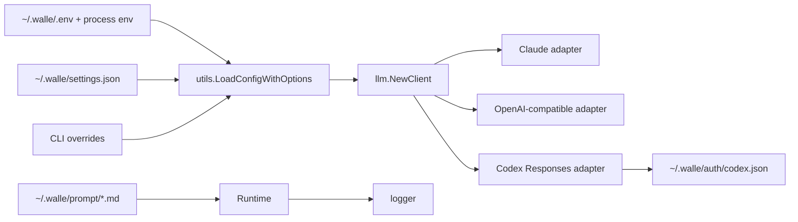

# Model / Config / Logger Spec

> 由 Claude Fable 5 于 2026-08-24 阅读 `internal/llm/*.go`、`internal/codex/*.go`、`internal/utils/*.go`、`internal/logger/*.go`、`.env.example`、`prompt/*.md` 后重构。
> 覆盖范围：provider/model 配置、Prompt 加载、Claude/OpenAI/Codex adapter、Codex OAuth、token budget、日志。

## 职责边界

模型配置层只提供基础设施：配置值、prompt 文本、模型实例、模型目录、OAuth 凭据和日志。它不调用 Agent，不处理 TUI，不执行工具。

## 关键文件

| 文件 | 责任 |
| --- | --- |
| `internal/utils/utils.go` | 配置、路径、settings、prompt、provider 发现。 |
| `internal/utils/tokenBudget.go` | token 预算和累计使用量。 |
| `internal/llm/client.go` | 创建 Claude/OpenAI/Codex Eino model。 |
| `internal/codex/auth.go` | ChatGPT OAuth PKCE、callback、token 刷新和存储。 |
| `internal/codex/models.go` | 查询 ChatGPT 账号模型目录。 |
| `internal/codex/model.go` | Responses API stream adapter 和 tool name alias。 |
| `internal/logger/*.go` | 进程级文件日志、颜色包装和 ANSI 清理。 |

## 配置规则

模型引用统一是 `provider/model`。

优先级：

1. CLI `--model` / `Options.ModelRef`。
2. `~/.walle/settings.json` 的 `default_model`。
3. `LLM_MODEL` 环境变量或 `.env`。

provider 字段优先级：CLI `--llm-format`、`--llm-model` > 进程环境变量 > `~/.walle/.env` > provider 默认值。

稳定约束：

- `LLM_<PROVIDER>_FORMAT` 是协议格式：`claude`、`openai`、`codex`。
- `LLM_<PROVIDER>_BASE_URL/API_KEY/MAX_TOKENS/STREAM` 绑定当前 provider。
- `openai/` + `default_auth=chatgpt` 时走 Codex；`codex/` 默认走 Codex。
- 安装默认配置只提供模板；用户必须设置 `LLM_MODEL=<provider>/<model>` 和对应 `LLM_<PROVIDER>_*` 配置块。

## Prompt 规则

- 默认 prompt：`~/.walle/prompt/main.md`。
- TUI/interactive prompt：`~/.walle/prompt/tui.md`。
- 压缩 prompt：`~/.walle/prompt/compress.md`。
- 模型前缀：`~/.walle/prompt/prefix.<provider>.<model-slug>.md`。
- `LoadSystemPromptBase` 先读 base，再把模型 prefix 拼到 base 前面。
- 指定 base 缺失时可回退 `main`；启动主 prompt 缺失不能静默吞掉。

## Adapter 规则

| format | 创建路径 | 要点 |
| --- | --- | --- |
| `claude` | `newClaudeModel` | 传 API key、base URL、model、max tokens、可选 thinking。 |
| `openai` | `newOpenAIModel` | 复用 OpenAI-compatible Eino adapter，覆盖 DeepSeek/Ollama/OpenRouter。 |
| `codex` | `codex.NewModel` | 用 ChatGPT OAuth token 调 Responses API。 |

Codex adapter 必须保留：

- `store=false`，避免远端保存会话。
- 工具名 `.` 与远端别名 `__` 成对映射，冲突时报错。
- system messages 汇总为 Responses `instructions`。
- assistant tool call / tool result 可从历史重放。
- 401 时只强制刷新一次 token。

## Logger 和 token budget

- 日志目录：`~/.walle/logs/`；文件名 `walle-<timestamp>.log`。
- 最多保留 30 个 `walle-*` 或旧 `walle-debug-*` 日志文件。
- 日志写文件前去 ANSI 颜色；不要污染 TUI stdout/stderr。
- `TokenBudget` 只累计模型 callback 中的 usage，不裁剪消息。

## 不要做

- 不在配置层调用 Agent、工具、TUI 或 daemon。
- 不给每个本地模型新增专用 provider；优先复用 provider 配置块。
- 不把 Codex token、API key、account id 写入项目 `.walle/`、日志、debug request、session 或 report。
- 不把 prompt 加载失败静默吞掉后继续启动。

## 验收

- 改配置：同步 `.env.example`、`doc/config/llm.md`、`ConfiguredProviders`、`SwitchModel`。
- 改 adapter：检查 tool call / tool result 历史重放和流式错误。
- 改 OAuth：检查 state、超时、原子写凭据、刷新失败。
- 改 logger：检查文件轮转、ANSI 清理和 `CloseLog`。
