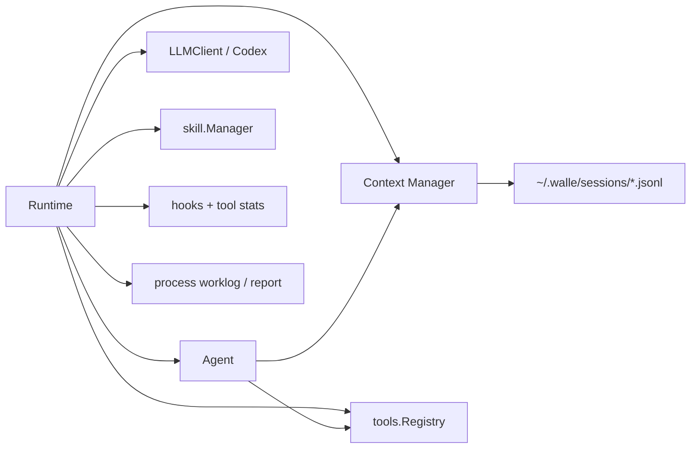

# Runtime Spec

> 由 Claude Fable 5 于 2026-08-24 阅读 `internal/runtime/*.go`、`internal/agent/*.go`、`internal/tools/registry.go` 后重构。
> 覆盖范围：Runtime 装配、模型切换、daemon session、通用 process report/worklog。

## 职责边界

`internal/runtime` 是装配层和模型状态真源：创建配置、Prompt、LLM、Agent、Context、Tools、Skill、hooks，并把它们接到 daemon interactive session 或通用 process runner 上。模型/provider 切换只在这里落地，UI 只发送意图。

总体关系见：[`diagrams/walle-overall-runtime.mmd`](diagrams/walle-overall-runtime.mmd)。

## 关键文件

| 文件 | 责任 |
| --- | --- |
| `runtime.go` | `New`、`SwitchModel`、`RunProcess`、Runtime 字段。 |
| `daemon_session.go` | daemon 长驻交互会话、slash command、事件历史和订阅者。 |
| `provider.go` | provider/model 列表、Codex OAuth 登录入口。 |
| `worklog.go` | 通用 process 工作日志。 |
| `hooks.go`、`tool_stats.go` | 工具事件 hook 和失败统计。 |

## 初始化顺序

1. 加载配置、logger、workspace 和项目数据目录。
2. 创建 session-backed `context.Manager` 和当前 message context。
3. 创建 LLM，加载 prompt base。
4. 创建 Agent，注入 Context Manager、debug 信息、context window。
5. `tools.NewRegistry().Init(skillMgr)` 注册 base/skill 工具。
6. `RegisterContextTool` 注册 `context.context`。
7. `ToolInfos` -> `WithTools` -> `Agent.SetModel/SetTools`。
8. 加载 hooks，返回 Runtime。

## 稳定接口

| 接口 | 调用方 | 要点 |
| --- | --- | --- |
| `New` | daemon、通用 process runner | 完成所有装配。 |
| `Close` | CLI defer | 关闭 logger。 |
| `SwitchModel` | `DaemonSession` | 替换模型、替换 context tool、重新绑定工具；TUI 不直接调用。 |
| `RunProcess` | `AgentSystemd` | 跑通用 `AgentProcess`，写 worklog/report。 |
| `NewDaemonSession` | `walle daemon` | 创建 attachable interactive adapter。 |
| `Providers` / `ProviderModels` / `StartOpenAILogin` | `/provider`、`/model` | 只暴露模型选择和登录能力。 |
| `RecordToolEvent` | daemon session | hooks + tool failure stats。 |

## 运行模式

- interactive daemon：默认模式，daemon 长驻持有 Runtime，TUI 通过 socket attach。
- generic process：`AgentSystemd` 调用 `RunProcess`，写 `.walle/reports` 和 `.walle/agents/.../logs`。

## 不要做

- 不在 Runtime 内置 TaskList、task watcher、任务状态或固定 `/task`。
- 不让 Runtime 依赖 Bubble Tea 或 TUI 渲染细节。
- 不绕过 `tools.Registry` 暴露工具。
- 不在模型切换时只替换模型而忘记重绑 `context.context` 和完整工具集合。

## 验收

- 改初始化或模型切换：`go vet ./...`，再 `go build -o walle ./cmd/walle`。
- 改 daemon session：补 attach 流程人工验收，检查 history replay、busy、stop、disconnect。
- 改 process runner：检查 report/worklog 路径和 tool event sink 恢复。
