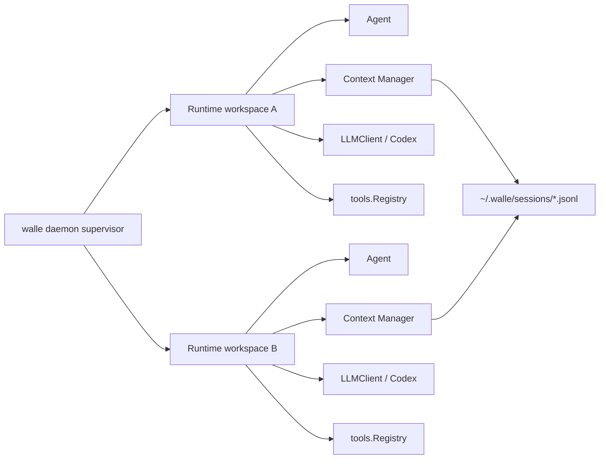

# Runtime Spec

> 由 Claude Fable 5 于 2026-08-26 阅读 `internal/runtime/*.go`、`internal/agent/*.go`、`internal/tools/registry.go` 后更新。
> 覆盖范围：Runtime 装配、模型切换、daemon session、通用 process report/worklog。

## 职责边界

`internal/runtime` 是单个 Agent Runtime 的装配层和模型状态真源：创建配置、Prompt、LLM、Agent、Context、Tools、Skill、hooks，并把它们接到一个 `DaemonSession` 或通用 process runner 上。

Runtime 不是用户级 daemon 单例。daemon 可以同时托管多个 Runtime，每个 interactive process 独占一份 Runtime、Context Manager、MessageCtx、ToolRegistry 和 Agent。

总体关系见：[`diagrams/walle-overall-runtime.mmd`](diagrams/walle-overall-runtime.mmd)。

## 关键文件

| 文件 | 责任 |
| --- | --- |
| `runtime.go` | `New`、`SwitchModel`、`RunProcess`、Runtime 字段。 |
| `daemon_session.go` | 单 Runtime 的 interactive adapter、slash command、事件历史和订阅者。 |
| `provider.go` | provider/model 列表、Codex OAuth 登录入口。 |
| `worklog.go` | 通用 process 工作日志。 |
| `hooks.go`、`tool_stats.go` | 工具事件 hook 和失败统计。 |

## 初始化顺序

1. 加载配置、logger、workspace 和项目数据目录。
2. 创建 session-backed `context.Manager` 和当前 message context。
3. 创建 LLM，加载 prompt base。
4. 创建 Agent，注入 Context Manager、debug 信息、context window。
5. `tools.NewRegistry().Init(skillMgr)` 注册 base/skill 工具。
6. `RegisterContextTool` 注册 `context.context`。
7. `ToolInfos` -> `WithTools` -> `Agent.SetModel/SetTools`。
8. 加载 hooks，返回 Runtime。

## 稳定接口

| 接口 | 调用方 | 要点 |
| --- | --- | --- |
| `New` | daemon open 请求、通用 process runner | 为一个 workspace/session 完成一份 Runtime 装配。 |
| `Close` | daemon process lifecycle | 关闭 logger；多 Runtime 实现不得提前关闭其他 Runtime 仍在使用的共享日志。 |
| `SwitchModel` | `DaemonSession` | 替换模型、替换 context tool、重新绑定工具；TUI 不直接调用。 |
| `RunProcess` | `Agentd` | 跑通用 `AgentProcess`，写 worklog/report。 |
| `NewDaemonSession` | daemon interactive registry | 把一个 Runtime 包装成可 attach 的 interactive process。 |
| `Providers` / `ProviderModels` / `StartOpenAILogin` | `/provider`、`/model` | 只暴露模型选择和登录能力。 |
| `RecordToolEvent` | daemon session | hooks + tool failure stats。 |

## Runtime 创建语义

Runtime 创建必须由调用方传入明确意图：

| 意图 | `Options` 要点 |
| --- | --- |
| 默认 `walle` | `ProjectDir=cwd`、`ContinueLast=false`、`SessionID=""`，创建新 session。 |
| `walle -c` | `ProjectDir=cwd`、`ContinueLast=true`，优先继续最近 session。 |
| `walle --session <id>` | `ProjectDir=cwd`、`SessionID=id`，打开指定 session。 |
| `--model provider/model` | `ModelRef` 只影响本次 Runtime，不改写 `~/.walle/.env`。 |

默认 `walle` 不得因为同 workspace 存在 idle Runtime 就复用其 `MessageCtx`。复用 Runtime 或 session 必须来自 `-c/--continue`、`--session` 或显式 `attach`。

## 运行模式

- interactive Runtime：由 daemon 的 `open` 请求创建或续接；每个 `DaemonSession` 持有一份 Runtime。
- generic process：`Agentd` 调用 `RunProcess`，写 `.walle/reports` 和 `.walle/agents/.../logs`。

## 状态隔离

多 Runtime 场景必须满足：

- 每个 Runtime 有自己的 `Agent`、`MessageCtx`、`ToolRegistry` 和 `ProjectDir`。
- `SwitchModel` 只影响当前 Runtime。
- tool event sink 的接管只影响当前 Runtime 的 Agent。
- context tool 注册在当前 Runtime 的 `ToolRegistry` 中，不污染其他 Runtime。
- session JSONL 可以共享同一 store 目录，但当前 `MessageCtx` 不共享，除非用户显式 `-c` / `--session` / `attach`。

## 不要做

- 不把 Runtime 做成 daemon 全局单例。
- 不让默认 `walle` 复用上一次 Runtime 或 session。
- 不在 Runtime 内置 TaskList、task watcher、任务状态或固定 `/task`。
- 不让 Runtime 依赖 Bubble Tea 或 TUI 渲染细节。
- 不绕过 `tools.Registry` 暴露工具。
- 不在模型切换时只替换模型而忘记重绑 `context.context` 和完整工具集合。

## 验收

- 默认新建：同一 workspace 连续创建两个 Runtime，`SessionID` 不同、`MessageCtx` 不同、事件历史隔离。
- 显式续接：`ContinueLast=true` 时才复用最近 session。
- 模型隔离：在 Runtime A `/model` 切换模型，不影响 Runtime B 的 `ModelRef`。
- 工作区隔离：不同 `ProjectDir` 的工具相对路径解析分别落在各自 workspace。
- 改初始化或模型切换：`go vet ./...`，再 `go build -o walle ./cmd/walle`。
- 改 daemon session：补 attach 流程人工验收，检查 history replay、busy、stop、disconnect。
- 改 process runner：检查 report/worklog 路径和 tool event sink 恢复。
