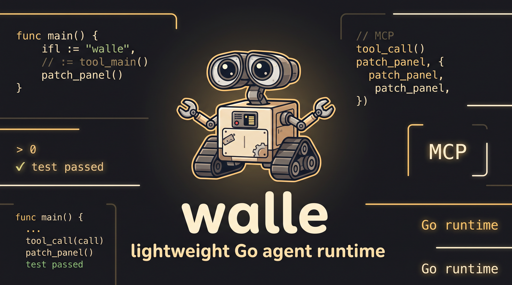

<p align="center">
  
</p>

<h1 align="center">walle</h1>

<p align="center">
  <strong>一个用 Go 写的轻量 Agent Runtime。</strong><br />
  会使用工具、能修补自己，并把每一步运行在你看得见的终端里。
</p>

<p align="center">
  <a href="https://go.dev/"></a>
  <a href="https://github.com/cloudwego/eino"></a>
  
  
</p>

<p align="center">
  <a href="#快速开始">快速开始</a> ·
  <a href="#为什么是-walle">为什么是 walle</a> ·
  <a href="#运行方式">运行方式</a> ·
  <a href="#扩展能力">扩展能力</a> ·
  <a href="doc/0README.md">完整文档</a>
</p>

---

## 为什么是 walle

`walle` 是一个小而完整的 Agent 运行时。它不把自己包装成庞大的平台，而是像一个小维修机器人：观察现场、选择工具、打补丁、继续验证。

它适合放在真实项目目录里工作：连接模型，维护会话，控制上下文，执行工具，并通过可分离的 TUI / daemon 让一次任务可以持续运行。

<table>
  <tr>
    <td width="33%" valign="top">
      <strong>🪶 小核心</strong><br />
      Go 实现，运行链路清楚，适合阅读、调试和二次开发。
    </td>
    <td width="33%" valign="top">
      <strong>🛠️ 工具优先</strong><br />
      内置文件、搜索、Shell、上下文工具，并支持多轮工具调用。
    </td>
    <td width="33%" valign="top">
      <strong>🧰 可分离运行</strong><br />
      后台 daemon 托管 Agent，终端 TUI 可以随时 attach / detach。
    </td>
  </tr>
  <tr>
    <td width="33%" valign="top">
      <strong>🧠 可控上下文</strong><br />
      管理 session、历史消息和自动压缩，减少无关内容进入模型。
    </td>
    <td width="33%" valign="top">
      <strong>🔌 可扩展</strong><br />
      支持用户级 / 项目级 Skill，也可以接入 MCP Server。
    </td>
    <td width="33%" valign="top">
      <strong>🔧 可修补</strong><br />
      Agent 可以检查源码、精确编辑文件，并主动运行命令验证结果。
    </td>
  </tr>
</table>

## 工作方式

```text
用户输入
   │
   ▼
Agent Runtime ──► LLM
   ▲              │
   │              ▼
工具执行结果 ◄── Tool Call
   │
   └── 继续推理，直到完成或停止
```

在代码项目里，`walle` 的理想闭环是：

```text
Inspect  →  Patch  →  Run
  检查       修改      验证
```

这不是不可控的“自我进化”。它只是把工程师熟悉的步骤变成一个透明的工具调用过程：能看到输入，能看到工具，能看到结果，也能随时停下。

## 快速开始

### 1. 安装

需要 **Go 1.24.2+**。Node.js 仅在部分 MCP Server 需要时安装。

```bash
git clone https://github.com/Ozqi/walle.git
cd walle
bash install.sh
```

安装脚本会把二进制安装到 `~/.local/bin/walle`，首次创建 `~/.walle/.env`。

如果终端找不到命令：

```bash
export PATH="$HOME/.local/bin:$PATH"
```

<details>
<summary>使用远程安装脚本</summary>

```bash
curl -fsSL https://raw.githubusercontent.com/Ozqi/walle/master/install.sh | bash
```

建议在执行前先查看脚本内容。

</details>

### 2. 配置模型

模型名统一使用 `provider/model` 格式。下面以本地 Ollama 为例：

```bash
ollama pull qwen3:14b
ollama serve
```

编辑 `~/.walle/.env`：

```env
LLM_MODEL=ollama/qwen3:14b
LLM_OLLAMA_FORMAT=openai
LLM_OLLAMA_BASE_URL=http://localhost:11434/v1
LLM_OLLAMA_API_KEY=dummy
LLM_OLLAMA_MAX_TOKENS=4096
LLM_OLLAMA_STREAM=true

AGENT_NAME=walle
AGENT_CONTEXT_AUTO_COMPRESS=true
```

也可以在单次启动时临时切换模型：

```bash
walle --model openrouter/openrouter/owl-alpha
```

完整配置见 [.env.example](.env.example) 和 [LLM 配置文档](doc/config/llm.md)。

### 3. 启动

在任意项目目录执行：

```bash
walle
```

进入 TUI 后直接描述任务即可。输入 `/` 查看命令，按 `Tab` 补全。

## 运行方式

### 交互式 TUI

```bash
walle
```

默认入口会连接当前 workspace 的交互 Agent；如果不存在，则自动在后台创建。离开 TUI 后仍可保留 Agent，并在稍后重新进入：

```bash
walle ps
walle attach interactive
```

### 后台 daemon

`walle daemon` 托管一个可 attach 的交互 Agent，并通过本机 Unix Socket 提供控制面：

```bash
walle daemon
walle ps
walle attach interactive
```

默认执行 `walle` 时无需手动启动 daemon：CLI 会优先复用已有实例，不存在时自动启动。`ps`、`attach` 和运行中的停止操作通过 `~/.walle/run/supervisor.sock` 完成。

## 常用 TUI 命令

| 命令 | 用途 |
| --- | --- |
| `/provider [name]` | 选择 Provider 或完成认证 |
| `/model <provider/model>` | 查看或切换当前模型 |
| `/session <new\|list\|id>` | 新建、查看或切换会话 |
| `/stop` | 停止当前 Agent 执行 |
| `/skill <list\|get\|reload>` | 查看或重新加载 Skill |
| `/mcp <list\|add\|remove\|...>` | 管理 MCP 配置 |
| `/compress` | 手动压缩当前上下文 |
| `/detach` | 退出 TUI，但保留后台 Agent |

### ChatGPT OAuth

在 TUI 中输入 `/provider openai`，按提示完成浏览器登录，再用 `/model` 选择当前账号可用的模型。凭据保存在 `~/.walle/auth/codex.json`，不会写入项目目录、session 或 report。

## 扩展能力

### Skill

Skill 可以放在用户目录或项目目录中，用来补充特定工作流和工具说明：

```text
~/.walle/skills/              用户级 Skill
<workspace>/.walle/skills/    项目级 Skill
```

详情见 [Skill 文档](doc/core/skill.md)。

### MCP

`walle` 支持管理并连接 MCP Server，把外部服务注册为 Agent 可调用的工具：

```text
/mcp list
/mcp add ...
/mcp remove ...
```

详情见 [MCP 文档](doc/integrations/mcp.md)。

## 项目结构

```text
cmd/walle/        CLI 入口
internal/
├── runtime/      daemon 托管的交互 Agent 装配层
├── agent/        ReAct 循环与工具调度
├── llm/          模型客户端与协议适配
├── tools/        内置工具与注册表
├── context/      上下文与 session
├── skill/        Skill 加载
├── mcp/          MCP 客户端
├── systemd/      Agent process 调度与控制面
└── tui/          Bubble Tea 客户端
doc/              设计与模块文档
prompt/           Runtime 提示词
```

## 开发

```bash
go build ./cmd/walle
go test ./...
```

建议从以下文件开始阅读：

1. [`cmd/walle/main.go`](cmd/walle/main.go)：CLI 入口
2. [`internal/runtime/runtime.go`](internal/runtime/runtime.go)：Runtime 装配
3. [`internal/agent/agent.go`](internal/agent/agent.go)：Agent 主循环
4. [`internal/tools/registry.go`](internal/tools/registry.go)：工具注册

## 文档

- [文档索引](doc/0README.md)
- [Runtime](doc/runtime/runtime.md)
- [Agent 主循环](doc/core/agent.md)
- [Context 与 Session](doc/core/context.md)
- [Skill](doc/core/skill.md)
- [Tools](doc/integrations/tools.md)
- [MCP](doc/integrations/mcp.md)
- [TUI / CLI](doc/interface/cli.md)
- [LLM 配置](doc/config/llm.md)

<details>
<summary>终端里的 walle</summary>

```text
 ╭───╮ ╭───╮
╱  ● ╲_╱ ●  ╲
╲____╱ ╲____╱
     ║╬║
╭██╮╭─╨─╮╭██╮
│██├┤▪▦▪├┤██│
╰██╯╰───╯╰██╯
```

</details>
