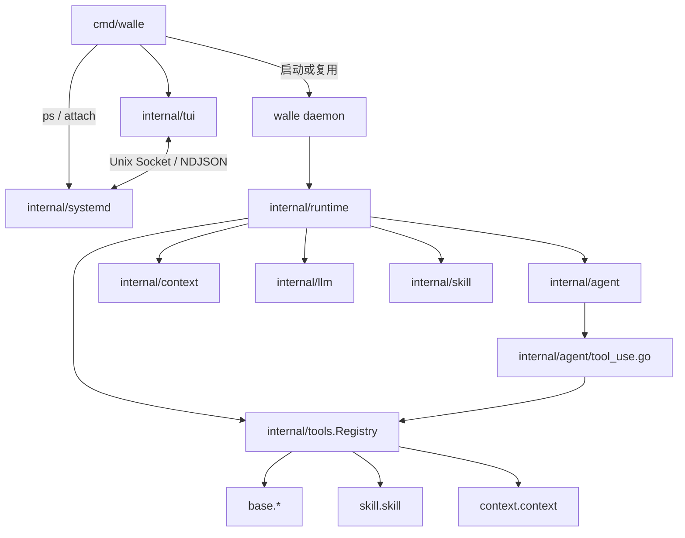

# walle 文档

> 由 Claude Fable 5 于 2026-08-23 阅读 `cmd/walle/*.go`、`internal/{runtime,agent,context,tools,systemd,tui}/*.go` 与 `doc/` 模块文档后更新。
> 覆盖范围：当前代码架构、用户入口与模块文档导航。

本目录只记录当前实现。入口短，细节进模块文档。

## 结构

```text
doc/
├── 0README.md              # 本页
├── brand/                  # 品牌主题与终端字符图
├── core/                   # Agent、Context、Skill
├── runtime/                # Runtime、Agent Systemd
├── interface/              # TUI、slash commands、logger
├── integrations/           # Tools、MCP
├── config/                 # LLM、prompt、调用链路
└── topology.md             # 当前架构拓扑导读
```

## 当前架构



## 模块索引

| 模块 | 文档 | 读它为了 |
| --- | --- | --- |
| Agent 主循环 | [core/agent.md](core/agent.md) | ReAct、stream、tool call 收集与写回 |
| Context / Session | [core/context.md](core/context.md) | 消息内存、JSONL session、压缩、时间戳 |
| Skill | [core/skill.md](core/skill.md) | 全局/项目 skill 加载和注入 |
| Runtime | [runtime/runtime.md](runtime/runtime.md) | 交互 Agent 初始化和通用 process runner |
| Agent Systemd | [runtime/agent-systemd.md](runtime/agent-systemd.md) | 通用 process 调度与 Unix Socket 控制面 |
| TUI | [interface/cli.md](interface/cli.md) | Bubble Tea 状态、输入栏、`/stop`、工具提示 |
| Slash Commands | [interface/commands.md](interface/commands.md) | `/skill`、`/compress`、`/mcp` 及会话/模型命令 |
| Logger / Worklog | [interface/logger.md](interface/logger.md) | 日志、工具事件、process worklog 时间戳 |
| Tools | [integrations/tools.md](integrations/tools.md) | 工具注册、schema、执行策略 |
| MCP | [integrations/mcp.md](integrations/mcp.md) | MCP stdio client 和未来 lazy 注册 |
| Claude Context | [integrations/mcp.claude-context.md](integrations/mcp.claude-context.md) | claude-context 接入验证 |
| LLM 配置 | [config/llm.md](config/llm.md) | `LLM_MODEL=provider/model` 和 provider 配置 |
| LLM 调用链路 | [config/llm-call-flow.md](config/llm-call-flow.md) | 一次模型调用到 ToolCall 回灌 |
| Prompt | [config/prompt.md](config/prompt.md) | `main.md` / `tui.md` / prefix 加载 |
| 架构拓扑 | [topology.md](topology.md) | 当前模块、调用链与持久化边界 |
| 品牌 | [brand/walle-brand.md](brand/walle-brand.md) | walle 名称、主题色和终端图标 |

## 稳定事实

- 默认 `walle` 自动启动或复用 `walle daemon`，然后 attach 到 `interactive` Agent。
- `walle daemon` 固定托管可 attach 的交互 Agent；没有 `--poll` 或 `--interactive` 模式。
- `ps`、`attach`、`stop` 与 `internal/systemd` 的通用 process 能力保留。
- Runtime 提供通用 process 执行能力；任务管理由 Skill、MCP 或外置动态工具提供。
- `runtime.New` 启动阶段只注册本地 base/skill 工具和 `context.context`，不启动 MCP stdio server。
- TUI 使用 `prompt/tui.md`；其他 Runtime 调用默认使用 `prompt/main.md`。
- Session 默认写 `~/.walle/sessions/*.jsonl`；通用 process 可写项目 `.walle` 下的 report/worklog。
- 拓扑导读见 [topology.md](topology.md)；架构图事实源集中在 [../.spec/diagrams/](../.spec/diagrams/)。
