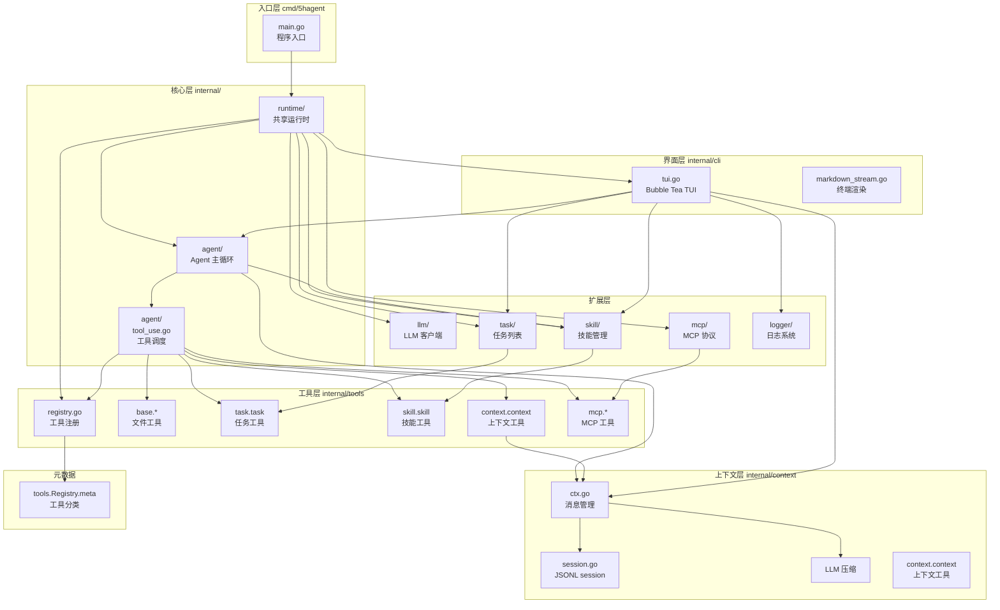
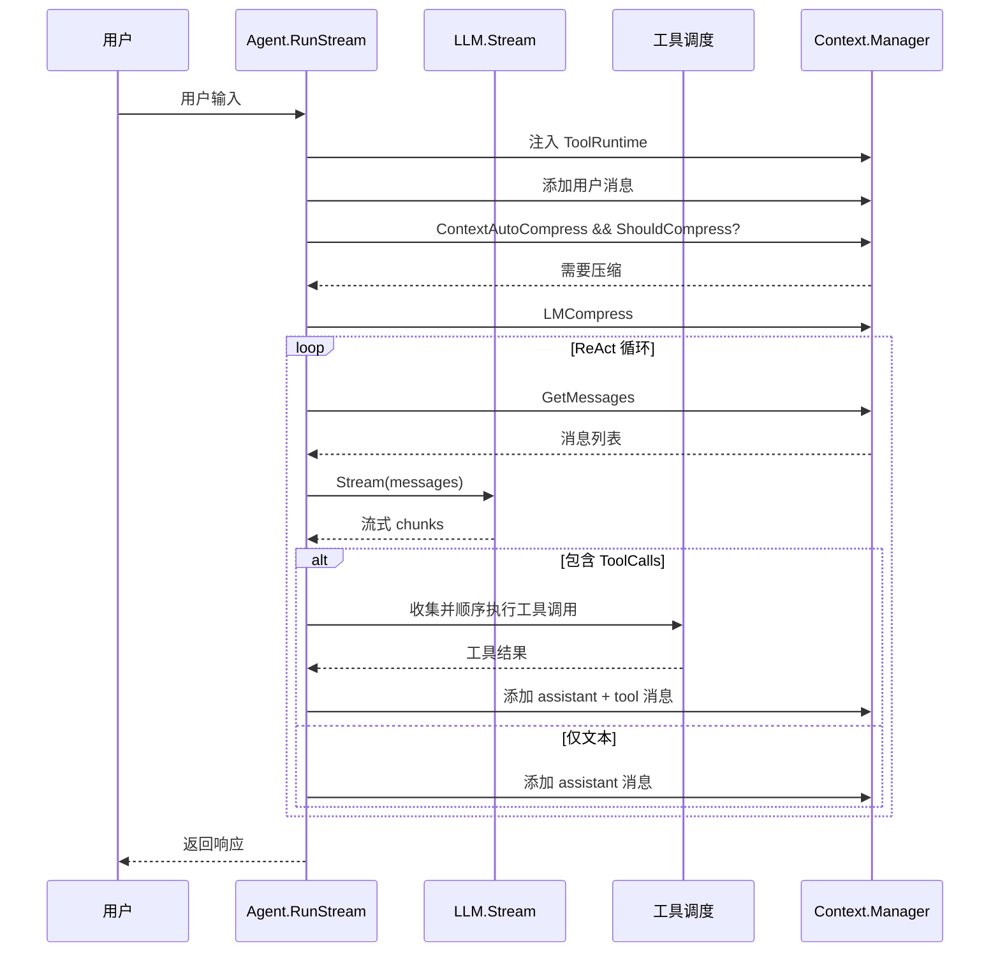
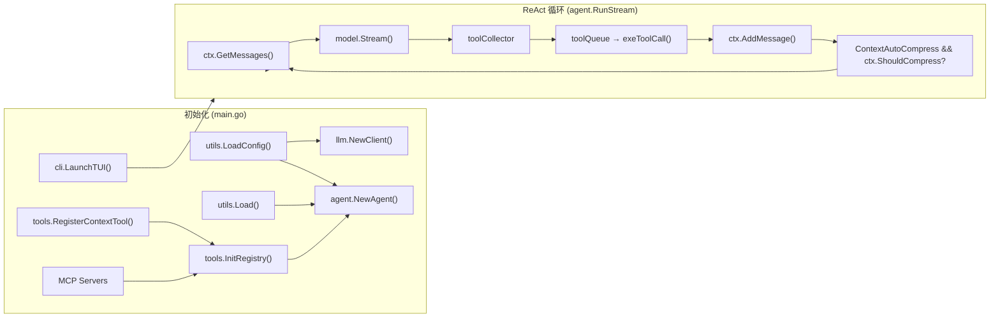

# 5hAgent 文档

轻量级 Go + Eino AI Agent 框架，支持 ReAct 循环、流式输出、工具执行、上下文压缩、LLM 自主管理上下文、Skill 注入和 MCP 扩展。

> 本页是文档总览；具体实现细节按模块拆到同目录各子文档。

## 文档规则

- 文档必须和代码匹配，优先写当前实现
- 先给结构图，再给关键文件和关键函数
- 如果引用代码，优先使用相对路径链接

## 架构总览



## ReAct 循环流程



## 代码结构

```
5hAgent/
├── cmd/5hagent/
│   └── main.go                 # 程序入口：初始化 Agent、TUI、工具注册，启动交互界面
│
├── internal/
│   ├── runtime/                # 共享运行时
│   │   └── runtime.go         # 初始化配置、Agent、工具、MCP；无头任务执行和报告写入
│   │
│   ├── agent/                  # Agent 核心
│   │   ├── agent.go           # ReAct 循环、流式 LLM 调用、上下文初始化、skill 注入
│   │   └── tool_use.go        # ToolCall 分片收集、单工具执行、结果格式化
│   │
│   ├── cli/                    # 终端 UI（TUI）
│   │   ├── tui.go             # Bubble Tea 主界面：对话面板 + 状态栏，/task /skill /compress 命令入口
│   │   ├── ui.go              # PrintError（stdout 退路）
│   │   └── markdown_stream.go # Markdown 终端渲染
│   │
│   ├── commands/               # Slash 命令处理
│   │   ├── skill.go           # /skill list/get
│   │   ├── task.go            # /task create/update/get/list/delete/archive/reopen
│   │   ├── compress.go        # /compress 手动触发上下文压缩
│   │   └── mcp.go             # /mcp list/add/remove/enable/disable
│   │
│   ├── context/                # 消息上下文管理
│   │   ├── ctx.go             # Context 创建/克隆、消息存储、LLM 压缩、inspect/pin/audit 元数据
│   │   └── session.go         # Session JSONL 持久化、列表、恢复、替换消息
│   │
│   ├── llm/                    # LLM 客户端
│   │   └── client.go          # Eino Claude/OpenAI-compatible ChatModel 封装
│   │
│   ├── logger/                 # 日志与输出
│   │   ├── logger.go          # DEBUG/INFO/WARN/ERROR 带标签日志
│   │   ├── color.go           # ANSI 颜色
│   │   └── toolprint.go       # 工具调用格式化输出
│   │
│   ├── mcp/                    # MCP 协议定义
│   │   ├── mcp.go            # ServerConfig/ToolSpec，FullToolName
│   │   └── client_stdio.go   # StdioClient 实现
│   │
│   ├── skill/                  # 技能加载与管理
│   │   └── skill.go          # 从全局和项目 skills 目录加载启动快照
│   │
│   ├── task/                   # 任务列表持久化
│   │   ├── tasklist.go       # Task CRUD、Markdown 持久化、历史归档
│   │   └── task_actions.go   # TaskActionRequest 分发
│   │
│   ├── toolmeta/               # 工具元数据类型
│   │   └── toolmeta.go       # 工具分类（base/task/skill/context/sys/mcp）、只读属性类型
│   │
│   ├── tools/                  # 工具实现
│   │   ├── registry.go       # 工具注册表 Registry / InitRegistry / RegisterMCPTools
│   │   ├── read_file.go      # 读文件（offset/limit 范围）
│   │   ├── write_file.go     # 写文件
│   │   ├── edit.go           # 字符串替换编辑
│   │   ├── exec_shell.go     # 执行 shell 命令
│   │   ├── grep.go           # 文本搜索
│   │   ├── glob.go           # 文件模式匹配
│   │   ├── list_dir.go       # 目录列表
│   │   ├── task_tool.go      # TaskList 的 Eino Tool 封装
│   │   ├── skill_tool.go     # SkillManager 的 Eino Tool 封装
│   │   ├── context_tool.go   # LLM 可调用的上下文 inspect/pin/audit/compress 工具
│   │   └── mcp_tool.go       # MCP 工具的 Eino Tool 封装
│   │
│   └── utils/                  # 公共工具函数
│       ├── utils.go           # 配置读取、prompt 加载和模型前缀命名
│       └── tokenBudget.go    # TokenBudget 累计 token 上限检查
│
├── doc/                        # 文档
│   ├── 0README.md             # 本文件，文档总览和导航
│   ├── runtime.md             # 无头/TUI 共享运行时
│   ├── agent.md               # Agent 主循环、ReAct、工具执行
│   ├── tools.md               # 工具注册、并发策略
│   ├── context.md             # 消息上下文、LLM 压缩
│   ├── skill.md               # Skill 加载与注入
│   ├── commonds.md            # /skill 和 /task 命令
│   ├── mcp.md                 # MCP 模块
│   ├── cli.md                 # TUI 界面
│   ├── llm.md                 # LLM 客户端
│   ├── llm-call-flow.md       # 一次 LLM 调用和 Tool Call 数据流
│   ├── agent-systemd.md       # Agent Systemd 顶层调度设计和当前边界
│   ├── agent-systemd-test.md  # Agent Systemd 调试入口
│   ├── logger.md              # 日志模块
│   ├── prompt.md              # prompt 文件加载
│   └── task.md                # 任务管理
│
└── prompt/                     # System prompt 文件
    ├── main.md                # Agent 主 prompt
    ├── compress.md            # 上下文压缩 prompt
    ├── plan.md                # 规划 prompt
    └── worker.md              # Worker prompt
```

## 关键数据流



## 关键类型

| 类型 | 文件 | 作用 |
|------|------|------|
| `Agent` | `agent/agent.go` | ReAct 循环核心，协调 LLM/工具/上下文 |
| `TaskList` | `task/tasklist.go` | 任务列表（Markdown 持久化） |
| `Context` | `context/ctx.go` | 单次对话的消息历史 |
| `Manager` | `context/ctx.go` | 管理多个 Context，支持压缩、inspect、pin、audit |
| `Skill.Manager` | `skill/skill.go` | 启动时技能加载快照 |
| `toolmeta.Meta` | `toolmeta/toolmeta.go` | 工具元数据类型（分类/只读/显示名） |
| `AppModel` | `cli/tui.go` | TUI 主界面状态管理 |
| `LLMClient` | `llm/client.go` | LLM 模型客户端封装 |

## 模块文档导航

| 文档 | 模块 | 重点 |
|------|------|------|
| [runtime.md](runtime.md) | `internal/runtime` | 共享运行时初始化、TUI/无头入口、报告写入、工具绑定 |
| [agent-systemd.md](agent-systemd.md) | Stage 6 设计 | Agent Systemd、system prompt、exit condition、内存 context、IPC、task daemon 调度 |
| [agent-systemd-test.md](agent-systemd-test.md) | 调试入口 | tmux TUI、headless、daemon 真实交互调试 |
| [agent.md](agent.md) | `internal/agent` | ReAct 循环、stream 读取、tool call 收集、上下文写回 |
| [tools.md](tools.md) | `internal/tools` / `internal/toolmeta` | 工具注册、工具 schema、执行策略、MCP 工具包装 |
| [context.md](context.md) | `internal/context` | 消息上下文、session、压缩、`context.context` |
| [task.md](task.md) | `internal/task` | `.5hagent/task.md` 格式、状态流转、task 工具 |
| [skill.md](skill.md) | `internal/skill` | Skill 加载快照、来源覆盖、prompt 注入 |
| [llm.md](llm.md) | `internal/llm` | Claude/OpenAI-compatible provider 配置和模型创建 |
| [llm-call-flow.md](llm-call-flow.md) | LLM 调用链路 | 一次 stream 调用、ToolCall 合并、工具结果回灌 |
| [prompt.md](prompt.md) | `prompt/` / `utils` | 主 prompt、模型 prefix、压缩 prompt |
| [cli.md](cli.md) | `internal/cli` | TUI 渲染、状态栏、工具事件、thinking 展示 |
| [commonds.md](commonds.md) | `internal/commands` | `/task`、`/skill`、`/compress`、`/mcp` |
| [mcp.md](mcp.md) | `internal/mcp` / MCP tools | MCP stdio client、工具注册、schema 转换 |
| [logger.md](logger.md) | `internal/logger` | 日志、工具调用展示、错误输出 |
