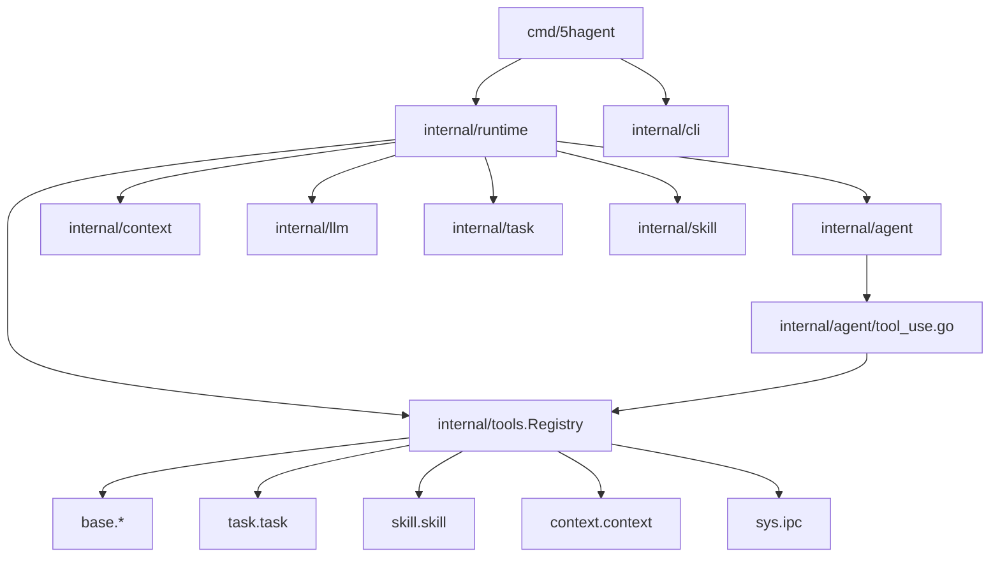

# 5hAgent 文档

本目录只记录当前实现。入口短，细节进模块文档。

## 结构

```text
doc/
├── 0README.md              # 本页
├── core/                   # Agent、Context、Task、Skill
├── runtime/                # Runtime、Agent Systemd、运行验证
├── interface/              # TUI、slash commands、logger
├── integrations/           # Tools、MCP
└── config/                 # LLM、prompt、调用链路
```

## 当前架构



## 模块索引

| 模块 | 文档 | 读它为了 |
| --- | --- | --- |
| Agent 主循环 | [core/agent.md](core/agent.md) | ReAct、stream、tool call 收集与写回 |
| Context / Session | [core/context.md](core/context.md) | 消息内存、JSONL session、压缩、时间戳 |
| Task | [core/task.md](core/task.md) | `.5hagent/task.md`、状态流转、task tool |
| Skill | [core/skill.md](core/skill.md) | 全局/项目 skill 加载和注入 |
| Runtime | [runtime/runtime.md](runtime/runtime.md) | 初始化、TUI/headless/daemon 共用链路 |
| Agent Systemd | [runtime/agent-systemd.md](runtime/agent-systemd.md) | 串行 AgentProcess daemon 边界 |
| Systemd 验证 | [runtime/agent-systemd-test.md](runtime/agent-systemd-test.md) | daemon/headless 验证入口 |
| TUI | [interface/cli.md](interface/cli.md) | Bubble Tea 状态、输入栏、`/stop`、工具提示 |
| Slash Commands | [interface/commands.md](interface/commands.md) | `/task`、`/skill`、`/compress`、`/mcp` |
| Logger / Worklog | [interface/logger.md](interface/logger.md) | 日志、工具事件、worklog 时间戳 |
| Tools | [integrations/tools.md](integrations/tools.md) | 工具注册、schema、执行策略 |
| MCP | [integrations/mcp.md](integrations/mcp.md) | MCP stdio client 和未来 lazy 注册 |
| Claude Context | [integrations/mcp.claude-context.md](integrations/mcp.claude-context.md) | claude-context 接入验证 |
| LLM 配置 | [config/llm.md](config/llm.md) | `LLM_MODEL=provider/model` 和 provider 配置 |
| LLM 调用链路 | [config/llm-call-flow.md](config/llm-call-flow.md) | 一次模型调用到 ToolCall 回灌 |
| Prompt | [config/prompt.md](config/prompt.md) | `main.md` / `tui.md` / prefix 加载 |

## 稳定事实

- 默认入口 `5hagent` 启动 TUI；`5hagent run` 执行一个文件任务；`5hagent daemon` 监听 task 文件。
- `runtime.New` 启动阶段只注册本地工具和 `context.context`，不启动 MCP stdio server。
- TUI 使用 `prompt/tui.md`；headless/daemon 使用 `prompt/main.md`。
- Session 默认写 `~/.5hAgent/sessions/*.jsonl`；项目执行产物写当前目录 `.5hagent/`。
- 当前 daemon 是串行 AgentProcess，不是并发多 Agent。

## 文档约束

- 只写当前实现，不写愿景长文。
- 模块文档保留：职责、关键文件、关键函数、边界。
- 代码路径要可点击；命令必须存在再写。
