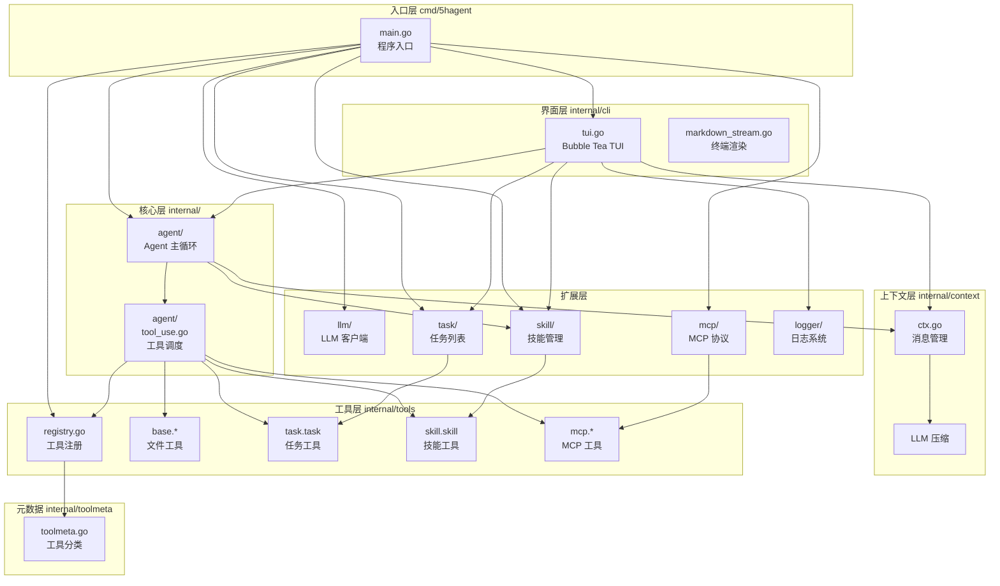
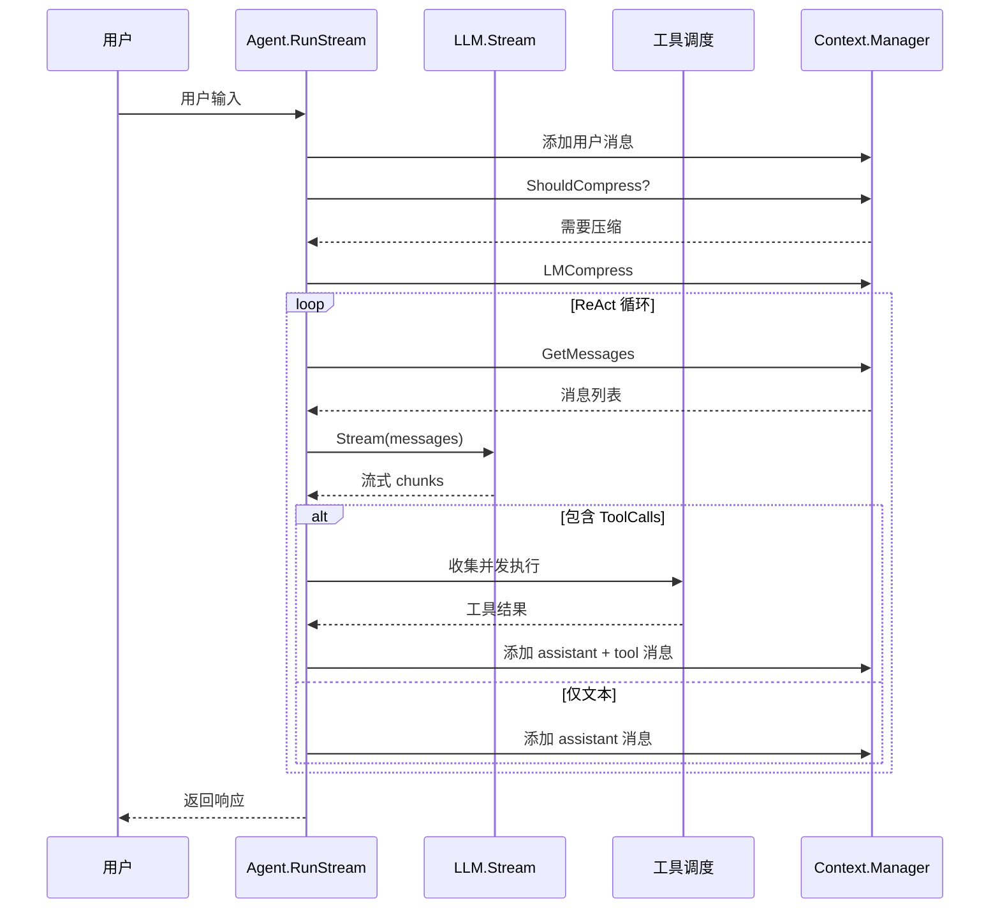
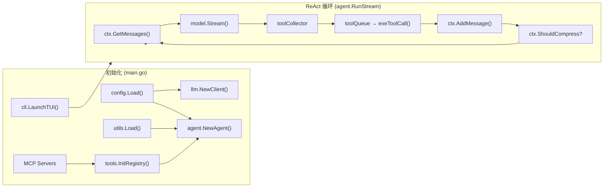

# 5hAgent 文档

轻量级 Go + Eino AI Agent 框架，支持 ReAct 循环、流式输出、工具执行、上下文压缩和 Skill 注入。

## 架构总览



## ReAct 循环流程



## 代码结构

```
5hAgent/
├── cmd/5hagent/
│   └── main.go                 # 程序入口：初始化 Agent、TUI、工具注册，启动交互界面
│
├── internal/
│   ├── agent/                  # Agent 核心
│   │   ├── agent.go           # ReAct 循环、流式 LLM 调用、上下文初始化、skill 注入
│   │   └── tool_use.go        # ToolCall 分片收集、单工具执行、结果格式化
│   │
│   ├── cli/                    # 终端 UI（TUI）
│   │   ├── tui.go             # Bubble Tea 主界面：对话面板 + 状态栏，/task /skill /compress 命令入口
│   │   ├── ui.go              # PrintError（stdout 退路）
│   │   └── markdown_stream.go # Markdown 终端渲染
│   │
│   ├── commands/               # Slash 命令处理
│   │   ├── skill.go           # /skill list/enable/disable
│   │   ├── task.go            # /task create/update/get/list/delete/archive/reopen
│   │   ├── compress.go        # /compress 手动触发上下文压缩
│   │   └── mcp.go             # /mcp list/add/remove/enable/disable
│   │
│   ├── context/                # 消息上下文管理
│   │   └── ctx.go             # Context 创建/克隆、消息存储、LLM 压缩
│   │
│   ├── llm/                    # LLM 客户端
│   │   └── client.go          # Eino Claude ChatModel 封装
│   │
│   ├── logger/                 # 日志与输出
│   │   ├── logger.go          # DEBUG/INFO/WARN/ERROR 带标签日志
│   │   ├── color.go           # ANSI 颜色
│   │   └── toolprint.go       # 工具调用格式化输出
│   │
│   ├── mcp/                    # MCP 协议定义
│   │   ├── mcp.go            # ServerConfig/ToolSpec，FullToolName
│   │   └── client_stdio.go   # StdioClient 实现
│   │
│   ├── skill/                  # 技能加载与管理
│   │   └── skill.go          # 从 .5hagent/skills/*/SKILL.md 加载
│   │
│   ├── task/                   # 任务列表持久化
│   │   ├── tasklist.go       # Task CRUD、Markdown 持久化、历史归档
│   │   └── task_actions.go   # TaskActionRequest 分发
│   │
│   ├── toolmeta/               # 工具元数据注册
│   │   └── toolmeta.go       # 工具分类（base/task/skill/mcp）、只读属性
│   │
│   ├── tools/                  # 工具实现
│   │   ├── registry.go       # 工具注册表 InitRegistry / GetAllTools / RegisterMCPTools
│   │   ├── read_file.go      # 读文件（offset/limit 范围）
│   │   ├── write_file.go     # 写文件
│   │   ├── edit.go           # 字符串替换编辑
│   │   ├── exec_shell.go     # 执行 shell 命令
│   │   ├── grep.go           # 文本搜索
│   │   ├── glob.go           # 文件模式匹配
│   │   ├── list_dir.go       # 目录列表
│   │   ├── task_tool.go      # TaskList 的 Eino Tool 封装
│   │   ├── skill_tool.go     # SkillManager 的 Eino Tool 封装
│   │   └── mcp_tool.go       # MCP 工具的 Eino Tool 封装
│   │
│   └── utils/                  # 公共工具函数
│       ├── utils.go           # Load(dir, name) 加载 prompt/*.md
│       └── tokenBudget.go    # TokenBudget 累计 token 上限检查
│
├── doc/                        # 文档
│   ├── README.md              # 本文件
│   ├── agent.md               # Agent 主循环、ReAct、工具执行
│   ├── tools.md               # 工具注册、并发策略
│   ├── context.md             # 消息上下文、LLM 压缩
│   ├── skill.md               # Skill 加载与注入
│   ├── commonds.md            # /skill 和 /task 命令
│   ├── mcp.md                 # MCP 模块
│   ├── cli.md                 # TUI 界面
│   ├── llm.md                 # LLM 客户端
│   ├── logger.md              # 日志模块
│   ├── prompt.md              # prompt 文件加载
│   └── task.md                # 任务管理
│
└── prompt/                     # System prompt 文件
    ├── main.md                # Agent 主 prompt
    ├── compress.md            # 上下文压缩 prompt
    ├── plan.md                # 规划 prompt
    └── worker.md              # Worker prompt
```

## 关键数据流



## 关键类型

| 类型 | 文件 | 作用 |
|------|------|------|
| `Agent` | `agent/agent.go` | ReAct 循环核心，协调 LLM/工具/上下文 |
| `TaskList` | `task/tasklist.go` | 任务列表（Markdown 持久化） |
| `Context` | `context/ctx.go` | 单次对话的消息历史 |
| `Manager` | `context/ctx.go` | 管理多个 Context，支持压缩 |
| `Skill.Manager` | `skill/skill.go` | 技能加载与启用状态 |
| `toolmeta.Meta` | `toolmeta/toolmeta.go` | 工具元数据（分类/只读/显示名） |
| `AppModel` | `cli/tui.go` | TUI 主界面状态管理 |
| `LLMClient` | `llm/client.go` | LLM 模型客户端封装 |

## 快速开始

```bash
# 构建
go build -o 5hagent cmd/5hagent/main.go

# 运行（需要配置 .env）
./5hagent

# Debug 模式
./5hagent --debug
```

## 内置命令

| 命令 | 说明 |
|------|------|
| `/skill list/enable/disable <name>` | 管理技能 |
| `/task create/update/get/list/delete <id>` | 管理任务 |
| `/compress` | 手动压缩上下文 |
| `/mcp list/add/remove <name>` | 管理 MCP 服务器 |

## 文档规则

- 文档必须和代码匹配，优先写当前实现
- 先给结构图，再给关键文件和关键函数
- 如果引用代码，优先使用相对路径链接

**最后更新**: 2026-04-30
