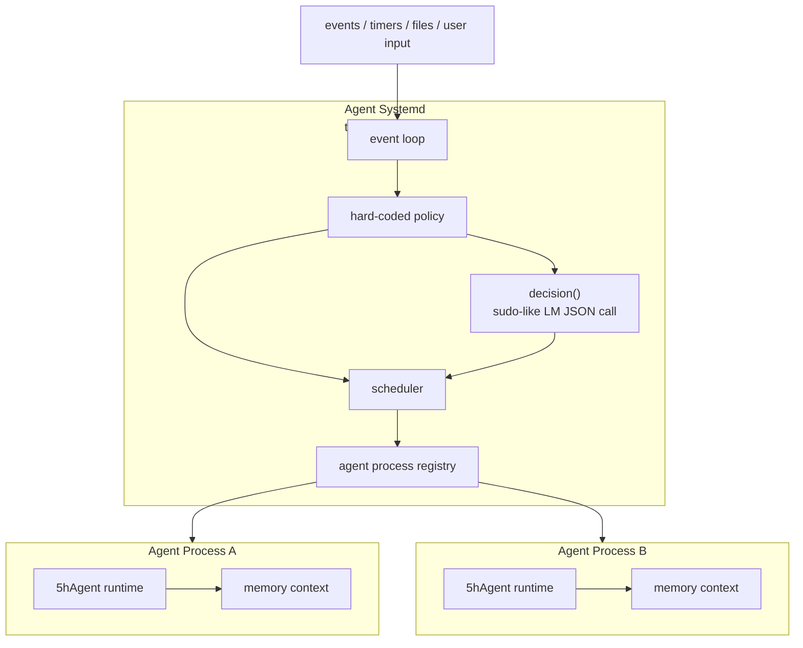

# Agent Systemd - 顶层调度层设计

> 由 GPT-5.5 于 2026-06-26 阅读 `internal/runtime/runtime.go`、`internal/agent/agent.go`、`internal/context/session.go`、`doc/runtime.md`、`doc/agent.md` 后生成。

## 摘要

下一阶段的顶层调度层正式命名为 Agent Systemd。这个名字取 systemd 的 supervisor / process manager 语义，但只是类比：最终目标是做一个极简、可靠的 Agent 调度框架，不是复刻操作系统。Agent Systemd 不替代当前 `internal/runtime`，而是站在 runtime 之上，把每个运行中的 Agent 看作一个独立进程，把 5hAgent runtime 看作执行引擎。Agent Systemd 本身应尽量保持 AI 无关；`decision` 只是纯规则判断不了时的受控升级点，类似 `sudo`，用一次 LM API 调用把字符串事实判断成结构化 JSON。



## 设计目标

- 把 Agent 抽象成进程：启动参数只包含提示词和退出条件，运行时上下文视作进程内存。
- 借鉴 OS 的进程调度和 supervisor 思路，但不追求完整 OS 语义。
- 保持上层调度 AI 无关：调度循环、事件处理、进程表、状态机和策略都用确定性代码实现。
- 只保留一个受控 AI 升级点：`decision` 函数调用一次 LM API，要求返回格式化 JSON，不允许自由文本驱动控制流。
- 保持 runtime 可复用：当前 `internal/runtime` 是执行引擎，一个调度层实例下可以启动多份 runtime。
- 支持事件触发：外部事件、文件变化、定时器、任务状态变化或人工输入都可以成为启动 Agent 的原因。

## 非目标

- 不在第一阶段实现完整 daemon、网络 API、分布式调度或持久化队列。
- 不让 LLM 直接控制 Harness 的主循环。
- 不共享不同 Agent 进程的上下文；跨进程通信必须走显式 IPC：事件、消息、报告或系统工具。
- 不由 Agent Systemd 自动落盘 Agent 上下文；上下文持久化必须是 Agent 内部显式行为。
- 不把顶层调度层写成新的大 Agent；它是调度约束，不是另一个 ReAct 循环。

## 核心概念

| 概念 | 含义 | 当前对应 |
| --- | --- | --- |
| `AgentSystemd` | 顶层 Agent 调度器，借鉴 supervisor / process manager | 最小调度链路已实现 |
| `AgentProcess` | 一个运行中的 Agent 实例，类似进程 | `runtime.New` + `RunTaskOnce` 的一次运行 |
| `RuntimeEngine` | 执行 Agent 的引擎 | `internal/runtime` |
| `Event` | 触发调度的外部或内部事实 | 文件变化、task 更新、timer、manual input |
| `Decision` | 纯规则无法判断时的受控 LM 升级点，返回 JSON | 最小 caller 和 JSON 校验已实现 |
| `ProcessTable` | Agent 进程表，记录状态和资源 | 内存进程表已实现 |
| `Policy` | 硬编码调度规则摘要 | 最小结构已实现 |
| `Project` | Agent 执行任务时所在的项目工作空间目录 | 由调度环境决定，不进入 PromptSpec |
| `MetaDisk` | Agent Systemd 的 meta 级持久化目录 | `~/.5hAgent` |

## 分层边界

```text
Agent Systemd
  - 收事件
  - 维护进程表
  - 做调度
  - 必要时调用 decision()
  - 启动/停止 AgentProcess

AgentProcess
  - 持有启动提示词和退出条件
  - 持有独立内存上下文
  - 调用 RuntimeEngine 执行任务
  - 产生 report/worklog/event

RuntimeEngine
  - 初始化配置、LLM、工具、MCP、TaskList、Context
  - 调用 Agent.RunStream
  - 写报告和 work log
```

顶层调度层不直接执行工具，不直接改 Agent 上下文，不直接拼 prompt。它只管理进程级生命周期。

## Project 和 MetaDisk

```text
~/.5hAgent/
  - Agent Systemd meta 级持久化
  - process table snapshot
  - event log
  - explicit sessions
  - system-level audit

<Project>/
  - Agent 工作空间
  - 代码、文档、构建产物
  - 工具调用产生的普通文件
  - 项目自己的 .5hagent/ 数据
```

规则：

- `~/.5hAgent` 是 Agent Systemd 的 meta 级持久化目录，可以类比成调度层的盘。
- Project 是每个 AgentProcess 的工作空间目录。
- Project 不属于传给 Agent 的 `PromptSpec/ExitSpec`，而是进程运行环境。
- Agent 工具调用在 Project 下写出的代码、文档、报告、构建产物，不算 meta 级持久化。
- meta 级状态只能写到 `~/.5hAgent`，不要散落到 Project。
- Project 可以有自己的 `.5hagent/`，但它表示项目运行数据，不表示 Agent Systemd 的 meta 状态。

## Agent 进程模型

每个 AgentProcess 至少包含：

```go
type AgentProcess struct {
    ID        string
    Name      string
    State     ProcessState
    Spec      ProcessSpec
    StartedAt time.Time
    EndedAt   time.Time
    LastEvent Event
}
```

`ProcessSpec` 只描述进程启动必需信息：

```go
type ProcessSpec struct {
    Prompt PromptSpec
    Exit   ExitSpec
}

type PromptSpec struct {
    System string
    Skills []SkillRef
}

type SkillRef struct {
    Name        string
    Description string
}

type ExitSpec struct {
    Condition string
    Deadline  time.Time
    MaxTurns  int
}
```

约束：

- 启动 AgentProcess 时只传 `PromptSpec` 和 `ExitSpec`。
- `PromptSpec` 目前只包含两部分：system prompt、已激活 skill 的 `Name/Description` 列表。
- Agent Systemd 进程模式下，`PromptSpec.System` 替代默认 `main.md` system prompt。
- Agent Systemd 只注入 `SkillRef.Name/Description` 摘要；完整 skill 正文必须由 Agent 通过 `skill.skill get` 显式查看。
- `ExitSpec` 是调度层判断进程是否应停止的唯一外部条件。
- Context 是进程内存；进程退出后销毁。
- session 是可选持久化文件，不是默认上下文载体。
- 需要落盘上下文时，必须由 Agent 调用系统级工具显式创建 session。
- runtime 绑定属于执行期私有状态，骨架阶段不暴露为 `AgentProcess` 字段。

## 上下文和持久化

```text
AgentProcess memory
  - messages
  - tool results
  - temporary reasoning state
  - pinned/audit metadata

Persistent session
  - stored under ~/.5hAgent
  - only created by Agent syscall/tool
  - not created automatically by Agent Systemd
  - survives process exit
```

必须修正的当前冲突：

- 当前 `runtime.New` 默认创建 `~/.5hAgent/sessions` manager。
- 当前 `RunTaskOnce` 会创建 task session。
- 目标模型要求：默认 context 只在内存；session 持久化改为 Agent 显式系统工具行为。
- 所有 meta 级持久化统一落到 `~/.5hAgent`；Project 下的文件是工具调用产物，不是 meta 盘。

当前系统工具：

| 系统工具 | 作用 |
| --- | --- |
| `sys.session.create` | 创建持久化 session，并把当前内存 context 绑定到该 session |
| `sys.session.save` | 将当前 context 写入已绑定 session |
| `sys.session.drop` | 解除绑定，不删除文件 |
| `sys.ipc.send` | 向另一个 AgentProcess 发送短消息事件 |
| `sys.ipc.recv` | 拉取发给当前 AgentProcess 的消息 |

这些工具属于系统调用层，不属于普通业务工具。它们需要 AgentProcess 身份和权限。

## 事件模型

第一版事件可以保持简单结构：

```go
type Event struct {
    ID        string
    Type      string
    Source    string
    ProcessID string
    Risk      string
    Payload   json.RawMessage
    CreatedAt time.Time
}
```

常见事件：

| Type | 触发来源 | 典型动作 |
| --- | --- | --- |
| `task.created` | Project 内任务变化 | 启动一个 AgentProcess |
| `task.failed` | runtime report | 判断是否重试或交给人工 |
| `timer.tick` | 定时器 | 扫描任务和进程状态 |
| `manual.request` | 用户输入 | 创建任务或启动指定 Agent |
| `process.exited` | AgentProcess 结束 | 收集报告并更新进程表 |
| `process.start` | 外部调度入口 | 从 payload 解析 `ProcessSpec` 并启动 AgentProcess |
| `ipc.message` | AgentProcess 系统工具 | 投递给目标 AgentProcess |
| `file.changed` | 单文件 watcher | 通知上层重新读取 Project 文件 |

## Agent 间通信

参考进程 IPC，不共享内存。

| IPC 形态 | Agent Systemd 语义 | 第一版是否做 |
| --- | --- | --- |
| signal | 短控制事件：stop/retry/wakeup | 做 |
| pipe | 单向短消息流 | 做接口 |
| file | report/session/artifact | 复用现有文件 |
| shared memory | 共享上下文 | 不做 |
| socket | 长连接服务 | 后续再说 |

规则：

- Agent 之间不能直接读写彼此 context。
- Agent 之间只交换短消息、事件、报告路径或 artifact 路径。
- 大内容写 artifact，小消息只传摘要和路径。
- Agent Systemd 负责投递和权限检查，不理解业务内容。

## 调度模型

调度循环应是确定性的：

```go
func (s *AgentSystemd) Run(ctx context.Context, runner ProcessRunner) error {
    for {
        event := s.NextEvent(ctx)
        s.ApplyPolicy(event)
        if s.NeedsDecision(event) {
            decision := s.Decision(ctx, event)
            s.ApplyDecision(decision)
        }
        s.Dispatch()
    }
}
```

当前硬编码 policy：

- 同一个事件 ID 不重复启动两个 Agent。
- 同一个 Agent 名称可设置并发上限。
- `timer.tick` 扫描 `Deadline/MaxTurns`，满足退出条件时标记 stopped。
- 失败任务最多重试 N 次。
- stalled 当前用 `LastActiveAt` + `timer.tick` 做最小检测，后续可接真实输出心跳。
- 高风险事件当前通过 `risk=high` 只记录，不自动启动 Agent，不触发 decision。

## decision 函数

`decision` 不是主调度逻辑，只是类似 `sudo` 的受控升级点。普通调度必须先用硬编码规则处理；只有需要理解字符串、报告摘要或模糊失败原因时，才允许调用一次 LM。它只做判断，不执行动作。

输入是结构化事实：

```json
{
  "event": {},
  "processes": [],
  "policy": {
    "dedup_event_id": true,
    "single_process": true,
    "high_risk_wait": true,
    "max_retries": 1,
    "stalled_after": "30m0s"
  }
}
```

输出必须是 JSON：

```json
{
  "action": "start_agent",
  "reason": "new pending task needs an isolated worker",
  "process_spec": {
    "prompt": {
      "system": "You are a focused debugging agent.",
      "skills": [
        {"name": "systematic-debugging", "description": "Debug by reproducing, isolating, and verifying."}
      ]
    },
    "exit": {
      "condition": "report written or unrecoverable blocker found",
      "max_turns": 12
    }
  }
}
```

允许的 action 第一版控制在：

| Action | 含义 |
| --- | --- |
| `start_agent` | 启动一个新 AgentProcess |
| `wait` | 不动作，等待更多事件 |
| `retry_agent` | 用相同或调整后的 spec 重试 |
| `escalate` | 需要人工判断 |
| `stop_agent` | 停止某个 AgentProcess；需要 `target_process_id` |

必须校验：

- JSON parse 成功。
- action 在枚举内。
- `process_spec.prompt.system` 非空。
- `process_spec.prompt.skills` 只包含 `name/description`，不包含 skill 正文。
- `process_spec.exit` 至少包含一个退出条件。
- `stop_agent.target_process_id` 非空。
- 不允许 decision 返回任意 shell 命令。
- decision 不能绕过硬编码 policy；只能给 policy 提供结构化判断结果。

## 与当前 runtime 的关系

当前 `internal/runtime` 已经具备执行引擎雏形：

- `runtime.New` 初始化配置、LLM、Agent、工具、MCP、TaskList、Context。
- `RunTaskOnce` 从 `.5hagent/task.md` 选择任务并执行。
- work log 写入 `.5hagent/agents/<agent-name>/logs/`。
- report 写入 `.5hagent/reports/<task-id>.md`。

顶层调度层只需要把这些能力包装成进程生命周期：

```text
StartProcess(spec)
  -> build PromptSpec
  -> runtime.NewInMemory(...)
  -> Runtime.RunProcess(proc)
  -> collect report/worklog
  -> emit process.exited
```

后续如果要同一 OS 下启动多份 runtime，应避免全局状态污染，重点检查：

- `tools.Registry` 已经实例化工具列表和 MCP server map；包级默认 registry 仍保留兼容入口。
- `toolmeta` 已收敛为类型和 fallback；工具元数据由 `tools.Registry` 实例持有。
- `logger` sink 仍是包级全局变量，目前只有保存/恢复保护。
- MCP client 生命周期需要绑定到单个 runtime。
- `runtime.Options.ProjectDir` 已固定 Project root；默认空值仍来自启动时 cwd。
- `runtime.NewInMemory` 默认使用内存 context，但保留 session store 供 `sys.session` 显式持久化。

## TODO 小目标

### A. 接口骨架

- A1. 已完成：新增 `internal/systemd` 包。
- A2. 已完成：定义 `AgentSystemd`、`AgentProcess`、`ProcessSpec`、`PromptSpec`、`ExitSpec`、`Event`、`Decision`。
- A3. 已完成：给每个函数写中文头注释：功能、参数、调用下层、步骤。
- A4. 已完成：移除过早的 `BuildPrompt` 和测试文件；IPC 在事件链路稳定后作为 `sys.ipc` 最小内存队列落地。

### B. Prompt 启动模型

- B1. 已完成：`SkillRefs` 从已激活 skill 列表提取 `Name/Description`，生成 `PromptSpec.Skills`。
- B2. 已完成：`SkillRefs` 不读取 skill 正文。
- B3. 人工 review：PromptSpec 只含 system、skill name、skill description。
- B4. 进入实现阶段后，再决定是否需要 `BuildPrompt`；一行包装逻辑优先内联。

### C. 内存上下文模型

- C1. 已完成：新增 `runtime.NewInMemory`，可创建不绑定 session store 的 Runtime。
- C2. 标记当前冲突点：`runtime.New`、`RunTaskOnce`、`openMessageCtx`。
- C3. 已完成：`context.Manager` 增加 `BindSession/SaveSession/DropSession`，并注册 `sys.session create/save/drop`。
- C4. 人工 review：AgentProcess 退出后内存 context 不可恢复；只有显式 session 才落盘。
- C5. 明确 meta 级 session 路径只在 `~/.5hAgent` 下。

### D. 退出条件

- D1. 定义 `ExitSpec` 最小字段：`Condition/Deadline/MaxTurns`。
- D2. 已完成：定义并最小实现 `ShouldExit(proc, event) bool`。
- D3. 人工 review：满足 max turns、deadline、完成事件时退出。

### E. 事件和 IPC

- E1. 先只定义 `Event` 类型。
- E2. 已完成：`Event.ProcessID` 标记目标进程，空值表示广播事件。
- E3. 禁止共享 context，只允许短消息和 artifact 路径。
- E4. 人工 review：A 进程不能读 B 进程 context。
- E5. 已完成：`IPCMessage`、`Send`、`Recv` 提供内存短消息队列。
- E6. 已完成：`AgentSystemd.RunProcess` 注入 `ProcessID/IPC`，并注册 `sys.ipc send/recv` 工具。

### F. decision

- F1. 定义 `DecisionInput` / `DecisionResult`。
- F2. 已完成：定义 `Decision(ctx, caller, input) (DecisionResult, error)`，caller 负责唯一 LM 调用。
- F3. 已完成：`ParseDecision` 校验 JSON action enum、PromptSpec、ExitSpec。
- F4. 人工 review：非法 JSON、缺退出条件、skill 正文泄漏都失败。

### G. 单进程调度

- G1. 已完成：`StartProcess(spec)` 只接收 `ProcessSpec`。
- G2. 已完成：定义 `ProcessRunner`，由外部执行引擎运行进程，不复制 ReAct。
- G3. 已完成：`RunProcess` 当前只允许一个进程运行；进程表和本地 PID 由最小 mutex 保护。
- G4. 已完成：`Emit` 对非空事件 ID 去重。
- G5. 已完成：`RunProcess` 结束后自动投递 `process.exited/process.failed` 事件；`Runtime.RunProcess` 写进程 report/worklog，并把路径回填到结束事件 payload。

## 已落地最小实现

- `internal/systemd.New()`：创建内存进程表。
- `SkillRefs(skills)`：从已激活 skill 快照提取 `Name/Description`，不读取 skill 正文。
- `StartEvent(type, id, source, spec)`：把 `ProcessSpec` 编码成启动类事件 payload，避免外部重复拼 JSON。
- `StartProcess(spec)`：校验 `PromptSpec/ExitSpec`，登记本地进程，不启动 runtime。
- `ListProcesses()`：返回进程表快照，不暴露内部 map 和指针。
- `Emit(event)` / `Run(ctx, runner)`：内存事件队列和最小事件循环；`Emit` 对非空事件 ID 去重并唤醒循环；`Run` 等待事件直到 ctx 取消。
- `StartTimer(ctx, interval)`：周期性发出 `timer.tick` 事件；ctx 取消时停止。
- `StartSource(ctx, source)`：接入外部事件源，循环读取 `source.Next(ctx)` 并 `Emit`。
- `NewFileEventSource(path, type, source, interval)`：轮询单个文件 mtime/size，变化时产生 `file.changed` 或调用方指定事件；首次读取只建立基线。
- `RunWithDecision(ctx, runner, caller)`：在 `task.failed` 事件后调用受控 decision；同一失败 key 默认最多触发一次，并用 `ApplyDecision` 执行返回动作。
- `DispatchEvent(ctx, runner, event)`：支持 `process.start/task.created/manual.request` 从 payload 解析 `ProcessSpec` 并异步启动；`risk=high` 只记录不启动；其他事件应用 `process.exited/process.failed/process.stopped`，不启动 watcher。
- `timer.tick`：扫描进程退出条件，满足 `Deadline/MaxTurns` 或超过 stalled 阈值时 cancel 并标记 stopped。
- `RunProcess(ctx, runner, spec)`：同步执行单个进程，runner 由外部注入；单进程检查和进程登记受锁保护；为运行中的进程保存 cancel；执行结束后自动投递带 report/worklog 路径的 `process.exited/process.failed` 事件。
- `Runtime.RunProcess(ctx, proc)`：runtime 适配器，先把 `PromptSpec.System` 和 `SkillRef Name/Description` 注入内存 context，再调用 `Agent.RunStream`，最后写 Project 下的 `.5hagent/reports/<pid>.md` 和 `.5hagent/agents/<pid>/logs/`。
- `Runtime.CallDecision(ctx, input)`：具体 `DecisionCaller` 适配器，使用未绑定工具的模型执行一次 `Generate`，要求只返回 JSON。
- `ShouldExit(proc, event)`：按进程状态、目标事件、`MaxTurns`、`Deadline` 判断退出。
- `Policy`：decision 输入包含 `dedup_event_id/single_process/high_risk_wait/max_retries/stalled_after` 的硬编码规则摘要。
- `runtime.NewInMemory(...)`：创建默认不绑定 session 的 Runtime，但保留 session store 供 `sys.session.create` 显式持久化；现有 `runtime.New` 默认行为不变。
- `sys.session create/save/drop`：显式创建、保存、解除当前 context 的 session 绑定。
- `Decision(ctx, caller, input)`：编码结构化输入，调用一次外部 `DecisionCaller`，再用 `ParseDecision` 校验输出。
- `decisionInput(event)`：为 decision 填入当前事件、进程表快照和硬编码 policy 摘要。
- `ParseDecision(data)`：解析并校验 decision JSON，拒绝未知字段。
- `ApplyDecision(ctx, runner, decision)`：已校验 decision 的最小执行入口；执行 `start_agent/retry_agent`，`stop_agent` cancel 并标记目标进程 stopped，`wait/escalate` 暂不动作。
- `sys.ipc send/recv`：内存 IPC 短消息队列，不共享 context。

## 当前增强项

- Agent Systemd 进程模式采用“进程 prompt 替代默认 main prompt”；完整 skill 正文由 `skill.skill get` 显式获取。
- `tools.Registry` 已实例化工具列表、工具元数据和 MCP map；包级默认 registry 仍保留兼容入口。

### H. 多进程前置改造

- H1. 已完成：把 `tools` registry 从包级全局收敛到 runtime 实例；工具列表、工具元数据和 MCP server map 都由 `tools.Registry` 持有。
- H2. 已完成基础保护：`logger.PushToolEventSink` 支持保存/恢复旧 sink，TUI/headless 不再无条件清空外层 sink；完全实例化仍需后续重构。
- H3. 移除并发路径对 `os.Getwd()` 的依赖。
- H4. 已完成当前可见边界：MCP 工具注册到 runtime 的实例 registry；MCP client 仍由 `Runtime.Close` 关闭。
- H5. 已完成基础入口：`runtime.Options.ProjectDir` 可显式指定 Project，任务、worklog、report、项目 skill 加载都走该 Project 的 `.5hagent`；base 文件工具和 `exec_shell` 的相对路径都跟随 runtime workspace root，绝对路径仍优先。

### H1 拆解：tools registry 实例化

- H1.1. 已完成：新增 `tools.Registry` 结构体，包住工具列表、工具元数据和 MCP server map。
- H1.2. 已完成：包级 registry 函数先代理默认 registry，保持兼容入口。
- H1.3. 已完成：`Runtime` 持有自己的 registry；`WithTools` 从实例 registry 取工具。
- H1.4. 已完成：`context.context`、`sys.session`、MCP 工具注册到当前 runtime registry。
- H1.5. 已完成基础防护：`Registry.All/GetMCPServers` 返回副本，MCP 注册加锁；两个 Runtime 不共享工具列表、工具元数据和 MCP server map。

### I. 文档同步

- I1. 更新 `doc/runtime.md`：区分内存 context 和显式 session。
- I2. 更新 `doc/context.md`：session 是 Agent 系统工具创建的持久化对象。
- I3. 更新 `AGENTS.md`：记录 Agent Systemd 的启动参数和实现纪律。
- I4. 更新开发日志：记录当前设计要求和现有冲突点。

## 实现纪律

Agent Systemd 的实现必须继续保持本项目的极简代码风格。第一轮提交只允许写类型、函数签名和中文注释，不写具体实现；随后先人工或自行 review 调用层级，确认没有过度抽象、一次性短函数和多余状态，再补实现。

签名阶段每个文件和函数至少说明：

- 文件职责、被哪些模块调用、是否有全局状态。
- 函数功能、参数含义、会调用哪些下层函数。
- 复杂函数的步骤，例如：接收事件 -> 套用硬编码策略 -> 必要时用 `decision` 升级判断 -> 调度 AgentProcess。

实现阶段约束：

- 优先复用 `internal/runtime` 已有入口，避免重写执行引擎。
- 优先让状态集中在少量结构体里，不为中间值创造冗余字段。
- 不为只调用一次且无复用价值的短逻辑新建包级 helper。
- 对不确定的路径、策略阈值、设备名或调度参数打 `TODO`，方便人工 review。
- 在人工 review 之前不要主动提交大段未审实现。

## 当前状态

已完成 Agent Systemd 的最小调度链路：进程表、内存事件队列、timer 事件源、外部事件源接口、单文件轮询 watcher、`PromptSpec/ExitSpec`、`runtime.NewInMemory`、runtime runner、decision caller、`sys.session`、`sys.ipc`、runtime 级 tools registry、`ProjectDir`、base tools workspace root、进程 report/worklog artifact 和 logger sink 保存/恢复保护。下一步主要是增强项：把文件事件解析成具体任务事件、logger 完全实例化和人工 review。
