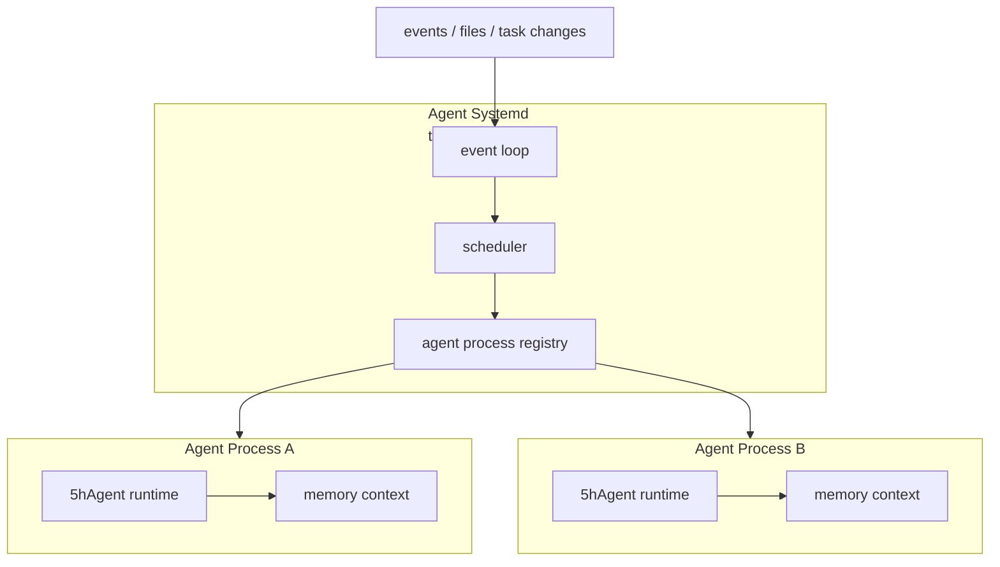

# Agent Systemd - 顶层调度层设计

> 由 GPT-5.5 于 2026-06-26 阅读 `internal/runtime/runtime.go`、`internal/agent/agent.go`、`internal/context/session.go`、`doc/runtime.md`、`doc/agent.md` 后生成。


## 设计目标

- 把 Agent 抽象成进程：启动参数只包含提示词和退出条件，运行时上下文视作进程内存。
- 借鉴 OS 的进程调度和 supervisor 思路，但不追求完整 OS 语义。
- 保持上层调度 AI 无关：调度循环、事件处理、进程表和状态机都用确定性代码实现。
- 保持 runtime 可复用：当前 `internal/runtime` 是执行引擎，一个调度层实例下可以启动多份 runtime。
- 支持事件触发：外部事件、文件变化或任务状态变化都可以成为启动 Agent 的原因。

## 非目标

- 不在第一阶段实现完整 daemon、网络 API、分布式调度或持久化队列。
- 不让 LLM 直接控制 Harness 的主循环。
- 不共享不同 Agent 进程的上下文；跨进程通信必须走显式 IPC：事件、消息、报告或系统工具。
- 不由 Agent Systemd 自动落盘 Agent 上下文；上下文持久化必须是 Agent 内部显式行为。
- 不把顶层调度层写成新的大 Agent；它是调度约束，不是另一个 ReAct 循环。


## 摘要

下一阶段的顶层调度层正式命名为 Agent Systemd。这个名字取 systemd 的 supervisor / process manager 语义，但只是类比：最终目标是做一个极简、可靠的 Agent 调度框架，不是复刻操作系统。Agent Systemd 不替代当前 `internal/runtime`，而是站在 runtime 之上，把每个运行中的 Agent 看作一个独立进程，把 5hAgent runtime 看作执行引擎。Agent Systemd 本身保持 AI 无关，只做确定性的 task supervisor。



## 核心概念

| 概念 | 含义 | 当前对应 |
| --- | --- | --- |
| `AgentSystemd` | 顶层 Agent 调度器，借鉴 supervisor / process manager | 最小调度链路已实现 |
| `AgentProcess` | 一个运行中的 Agent 实例，类似进程 | `runtime.New` + `RunTaskOnce` 的一次运行 |
| `RuntimeEngine` | 执行 Agent 的引擎 | `internal/runtime` |
| `Event` | 触发调度的外部或内部事实 | 文件变化、task 更新、进程结束 |
| `ProcessTable` | Agent 进程表，记录状态和资源 | 内存进程表已实现 |
| `Project` | Agent 执行任务时所在的项目工作空间目录 | 由调度环境决定，不进入 ProcessSpec |
| `MetaDisk` | Agent Systemd 的 meta 级持久化目录 | `~/.5hAgent` |

## 分层边界

```text
Agent Systemd
  - 收事件
  - 维护进程表
  - 做调度
  - 启动/停止 AgentProcess

AgentProcess
  - 持有启动提示词和退出条件
  - 持有独立内存上下文
  - 调用 RuntimeEngine 执行任务
  - 产生 report/worklog/event

RuntimeEngine
  - 初始化配置、LLM、工具、MCP、TaskList、Context
  - 调用 Agent.RunStream
  - 写报告和 work log
```

顶层调度层不直接执行工具，不直接改 Agent 上下文，不直接拼 prompt。它只管理进程级生命周期。

## Project 和 MetaDisk

```text
~/.5hAgent/
  - Agent Systemd meta 级持久化
  - process table snapshot
  - event log
  - explicit sessions
  - system-level audit

<Project>/
  - Agent 工作空间
  - 代码、文档、构建产物
  - 工具调用产生的普通文件
  - 项目自己的 .5hagent/ 数据
```

规则：

- `~/.5hAgent` 是 Agent Systemd 的 meta 级持久化目录，可以类比成调度层的盘。
- Project 是每个 AgentProcess 的工作空间目录。
- Project 不属于传给 Agent 的 `ProcessSpec`，而是进程运行环境。
- Agent 工具调用在 Project 下写出的代码、文档、报告、构建产物，不算 meta 级持久化。
- meta 级状态只能写到 `~/.5hAgent`，不要散落到 Project。
- Project 可以有自己的 `.5hagent/`，但它表示项目运行数据，不表示 Agent Systemd 的 meta 状态。

## Agent 进程模型

每个 AgentProcess 至少包含：

```go
type AgentProcess struct {
    ID        string
    Name      string
    State     ProcessState
    Spec      ProcessSpec
    StartedAt time.Time
    EndedAt   time.Time
}
```

`ProcessSpec` 只描述进程启动必需信息：

```go
type ProcessSpec struct {
    SystemPrompt  string
    ExitCondition string
}
```

约束：

- 启动 AgentProcess 时只传 `SystemPrompt` 和 `ExitCondition`。
- Agent Systemd 进程模式下，`SystemPrompt` 替代默认 `main.md` system prompt。
- `ExitCondition` 只作为运行提示和报告字段；进程实际结束由 `RunProcess` 返回决定。
- Context 是进程内存；进程退出后销毁。
- session 是可选持久化文件，不是默认上下文载体。
- 需要落盘上下文时，必须由 Agent 调用系统级工具显式创建 session。
- runtime 绑定属于执行期私有状态，骨架阶段不暴露为 `AgentProcess` 字段。

## 上下文和持久化

```text
AgentProcess memory
  - messages
  - tool results
  - temporary reasoning state
  - pinned/audit metadata

Persistent session
  - stored under ~/.5hAgent
  - managed by runtime/context session manager
  - not created automatically by Agent Systemd
  - survives process exit
```

当前职责边界：

- 当前 `runtime.New` 默认创建 `~/.5hAgent/sessions` manager。
- 当前 `RunTaskOnce` 会创建 task session。
- Agent Systemd 进程模式默认 context 只在内存。
- `sys.session` 不再注册为 LLM 可见工具，避免 daemon/AgentProcess 定义第二套持久化语义。
- 所有 meta 级持久化统一落到 `~/.5hAgent`；Project 下的文件是工具调用产物，不是 meta 盘。

当前系统工具：

| 系统工具 | 作用 |
| --- | --- |
| `sys.ipc.send` | 向另一个 AgentProcess 发送短消息事件 |
| `sys.ipc.recv` | 拉取发给当前 AgentProcess 的消息 |

这些工具属于系统调用层，不属于普通业务工具。它们需要 AgentProcess 身份和权限。

## 事件模型

第一版事件可以保持简单结构：

```go
type Event struct {
    ID        string
    Type      string
    Source    string
    ProcessID string
    Payload   json.RawMessage
    CreatedAt time.Time
}
```

常见事件：

| Type | 触发来源 | 典型动作 |
| --- | --- | --- |
| `task.created` | Project 内任务变化 | 启动一个 AgentProcess |
| `process.exited` | AgentProcess 结束 | 收集报告并更新进程表 |
| `ipc.message` | AgentProcess 系统工具 | 投递给目标 AgentProcess |
| `file.changed` | 单文件 watcher | 通知上层重新读取 Project 文件 |

## Agent 间通信

参考进程 IPC，不共享内存。

| IPC 形态 | Agent Systemd 语义 | 第一版是否做 |
| --- | --- | --- |
| signal | 短控制事件：stop/retry/wakeup | 做 |
| pipe | 单向短消息流 | 做接口 |
| file | report/session/artifact | 复用现有文件 |
| shared memory | 共享上下文 | 不做 |
| socket | 长连接服务 | 后续再说 |

规则：

- Agent 之间不能直接读写彼此 context。
- Agent 之间只交换短消息、事件、报告路径或 artifact 路径。
- 大内容写 artifact，小消息只传摘要和路径。
- Agent Systemd 负责投递和权限检查，不理解业务内容。

## 调度模型

调度循环应是确定性的：

```go
func (s *AgentSystemd) Run(ctx context.Context, runner ProcessRunner) error {
    for {
        event, ok := s.nextEvent(ctx)
        if !ok { return ctx.Err() }
        if err := s.dispatch(ctx, runner, event); err != nil { return err }
    }
}
```

当前硬编码规则：

- 非空事件 ID 去重。
- 同一时间只允许一个 running AgentProcess。
- 只有 `task.created` 能启动 AgentProcess。
- `process.exited/process.failed` 只更新进程状态。

## 与当前 runtime 的关系

当前 `internal/runtime` 已经具备执行引擎雏形：

- `runtime.New` 初始化配置、LLM、Agent、工具、MCP、TaskList、Context。
- `RunTaskOnce` 从 `.5hagent/task.md` 选择任务并执行。
- work log 写入 `.5hagent/agents/<agent-name>/logs/`。
- report 写入 `.5hagent/reports/<task-id>.md`。

顶层调度层只需要把这些能力包装成进程生命周期：

```text
RunProcess(spec)
  -> systemd 创建 AgentProcess
  -> runtime.NewInMemory(...)
  -> Runtime.RunProcess(proc, ipc)
  -> collect report/worklog
  -> emit process.exited
```

后续如果要同一 OS 下启动多份 runtime，应避免全局状态污染，重点检查：

- `tools.Registry` 已经实例化工具列表和 MCP server map；包级默认 registry 仍保留兼容入口。
- `toolmeta` 已收敛为类型和 fallback；工具元数据由 `tools.Registry` 实例持有。
- Agent 工具事件 sink 已挂到 Agent 实例；logger 包级 sink 只保留兼容旧直接调用路径。
- MCP client 生命周期需要绑定到单个 runtime。
- `runtime.Options.ProjectDir` 已固定 Project root；默认空值仍来自启动时 cwd。
- `runtime.NewInMemory` 默认使用内存 context；session store 属于 runtime/context 内部能力，不再通过 LLM 工具暴露给 AgentProcess。

## 实施状态

### 当前实现摘要

- `internal/systemd` 是纯调度核心，只依赖标准库；执行层由 `ProcessRunner` 接口接入。
- 启动输入固定为 `ProcessSpec{SystemPrompt, ExitCondition}`；systemd 不读取或填充 skill 列表。
- `runtime.NewInMemory` 提供默认不绑定 session 的运行时；Agent Systemd 不再通过工具定义独立 session 持久化语义。
- `Event.ProcessID` 标记目标进程；IPC 协议类型在 `internal/ipctypes`，只通过 `Message{from,to,summary,artifact}` 传短消息或 artifact 路径。
- `Run(ctx, runner)` 是唯一调度循环入口；当前只执行确定性 task supervisor 规则。
- `RunProcess(ctx, runner, spec)` 创建进程、调用 runner、投递 `process.exited/process.failed`，report/worklog artifact 路径保存在 `AgentProcess`。
- `task.created` 使用独立 `TaskCreatedPayload`；dispatch 对 payload 做严格 JSON 解析。
- 非空事件 ID 会进入 `seen` 去重表，避免重复处理。
- `tools.Registry`、toolmeta、MCP map 和 Agent tool event sink 已实例化到 runtime/Agent，降低多 Runtime 互相污染。
- `5hagent daemon` 已接入最小运行期路径：启动 systemd、投递当前 task、监听 task 文件事件源，并用当前 runtime 作为 runner。

## 已落地最小实现

- `internal/systemd.New()`：创建内存进程表。
- `ListProcesses()`：返回进程表快照，不暴露内部 map 和指针。
- `Emit(event)` / `Run(ctx, runner)`：内存事件队列和最小事件循环；`Emit` 对非空事件 ID 去重并唤醒循环；`Run` 等待事件直到 ctx 取消。
- `StartSource(ctx, source)`：接入外部事件源，循环读取 `source.Next(ctx)` 并 `Emit`。
- `NewFileEventSource(path, type, source, interval)`：轮询单个文件 mtime/size，变化时产生 `file.changed` 或调用方指定事件；首次读取只建立基线。
- `runtime.NewTaskFileEventSource(list, interval, builder)`：复用 `TaskList` 读取 `.5hagent/task.md`，在文件变化后选择 `in_progress/pending` 任务，并生成含 `TaskCreatedPayload` 的 `task.created` 事件。
- 包内 `dispatch(ctx, runner, event)`：支持 `task.created` 从 payload 解析 `ProcessSpec` 并异步启动；其他事件应用 `process.exited/process.failed`，不启动 watcher。
- `RunProcess(ctx, runner, spec)`：同步执行单个进程，runner 由外部注入；单进程检查和进程登记受锁保护；为运行中的进程保存 cancel；执行结束后自动投递 `process.exited/process.failed` 事件。
- `Runtime.RunProcess(ctx, proc, ipc)`：runtime 适配器，先把 `ProcessSpec.SystemPrompt` 注入内存 context，再调用 `Agent.RunStream`，最后写 Project 下的 `.5hagent/reports/<task-id>.<pid>.<timestamp>.md` 和 `.5hagent/agents/<pid>/logs/<timestamp>-<task-id>.md`。
- `runtime.NewInMemory(...)`：创建默认不绑定 session 的 Runtime；现有 `runtime.New` 默认行为不变。
- `5hagent daemon [--poll <duration>]`：启动最小 Agent Systemd 循环，先投递当前任务，再监听 task 文件变化。
- `sys.ipc send/recv`：内存 IPC 短消息队列，不共享 context。

## 已完成增强项

- Agent Systemd 进程模式采用“进程 prompt 替代默认 main prompt”；完整 skill 正文由 `skill.skill get` 显式获取。
- `tools.Registry` 已实例化工具列表、工具元数据和 MCP map；包级默认 registry 仍保留兼容入口。
- `runtime.Options.ProjectDir` 固定 Project root；任务、worklog、report、项目 skill 和 base tools workspace root 都跟随该 Project。
- 文档已同步到 `doc/runtime.md`、`doc/context.md`、`doc/tools.md`、`AGENTS.md` 和开发日志。

## 实现纪律

Agent Systemd 的实现必须继续保持本项目的极简代码风格。第一轮提交只允许写类型、函数签名和中文注释，不写具体实现；随后先人工或自行 review 调用层级，确认没有过度抽象、一次性短函数和多余状态，再补实现。

签名阶段每个文件和函数至少说明：

- 文件职责、被哪些模块调用、是否有全局状态。
- 函数功能、参数含义、会调用哪些下层函数。
- 复杂函数的步骤，例如：接收事件 -> 解析 payload -> 启动 AgentProcess -> 等待结束事件。

实现阶段约束：

- 优先复用 `internal/runtime` 已有入口，避免重写执行引擎。
- 优先让状态集中在少量结构体里，不为中间值创造冗余字段。
- 不为只调用一次且无复用价值的短逻辑新建包级 helper。
- 对不确定的路径、策略阈值、设备名或调度参数打 `TODO`，方便人工 review。
- 在人工 review 之前不要主动提交大段未审实现。

## 当前状态

已完成 Agent Systemd 的最小调度链路：进程表、内存事件队列、外部事件源接口、单文件轮询 watcher、task 文件事件源、`ProcessSpec{SystemPrompt, ExitCondition}`、`runtime.NewInMemory`、runtime runner、`sys.ipc`、runtime 级 tools registry、`ProjectDir`、base tools workspace root、进程 report/worklog artifact、Agent 实例级工具事件 sink 和 `5hagent daemon` 最小入口。

当前状态应表述为“串行 AgentProcess daemon 可用”，不要表述为“完备并发多 Agent 调度框架”。2026-06-30 真实复测确认：daemon 可以启动 `agent-1`，并在同一 daemon 生命周期内继续启动 `agent-2`；当前仍是串行多 AgentProcess，不是并发多 Agent。daemon task 状态闭环、task trace 持久化、report 不覆盖、IPC 基础闭环和智能效果基准均按 [agent-systemd-test.md](agent-systemd-test.md) 验收。

## 完成审计

| 要求 | 证据 | 状态 |
| --- | --- | --- |
| AgentProcess 启动只接收提示词和退出条件 | `ProcessSpec{SystemPrompt, ExitCondition}` | 已完成 |
| Prompt 只含 system | `ProcessSpec.SystemPrompt`、`Runtime.RunProcess` 注入 system message | 已完成 |
| Project/WorkDir 不进入 ProcessSpec | `runtime.Options.ProjectDir`、`Runtime.ProjectDir`、`tools.Registry.SetWorkspaceRoot` | 已完成 |
| context 默认是进程内存 | `runtime.NewInMemory`、`Runtime.RunProcess` 每进程新建 context | 已完成 |
| session 持久化不归 daemon 另设语义 | `BindSession/SaveSession/DropSession` 保留在 runtime/context；`sys.session` 不再注册为 LLM 工具 | 已完成 |
| Agent 间通信不共享 context | `ipctypes.Message` 只含 `from/to/summary/artifact`，`sys.ipc send/recv` | 已完成 |
| 退出条件可记录 | `ProcessSpec.ExitCondition` 注入 runtime prompt；进程实际结束由 `RunProcess` 返回决定 | 已完成 |
| 进程结束有 report/worklog artifact | `Runtime.RunProcess` 写 report/worklog，并回填 `AgentProcess.ReportPath/WorkLogPath` | 已完成 |
| 事件源可接文件和 task 文件 | `systemd.FileEventSource`、`runtime.TaskFileEventSource` | 已完成 |
| 多 Runtime 前置隔离 | `tools.Registry` 持有工具列表、工具元数据、MCP map；Agent 实例级 tool event sink | 已完成 |
| 异步启动错误可观察 | `dispatch` 在未创建进程时补发 `process.failed`，已创建进程由 `RunProcess` 投递失败事件 | 已完成 |
| 调度状态不重复处理 | 非空事件 ID 去重 | 已完成 |
| 事件 payload 合约清晰 | `TaskCreatedPayload` 和 `ProcessSpec` 分类型解析，`decodeStrict` 拒绝未知字段 | 已完成 |
| 端到端入口已接通 | `5hagent daemon` 组合 `systemd.New`、`NewTaskFileEventSource`、`Runtime.RunProcess` | 已完成 |
| systemd 有最小测试覆盖 | `internal/systemd/systemd_test.go` 覆盖 exited、异步失败、strict schema、IPC 和串行进程约束 | 已完成 |
| runtime 适配层有 fake LLM 覆盖 | `internal/runtime/process_test.go` 验证 `Runtime.RunProcess` 注入 system prompt | 已完成 |

## 已知精简项 (TODO.messages.md)

- 已落地：合并 `Run/RunWithDecision`，删除 `StartProcess/DispatchEvent/ApplyDecision/ShouldExit` 公开入口，统一 `terminate` 收尾。
- 已落地：`systemd` 不再 import `agentctx/skill/task`；`TaskFileEventSource` 迁到 `runtime`；IPC 接口改为结构化 `Send/Recv`。
- 已落地：内联 `processInput/processLogTask/nextTask/mustTaskPayload` 这类一次性 helper。
- 复审已落地：`dispatch` 异步错误补发事件、`RunProcess` 先校验 spec、`EndedAt` 解锁前复制、`terminate` 标注锁约定。
- r4 已落地：IPC 协议类型迁到 `internal/ipctypes`；`WithSystemRuntime` 改为 merge 模式；`task.created` payload 拆成独立 schema 并严格解析。
- r4 已落地：`daemon` 子命令接通最小运行期路径；`internal/systemd/systemd_test.go` 覆盖基础调度闭环。
- r4 已落地：`internal/runtime/process_test.go` 用 fake LLM 覆盖 `Runtime.RunProcess` 的 system prompt 注入。
- r5 已落地：按当时工作树重新验证指定命令，并补充 strict schema 等定向测试；后续简化已删除 timer/retry 路径。
- r6 已落地：daemon 任务状态闭环、task trace 写入 process report、report 命名不覆盖、daemon stdout 可观测性、串行策略测试、IPC 基础闭环测试和 L4 智能效果基准。
- 当前 IPC 只维护 mailbox，不维护活跃度；并发多 Agent 需先设计资源隔离；测试 workspace 产物归档规范仍需落地。

验证命令：

```bash
go test ./internal/systemd ./internal/runtime ./internal/context ./internal/tools ./internal/agent
go build -o 5hagent cmd/5hagent/main.go
git diff --check
```

全仓验证状态：

- `go test ./...` 通过。
- `go build -o 5hagent cmd/5hagent/main.go` 通过。
- `git diff --check` 通过。
