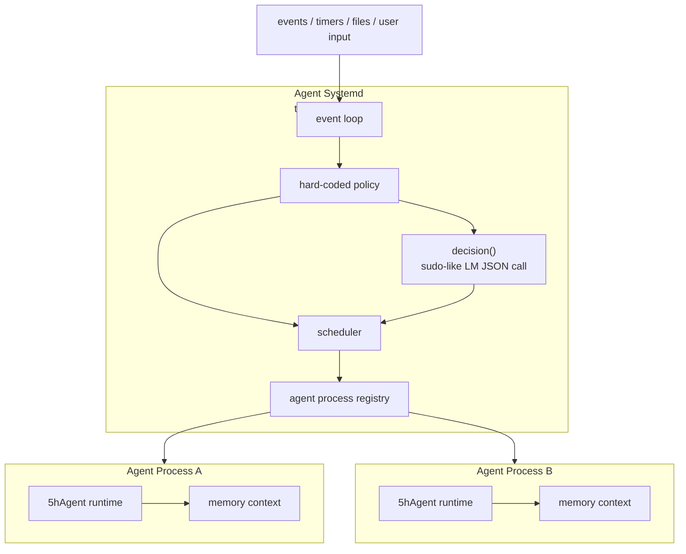

# Agent Systemd - 顶层调度层设计

> 由 GPT-5.5 于 2026-06-26 阅读 `internal/runtime/runtime.go`、`internal/agent/agent.go`、`internal/context/session.go`、`doc/runtime.md`、`doc/agent.md` 后生成。

## 摘要

下一阶段的顶层调度层正式命名为 Agent Systemd。这个名字取 systemd 的 supervisor / process manager 语义，但只是类比：最终目标是做一个极简、可靠的 Agent 调度框架，不是复刻操作系统。Agent Systemd 不替代当前 `internal/runtime`，而是站在 runtime 之上，把每个运行中的 Agent 看作一个独立进程，把 5hAgent runtime 看作执行引擎。Agent Systemd 本身应尽量保持 AI 无关；`decision` 只是纯规则判断不了时的受控升级点，类似 `sudo`，用一次 LM API 调用把字符串事实判断成结构化 JSON。



## 设计目标

- 把 Agent 抽象成进程：启动参数只包含提示词和退出条件，运行时上下文视作进程内存。
- 借鉴 OS 的进程调度和 supervisor 思路，但不追求完整 OS 语义。
- 保持上层调度 AI 无关：调度循环、事件处理、进程表、状态机和策略都用确定性代码实现。
- 只保留一个受控 AI 升级点：`decision` 函数调用一次 LM API，要求返回格式化 JSON，不允许自由文本驱动控制流。
- 保持 runtime 可复用：当前 `internal/runtime` 是执行引擎，一个调度层实例下可以启动多份 runtime。
- 支持事件触发：外部事件、文件变化、定时器、任务状态变化或人工输入都可以成为启动 Agent 的原因。

## 非目标

- 不在第一阶段实现完整 daemon、网络 API、分布式调度或持久化队列。
- 不让 LLM 直接控制 Harness 的主循环。
- 不共享不同 Agent 进程的上下文；跨进程通信必须走显式 IPC：事件、消息、报告或系统工具。
- 不由 Agent Systemd 自动落盘 Agent 上下文；上下文持久化必须是 Agent 内部显式行为。
- 不把顶层调度层写成新的大 Agent；它是调度约束，不是另一个 ReAct 循环。

## 核心概念

| 概念 | 含义 | 当前对应 |
| --- | --- | --- |
| `AgentSystemd` | 顶层 Agent 调度器，借鉴 supervisor / process manager | 新增设计，尚未实现 |
| `AgentProcess` | 一个运行中的 Agent 实例，类似进程 | `runtime.New` + `RunTaskOnce` 的一次运行 |
| `RuntimeEngine` | 执行 Agent 的引擎 | `internal/runtime` |
| `Event` | 触发调度的外部或内部事实 | 文件变化、task 更新、timer、manual input |
| `Decision` | 纯规则无法判断时的受控 LM 升级点，返回 JSON | 新增 `decision` 函数 |
| `ProcessTable` | Agent 进程表，记录状态和资源 | 新增设计 |
| `Policy` | 硬编码调度规则 | 新增设计 |

## 分层边界

```text
Agent Systemd
  - 收事件
  - 维护进程表
  - 做调度
  - 必要时调用 decision()
  - 启动/停止 AgentProcess

AgentProcess
  - 持有启动提示词和退出条件
  - 持有独立内存上下文
  - 调用 RuntimeEngine 执行任务
  - 产生 report/worklog/event

RuntimeEngine
  - 初始化配置、LLM、工具、MCP、TaskList、Context
  - 调用 Agent.RunStream
  - 写报告和 work log
```

顶层调度层不直接执行工具，不直接改 Agent 上下文，不直接拼 prompt。它只管理进程级生命周期。

## Agent 进程模型

每个 AgentProcess 至少包含：

```go
type AgentProcess struct {
    ID        string
    Name      string
    State     ProcessState
    Spec      ProcessSpec
    Runtime   RuntimeEngine
    StartedAt time.Time
    EndedAt   time.Time
    LastEvent Event
}
```

`ProcessSpec` 只描述进程启动必需信息：

```go
type ProcessSpec struct {
    Prompt PromptSpec
    Exit   ExitSpec
}

type PromptSpec struct {
    System string
    Skills []SkillRef
}

type SkillRef struct {
    Name        string
    Description string
}

type ExitSpec struct {
    Condition string
    Deadline  time.Time
    MaxTurns  int
}
```

约束：

- 启动 AgentProcess 时只传 `PromptSpec` 和 `ExitSpec`。
- `PromptSpec` 目前只包含两部分：system prompt、已激活 skill 的 `Name/Description` 列表。
- Agent 内部可根据 `SkillRef.Name` 读取完整 skill；Agent Systemd 不拼接 skill 正文。
- `ExitSpec` 是调度层判断进程是否应停止的唯一外部条件。
- Context 是进程内存；进程退出后销毁。
- session 是可选持久化文件，不是默认上下文载体。
- 需要落盘上下文时，必须由 Agent 调用系统级工具显式创建 session。

## 上下文和持久化

```text
AgentProcess memory
  - messages
  - tool results
  - temporary reasoning state
  - pinned/audit metadata

Persistent session
  - only created by Agent syscall/tool
  - not created automatically by Agent Systemd
  - survives process exit
```

必须修正的当前冲突：

- 当前 `runtime.New` 默认创建 `~/.5hAgent/sessions` manager。
- 当前 `RunTaskOnce` 会创建 task session。
- 目标模型要求：默认 context 只在内存；session 持久化改为 Agent 显式系统工具行为。

第一版系统工具只设计接口，不急于实现：

| 系统工具 | 作用 |
| --- | --- |
| `sys.session.create` | 创建持久化 session，并把当前内存 context 绑定到该 session |
| `sys.session.save` | 将当前 context 写入已绑定 session |
| `sys.session.drop` | 解除绑定，不删除文件 |
| `sys.ipc.send` | 向另一个 AgentProcess 发送短消息事件 |
| `sys.ipc.recv` | 拉取发给当前 AgentProcess 的消息 |

这些工具属于系统调用层，不属于普通业务工具。它们需要 AgentProcess 身份和权限。

## 事件模型

第一版事件可以保持简单结构：

```go
type Event struct {
    ID        string
    Type      string
    Source    string
    Payload   json.RawMessage
    CreatedAt time.Time
}
```

常见事件：

| Type | 触发来源 | 典型动作 |
| --- | --- | --- |
| `task.created` | `.5hagent/task.md` 新任务 | 启动一个 AgentProcess |
| `task.failed` | runtime report | 判断是否重试或交给人工 |
| `timer.tick` | 定时器 | 扫描任务和进程状态 |
| `manual.request` | 用户输入 | 创建任务或启动指定 Agent |
| `process.exited` | AgentProcess 结束 | 收集报告并更新进程表 |
| `ipc.message` | AgentProcess 系统工具 | 投递给目标 AgentProcess |

## Agent 间通信

参考进程 IPC，不共享内存。

| IPC 形态 | Agent Systemd 语义 | 第一版是否做 |
| --- | --- | --- |
| signal | 短控制事件：stop/retry/wakeup | 做 |
| pipe | 单向短消息流 | 做接口 |
| file | report/session/artifact | 复用现有文件 |
| shared memory | 共享上下文 | 不做 |
| socket | 长连接服务 | 后续再说 |

规则：

- Agent 之间不能直接读写彼此 context。
- Agent 之间只交换短消息、事件、报告路径或 artifact 路径。
- 大内容写 artifact，小消息只传摘要和路径。
- Agent Systemd 负责投递和权限检查，不理解业务内容。

## 调度模型

调度循环应是确定性的：

```go
func (s *AgentSystemd) Run(ctx context.Context) error {
    for {
        event := s.NextEvent(ctx)
        s.ApplyPolicy(event)
        if s.NeedsDecision(event) {
            decision := s.Decision(ctx, event)
            s.ApplyDecision(decision)
        }
        s.Dispatch()
    }
}
```

硬编码 policy 可以先覆盖：

- 同一个事件 ID 不重复启动两个 Agent。
- 同一个 Agent 名称可设置并发上限。
- 失败任务最多重试 N 次。
- 长时间无输出的 Agent 标记为 stalled。
- 高风险事件只记录，不自动启动 Agent。

## decision 函数

`decision` 不是主调度逻辑，只是类似 `sudo` 的受控升级点。普通调度必须先用硬编码规则处理；只有需要理解字符串、报告摘要或模糊失败原因时，才允许调用一次 LM。它只做判断，不执行动作。

输入是结构化事实：

```json
{
  "event": {},
  "processes": [],
  "tasks": [],
  "policy": {}
}
```

输出必须是 JSON：

```json
{
  "action": "start_agent",
  "reason": "new pending task needs an isolated worker",
  "process_spec": {
    "prompt": {
      "system": "You are a focused debugging agent.",
      "skills": [
        {"name": "systematic-debugging", "description": "Debug by reproducing, isolating, and verifying."}
      ]
    },
    "exit": {
      "condition": "report written or unrecoverable blocker found",
      "max_turns": 12
    }
  }
}
```

允许的 action 第一版控制在：

| Action | 含义 |
| --- | --- |
| `start_agent` | 启动一个新 AgentProcess |
| `wait` | 不动作，等待更多事件 |
| `retry_agent` | 用相同或调整后的 spec 重试 |
| `escalate` | 需要人工判断 |
| `stop_agent` | 停止某个 AgentProcess |

必须校验：

- JSON parse 成功。
- action 在枚举内。
- `process_spec.prompt.system` 非空。
- `process_spec.prompt.skills` 只包含 `name/description`，不包含 skill 正文。
- `process_spec.exit` 至少包含一个退出条件。
- 不允许 decision 返回任意 shell 命令。
- decision 不能绕过硬编码 policy；只能给 policy 提供结构化判断结果。

## 与当前 runtime 的关系

当前 `internal/runtime` 已经具备执行引擎雏形：

- `runtime.New` 初始化配置、LLM、Agent、工具、MCP、TaskList、Context。
- `RunTaskOnce` 从 `.5hagent/task.md` 选择任务并执行。
- work log 写入 `.5hagent/agents/<agent-name>/logs/`。
- report 写入 `.5hagent/reports/<task-id>.md`。

顶层调度层只需要把这些能力包装成进程生命周期：

```text
StartProcess(spec)
  -> build PromptSpec
  -> runtime.NewInMemory(...)
  -> Runtime.RunProcess(prompt, exit)
  -> collect report/worklog
  -> emit process.exited
```

后续如果要同一 OS 下启动多份 runtime，应避免全局状态污染，重点检查：

- `tools` registry 当前是包级全局变量。
- `logger` sink 是包级全局变量。
- MCP client 生命周期需要绑定到单个 runtime。
- `os.Getwd()` 作为项目目录来源，不适合并发多 WorkDir。
- `context.Manager` 当前默认可绑定 session store；Agent Systemd 需要默认内存 context。

## TODO 小目标

### A. 接口骨架

- A1. 新增 `internal/systemd` 包，只写文件头注释、类型和函数签名。
- A2. 定义 `AgentSystemd`、`AgentProcess`、`ProcessSpec`、`PromptSpec`、`ExitSpec`、`Event`、`Decision`。
- A3. 给每个函数写中文头注释：功能、参数、调用下层、步骤。
- A4. 自查调用层级，删除一次性短 helper 和无用字段。

### B. Prompt 启动模型

- B1. 从已激活 skill 列表提取 `Name/Description`，生成 `PromptSpec.Skills`。
- B2. 禁止 Agent Systemd 拼接 skill 正文。
- B3. 定义 `BuildPrompt(system string, skills []SkillRef) PromptSpec` 签名。
- B4. 写测试：PromptSpec 只含 system、skill name、skill description。

### C. 内存上下文模型

- C1. 增加 runtime 目标接口：默认创建内存 context，不创建 session。
- C2. 标记当前冲突点：`runtime.New`、`RunTaskOnce`、`openMessageCtx`。
- C3. 设计 `sys.session.create/save/drop` 工具签名。
- C4. 写测试：AgentProcess 退出后内存 context 不可恢复；只有显式 session 才落盘。

### D. 退出条件

- D1. 定义 `ExitSpec` 最小字段：`Condition/Deadline/MaxTurns`。
- D2. 定义 `ShouldExit(proc, event) bool` 签名。
- D3. 写测试：满足 max turns、deadline、完成事件时退出。

### E. 事件和 IPC

- E1. 定义 `Event` 和 `IPCMessage` 类型。
- E2. 定义 `Send(pid, msg)` / `Recv(pid)` 签名。
- E3. 禁止共享 context，只允许短消息和 artifact 路径。
- E4. 写测试：A 进程不能读 B 进程 context。

### F. decision

- F1. 定义 `DecisionInput` / `DecisionResult`。
- F2. 定义 `Decision(ctx, input) (DecisionResult, error)` 签名。
- F3. 校验 JSON action enum、PromptSpec、ExitSpec。
- F4. 写测试：非法 JSON、缺退出条件、skill 正文泄漏都失败。

### G. 单进程调度

- G1. `StartProcess(spec)` 只接收 `ProcessSpec`。
- G2. 复用 runtime 执行引擎，不复制 ReAct。
- G3. 同时只允许一个进程运行。
- G4. 写测试：同一任务不重复启动。

### H. 多进程前置改造

- H1. 把 `tools` registry 从包级全局收敛到 runtime 实例。
- H2. 把 logger sink 从包级全局收敛到 runtime / process 实例。
- H3. 移除并发路径对 `os.Getwd()` 的依赖。
- H4. MCP client 生命周期绑定到单个 runtime。

### I. 文档同步

- I1. 更新 `doc/runtime.md`：区分内存 context 和显式 session。
- I2. 更新 `doc/context.md`：session 是 Agent 系统工具创建的持久化对象。
- I3. 更新 `AGENTS.md`：记录 Agent Systemd 的启动参数和实现纪律。
- I4. 更新开发日志：记录当前设计要求和现有冲突点。

## 实现纪律

Agent Systemd 的实现必须继续保持本项目的极简代码风格。第一轮提交只允许写类型、函数签名和中文注释，不写具体实现；随后先人工或自行 review 调用层级，确认没有过度抽象、一次性短函数和多余状态，再补实现。

签名阶段每个文件和函数至少说明：

- 文件职责、被哪些模块调用、是否有全局状态。
- 函数功能、参数含义、会调用哪些下层函数。
- 复杂函数的步骤，例如：接收事件 -> 套用硬编码策略 -> 必要时用 `decision` 升级判断 -> 调度 AgentProcess。

实现阶段约束：

- 优先复用 `internal/runtime` 已有入口，避免重写执行引擎。
- 优先让状态集中在少量结构体里，不为中间值创造冗余字段。
- 不为只调用一次且无复用价值的短逻辑新建包级 helper。
- 对不确定的路径、策略阈值、设备名或调度参数打 `TODO`，方便人工 review。
- 在人工 review 之前不要主动提交大段未审实现。

## 当前状态

这是设计文档，不表示源码已经实现 Agent Systemd。当前已实现的是下层执行引擎：`internal/runtime` + `internal/agent` + `internal/task`。下一步应先补接口骨架和测试，再把 runtime 的全局状态逐步收敛到实例边界内。
