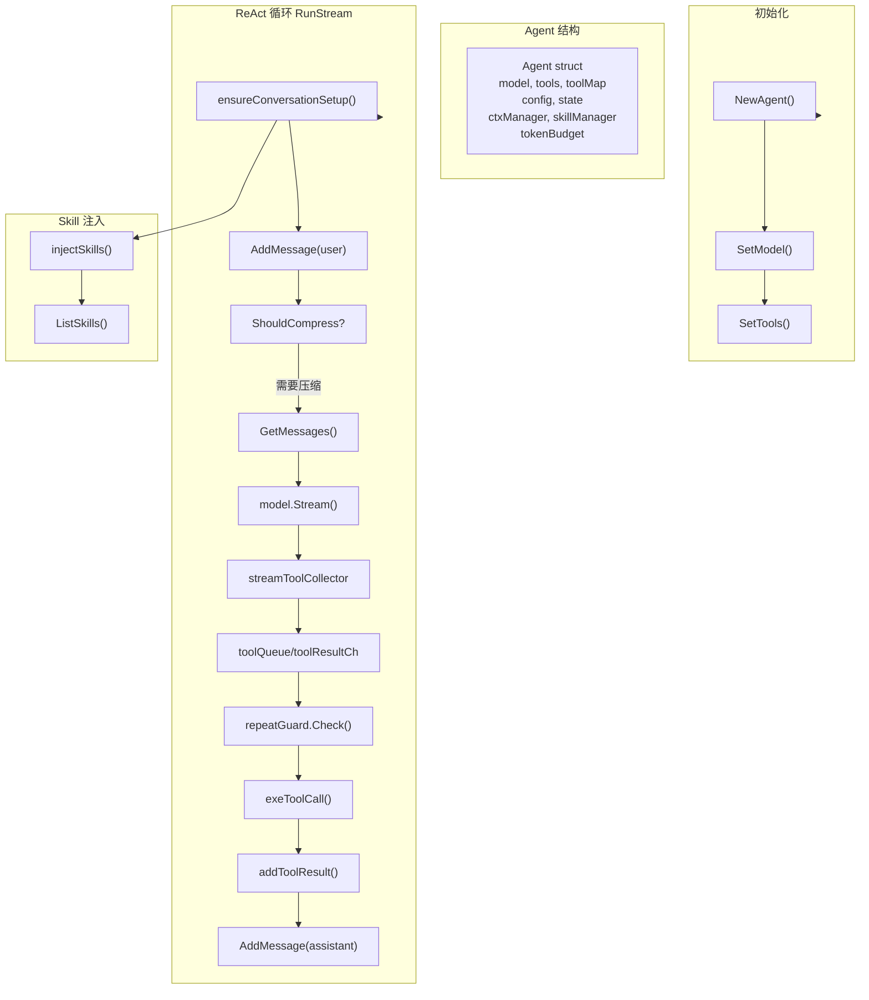
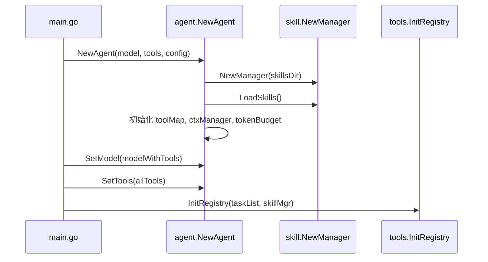
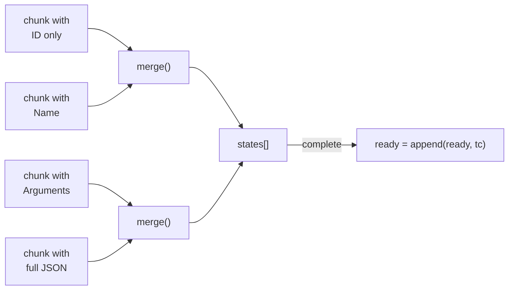

# Agent - Agent 核心

## 架构



## 位置

- `internal/agent/agent.go` - Agent 核心
- `internal/agent/tool_use.go` - 工具调度

## Agent 结构

```go
type Agent struct {
    model        model.ToolCallingChatModel  // LLM 模型
    tools        []tool.BaseTool             // 工具列表
    toolMap      map[string]tool.BaseTool   // 工具名→工具映射
    config       *Config                    // Agent 配置
    state        *State                     // 运行状态
    ctxManager   *agentctx.Manager          // 上下文管理器
    skillManager *skill.Manager             // 技能管理器
    tokenBudget  *utils.TokenBudget         // Token 预算
}

type Config struct {
    Name            string  // Agent 名称
    MaxTotalTokens  int     // 整场会话 token 上限
    RepeatToolLimit int     // 相同工具重复调用上限
    Debug           bool    // 调试模式
    SystemPrompt    string  // 系统提示词
}

type State struct {
    CurrentTurn int   // 当前轮数
    IsRunning   bool  // 是否运行中
}
```

## 初始化流程



关键代码（[agent.go:68-113](internal/agent/agent.go)）：

```go
skillMgr := skill.NewManager(skillsDir)
if err := skillMgr.LoadSkills(); err != nil {
    logger.DebugTag("SKILL", "Failed to load skills: %v", err)
}

toolMap := make(map[string]tool.BaseTool)
for _, t := range tools {
    info, err := t.Info(context.Background())
    if err != nil {
        continue
    }
    toolMap[info.Name] = t
}
```

## RunStream 主循环

核心流程（[agent.go:217-392](internal/agent/agent.go)）：

```go
func (a *Agent) RunStream(ctx, messageCtx, input, onToken) (string, error) {
    // 1. 首次对话注入 system prompt 和 skills
    a.ensureConversationSetup(messageCtx)

    // 2. 添加用户消息
    a.ctxManager.AddMessage(messageCtx, userMsg)

    // 2.5 检查上下文压缩
    if a.ctxManager.ShouldCompress(messageCtx) {
        a.ctxManager.LMCompress(ctx, messageCtx, a.model, "prompt")
    }

    // 3. ReAct 循环
    repeatGuard := newToolRepeatGuard(a.config.RepeatToolLimit)
    for turn := 0; ; turn++ {
        messages := a.ctxManager.GetMessages(messageCtx)
        reader := a.model.Stream(ctx, messages)

        collector := newStreamToolCollector()
        toolQueue := make(chan toolRequest, 8)
        toolResultCh := make(chan execResult, 8)

        // 并发执行 goroutine
        go func() {
            for req := range toolQueue {
                result, err := a.exeToolCall(ctx, req.tc, ...)
                toolResultCh <- execResult{...}
            }
        }()

        // 读取流
        for {
            chunk := reader.Recv()
            if err == io.EOF { break }

            // 收集 ToolCalls
            if len(chunk.ToolCalls) > 0 {
                for _, tc := range collector.Add(chunk.ToolCalls) {
                    repeatGuard.Check([]schema.ToolCall{tc})
                    toolQueue <- toolRequest{...}
                }
            }

            // 输出 token
            if chunk.Content != "" {
                fullContent.WriteString(chunk.Content)
                onToken(chunk.Content)
            }
        }
        reader.Close()
        close(toolQueue)

        // 执行结果写回上下文
        if len(finalMessage.ToolCalls) > 0 {
            a.ctxManager.AddMessage(messageCtx, assistantMsg)
            for _, res := range toolResults {
                a.addToolResult(messageCtx, res.tc, res.result, res.err)
            }
            continue  // 下一轮
        }

        return content, nil  // 完成
    }
}
```

## 工具重复调用防护

```go
type toolRepeatGuard struct {
    limit    int
    attempts map[string]int
}

func (g *toolRepeatGuard) Check(toolCalls []schema.ToolCall) error {
    for _, tc := range toolCalls {
        key := tc.Function.Name + ":" + normalizedArgs
        g.attempts[key]++
        if g.attempts[key] > g.limit {
            return fmt.Errorf("repeated tool call detected after %d attempts: %s",
                g.limit, tc.Function.Name)
        }
    }
    return nil
}
```

## 工具元数据合并

```go
func mergeMeta(current, incoming *schema.ResponseMeta) *schema.ResponseMeta {
    // 合并 token 使用统计
    if incoming.Usage.TotalTokens > current.Usage.TotalTokens {
        current.Usage.TotalTokens = incoming.Usage.TotalTokens
    }
    // ...
}
```

## Tool Use 工具调度

位置：[tool_use.go](internal/agent/tool_use.go)

### 流式 ToolCall 收集器



核心类型：

```go
type toolState struct {
    call       schema.ToolCall  // 累积状态
    dispatched bool             // 是否已分发
}

type streamToolCollector struct {
    states []*toolState
    byID   map[string]int
}
```

关键方法：

| 方法 | 说明 |
|------|------|
| `Add(chunks)` | 合并分片，返回可执行的 ToolCall |
| `merge(tc)` | 合并单条 ToolCall |
| `RunnableCalls()` | 提取所有有效 ToolCall |

### 执行策略

| 工具类型 | 策略 | 说明 |
|----------|------|------|
| 只读工具 | 并发 | read_file, glob, grep, list_dir |
| 写工具 | 串行 | write_file, edit, exec_shell |
| task.get/list | 并发 | 按 action 参数判断 |
| task 其他 | 串行 | create/update/delete/archive |

### exeTools 并发调度

```go
func (a *Agent) exeTools(ctx, messageCtx, toolCalls) error {
    readOnlyCalls, writeCalls := classify(toolCalls)

    // 只读并发
    if len(readOnlyCalls) > 0 {
        a.exeToolsPar(ctx, messageCtx, readOnlyCalls)
    }

    // 写操作串行
    for _, tc := range writeCalls {
        result, err := a.exeToolCall(ctx, tc, ...)
        a.addToolResult(messageCtx, tc, result, err)
    }
}
```

### 工具调用接口适配

```go
func (a *Agent) invokeTool(ctx, t, tc) (string, error) {
    // EnhancedInvokableTool：框架解码 JSON → Go struct
    if enhanced, ok := t.(tool.EnhancedInvokableTool); ok {
        toolArg := &schema.ToolArgument{Text: tc.Function.Arguments}
        result, err := enhanced.InvokableRun(ctx, toolArg)
        return formatToolResult(result), err
    }

    // InvokableTool：工具自己解析 JSON
    if invokable, ok := t.(tool.InvokableTool); ok {
        return invokable.InvokableRun(ctx, tc.Function.Arguments)
    }

    return "", fmt.Errorf("tool %s is not invokable", tc.Function.Name)
}
```

### 错误处理

```go
func formatToolErr(tc schema.ToolCall, execErr error) string {
    hint := toolHint(tc)
    return fmt.Sprintf("tool execution failed: %v\nSuggestion: %s", execErr, hint)
}

func toolHint(tc schema.ToolCall) string {
    // 根据工具名返回针对性建议
    switch toolmeta.DisplayName(tc.Function.Name) {
    case "read_file", "write_file", "edit", "glob", "grep", "list_dir":
        return "check the tool arguments and retry with an absolute path..."
    case "exec_shell":
        return "check the shell command, quote paths with spaces..."
    // ...
    }
}
```

## Skill 注入

首次对话时注入启用的 skills（[agent.go:445-483](internal/agent/agent.go)）：

```go
func (a *Agent) ensureConversationSetup(messageCtx) error {
    messages, _ := a.ctxManager.GetMessages(messageCtx)
    if len(messages) > 0 {
        return nil  // 非首次对话，跳过
    }

    // 注入 system prompt
    a.ctxManager.AddMessage(messageCtx, systemMsg)

    // 注入 skills
    a.injectSkills(messageCtx)
}

func (a *Agent) injectSkills(messageCtx) error {
    for _, skill := range a.skillManager.ListSkills() {
        if skill.Enabled {
            msg := &schema.Message{
                Role:    schema.System,
                Content: fmt.Sprintf("# Skill: %s\n\n%s", skill.Name, skill.Content),
            }
            a.ctxManager.AddMessage(messageCtx, msg)
        }
    }
}
```

## 导出函数

### agent.go

| 函数 | 说明 |
|------|------|
| `NewAgent(model, tools, config)` | 创建 Agent |
| `RunStream(ctx, messageCtx, input, onToken)` | 流式运行 |
| `GetSkillManager()` | 获取技能管理器 |
| `SetModel(model)` | 设置模型 |
| `GetModel()` | 获取模型 |
| `SetTools(tools)` | 设置工具 |
| `Name()` | 获取 Agent 名称 |
| `TokenUsage()` | 获取 Token 使用情况 |

### tool_use.go

| 函数 | 说明 |
|------|------|
| `exeTools(ctx, messageCtx, toolCalls)` | 执行工具调度 |
| `exeToolsPar(ctx, messageCtx, toolCalls)` | 并发执行只读工具 |
| `exeToolCall(ctx, tc, idx, total, concurrent)` | 执行单个工具 |
| `invokeTool(ctx, t, tc)` | 调用工具实例 |
| `addToolResult(messageCtx, tc, result, err)` | 写入工具结果 |
| `formatToolErr(tc, err)` | 格式化错误 |
| `isReadOnly(tc)` | 判断是否只读 |

## 相关代码

- [agent.go](../internal/agent/agent.go)
- [tool_use.go](../internal/agent/tool_use.go)
- [toolmeta.go](../internal/toolmeta/toolmeta.go)
- [main.go](../cmd/5hagent/main.go)
