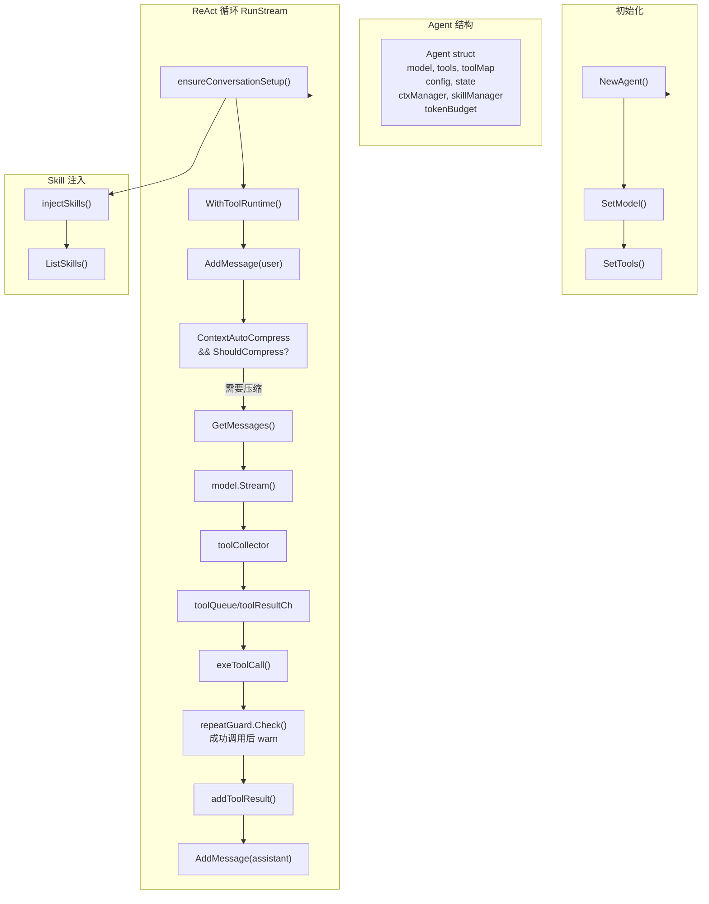
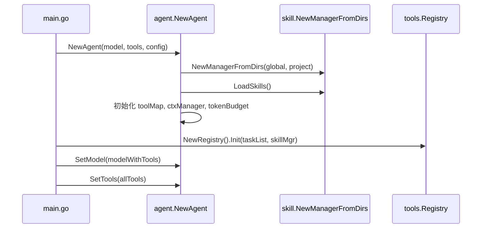
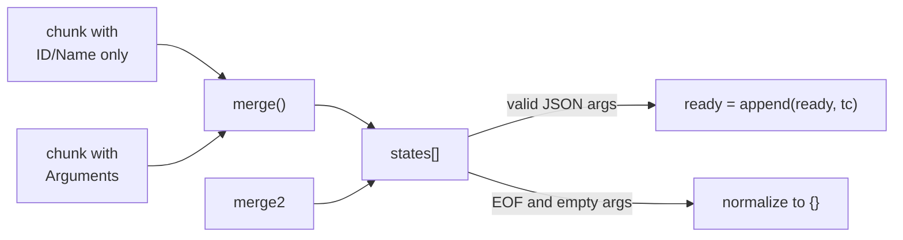

# Agent - Agent 核心

## 架构



## 位置

- `internal/agent/agent.go` - Agent 核心
- `internal/agent/tool_use.go` - 工具调度

## Agent 结构

```go
type Agent struct {
    model        model.ToolCallingChatModel  // LLM 模型
    tools        []tool.BaseTool             // 工具列表
    toolMap      map[string]tool.BaseTool   // 工具名→工具映射
    config       *Config                    // Agent 配置
    state        *State                     // 运行状态
    ctxManager   *agentctx.Manager          // 上下文管理器
    skillManager *skill.Manager             // 技能管理器
    tokenBudget  *utils.TokenBudget         // Token 预算
}

type Config struct {
    Name                string  // Agent 名称
    MaxTotalTokens      int     // 整场会话 token 上限
    RepeatToolLimit     int     // 相同工具重复调用上限
    ContextAutoCompress bool    // 是否自动触发上下文压缩
    Debug               bool    // 调试模式
    SystemPrompt        string  // 系统提示词
}

type State struct {
    CurrentTurn int   // 当前轮数
    IsRunning   bool  // 是否运行中
}
```

## 初始化流程



关键代码（[agent.go:68-113](internal/agent/agent.go)）：

```go
skillMgr := skill.NewManagerFromDirs(globalSource, projectSource)
if err := skillMgr.LoadSkills(); err != nil {
    logger.DebugTag("SKILL", "Failed to load skills: %v", err)
}

toolMap := make(map[string]tool.BaseTool)
for _, t := range tools {
    info, err := t.Info(context.Background())
    if err != nil {
        continue
    }
    toolMap[info.Name] = t
}
```

## RunStream 主循环

核心流程（[agent.go:217-392](internal/agent/agent.go)）：

```go
func (a *Agent) RunStream(ctx, messageCtx, input, onToken, onReasoning...) (string, error) {
    // 1. 首次对话注入 system prompt 和 skills
    a.ensureConversationSetup(messageCtx)

    // 2. 注入 context tool runtime，并添加用户消息
    ctx = agentctx.WithToolRuntime(ctx, a.ctxManager, messageCtx)
    a.ctxManager.AddMessage(messageCtx, userMsg)

    // 2.5 检查上下文压缩
    if a.config.ContextAutoCompress && a.ctxManager.ShouldCompress(messageCtx) {
        a.ctxManager.LMCompress(ctx, messageCtx, a.model, "prompt")
    }

    // 3. ReAct 循环
    repeatGuard := newToolRepeatGuard(a.config.RepeatToolLimit)
    for turn := 0; ; turn++ {
        messages := a.ctxManager.GetMessages(messageCtx)
        streamCtx, streamCancel := context.WithCancel(ctx)
        reader := a.model.Stream(streamCtx, messages)

        collector := newToolCollector()
        toolQueue := make(chan toolRequest, 8)
        toolResultCh := make(chan execResult, 8)

        // 工具 worker goroutine；与 LLM stream 读取并发，但多个工具在该 worker 内串行执行
        go func() {
            for req := range toolQueue {
                result, err := a.exeToolCall(ctx, req.tc, ..., false)
                toolResultCh <- execResult{...}
            }
        }()

        // 读取流。Recv() 外层有 90s idle timeout，防止 LLM 无 token/无 tool 时 TUI 无限转圈。
        for {
            chunk := recvWithIdleTimeout(reader, 90*time.Second)
            if err == io.EOF { break }

            // 收集 ToolCalls
            if len(chunk.ToolCalls) > 0 {
                for _, tc := range collector.Add(chunk.ToolCalls) {
                    toolQueue <- toolRequest{...}
                }
            }

            // 输出 token
            if chunk.ReasoningContent != "" {
                onReasoning(chunk.ReasoningContent)
            }
            if chunk.Content != "" {
                fullContent.WriteString(chunk.Content)
                onToken(chunk.Content)
            }
        }
        reader.Close()
        close(toolQueue)

        // 执行结果写回上下文
        if len(finalMessage.ToolCalls) > 0 {
            a.ctxManager.AddMessage(messageCtx, assistantMsg)
            for _, res := range toolResults {
                a.addToolResult(messageCtx, res.tc, res.result, res.err)
            }
            continue  // 下一轮
        }

        return content, nil  // 完成
    }
}
```

`WithToolRuntime()` 是 `context.context` 的运行时桥接。它把当前 `Manager` 和 `messageCtx` 放进 Go context，工具执行时通过 `agentctx.ToolRuntimeFrom(ctx)` 找到本轮真实上下文。没有这一步，LLM 虽然能看到 `context.context` 的 schema，但工具执行会返回 `context runtime not found`。

`ContextAutoCompress=false` 只关闭 Agent 在 LLM 调用前的自动压缩，不影响 LLM 主动调用 `context.context {"action":"compress"}`。

## 工具重复调用防护

重复调用防护只在工具执行成功后计数，失败调用不计入重复限制；超过限制时只写 warn，不中断 Agent。这样 LLM 可以根据失败的 tool message 自我修正参数，而不会因为连续错误参数直接结束会话。

```go
type toolRepeatGuard struct {
    limit    int
    attempts map[string]int
}

func (g *toolRepeatGuard) Check(toolCalls []schema.ToolCall) error {
    for _, tc := range toolCalls {
        key := tc.Function.Name + ":" + normalizedArgs
        g.attempts[key]++
        // 超过限制由调用方记录 warn，不作为 agent error 终止会话
    }
    return nil
}
```

## LLM Stream 空闲超时

`RunStream` 对 `reader.Recv()` 加了 90 秒 idle timeout。触发条件是连续 90 秒没有收到任何文本 chunk 或 tool call chunk。触发后会：

- `streamCancel()` 取消当前 LLM 请求
- `reader.Close()` 释放流
- 返回 `LLM stream idle timeout: no text or tool call chunk received for 90s`

这个超时处理的是“模型连接仍挂着但没有任何输出”的情况，避免 TUI 永久显示 thinking/spinner。

## 工具元数据合并

```go
func mergeMeta(current, incoming *schema.ResponseMeta) *schema.ResponseMeta {
    // 合并 token 使用统计
    if incoming.Usage.TotalTokens > current.Usage.TotalTokens {
        current.Usage.TotalTokens = incoming.Usage.TotalTokens
    }
    // ...
}
```

## Tool Use 工具调度

位置：[tool_use.go](internal/agent/tool_use.go)

### 流式 ToolCall 收集器



核心类型：

```go
type toolState struct {
    call       schema.ToolCall  // 累积状态
    dispatched bool             // 是否已分发
}

type toolCollector struct {
    states map[int]*toolCallState
    byID   map[string]int
}
```

关键规则：流式阶段不能把 `Arguments == ""` 立刻当成 `{}`。很多模型会先发 `id/name` 分片，再发参数分片；如果过早执行，会导致工具收到空参数。只有流结束后仍无参数的 tool call，才由 `PendingRunnableCalls()` 标准化为 `{}`。

关键方法：

| 方法 | 说明 |
|------|------|
| `Add(chunks)` | 合并分片，返回可执行的 ToolCall |
| `merge(tc)` | 合并单条 ToolCall |
| `PendingRunnableCalls()` | 流结束后提取未分发调用；空参数工具在这里补 `{}` |

### 执行策略

当前 `RunStream` 的执行模型是“流式收集 + 单 worker 执行”：

| 层级 | 策略 | 说明 |
|------|------|------|
| LLM stream 读取 vs 工具执行 | 并发 | 主流程持续接收 chunk；工具 worker 同时处理已完整的 ToolCall |
| 多个工具调用之间 | 串行 | 单个 worker 从 `toolQueue` 顺序执行请求 |
| 只读工具 | 未单独并发 | `read_file`, `glob`, `grep`, `list_dir` 当前没有特殊并发分支 |
| 写工具 | 串行 | `write_file`, `edit`, `exec_shell` 同样进入同一个 worker |
| `task.task get/list` | 未单独并发 | 当前执行路径没有按 action 分类调度 |

### 工具调度链路

```go
toolQueue := make(chan toolRequest, 8)
toolResultCh := make(chan execResult, 8)

go func() {
    for req := range toolQueue {
        result, execErr := a.exeToolCall(ctx, req.tc, req.idx, req.idx+1, false)
        toolResultCh <- execResult{idx: req.idx, tc: req.tc, result: result, err: execErr}
    }
    close(toolResultCh)
}()
```

`toolCollector.Add()` 在流式阶段合并 ToolCall 分片。只要某个调用已经具备 `ID`、`Function.Name`、合法 JSON `Function.Arguments`，就会被送入 `toolQueue`。流结束后，`PendingRunnableCalls()` 会把仍为空参数的完整调用标准化为 `{}` 后再分发。

工具结果通过 `execResult.idx` 回填到 `toolResults[res.idx]`，保证即使未来改成多 worker 或每个工具一个 goroutine，也可以按原始 `queuedCalls` 顺序写回上下文。

TUI 中的 `[并发]` 文案不表示当前一定并发执行。它只由 `logger.PrintToolCall(name, args, concurrent)` 的 `concurrent` 参数控制；当前 `RunStream` 传入的是 `false`。

### 工具调用接口适配

```go
func (a *Agent) invokeTool(ctx, t, tc) (string, error) {
    // EnhancedInvokableTool：框架解码 JSON → Go struct
    if enhanced, ok := t.(tool.EnhancedInvokableTool); ok {
        toolArg := &schema.ToolArgument{Text: tc.Function.Arguments}
        result, err := enhanced.InvokableRun(ctx, toolArg)
        return formatToolResult(result), err
    }

    // InvokableTool：工具自己解析 JSON
    if invokable, ok := t.(tool.InvokableTool); ok {
        return invokable.InvokableRun(ctx, tc.Function.Arguments)
    }

    return "", fmt.Errorf("tool %s is not invokable", tc.Function.Name)
}
```

### 错误处理

```go
func formatToolErr(tc schema.ToolCall, execErr error) string {
    hint := toolHint(tc)
    return fmt.Sprintf("tool execution failed: %v\nSuggestion: %s", execErr, hint)
}

func toolHint(tc schema.ToolCall) string {
    // 根据工具名返回针对性建议
    switch toolmeta.DisplayName(tc.Function.Name) {
    case "read_file", "write_file", "edit", "glob", "grep", "list_dir":
        return "check the tool arguments and retry with an absolute path..."
    case "exec_shell":
        return "check the shell command, quote paths with spaces..."
    // ...
    }
}
```

## Skill 注入

首次对话时注入启用的 skills（[agent.go:445-483](internal/agent/agent.go)）：

```go
func (a *Agent) ensureConversationSetup(messageCtx) error {
    messages, _ := a.ctxManager.GetMessages(messageCtx)
    if len(messages) > 0 {
        return nil  // 非首次对话，跳过
    }

    // 注入 system prompt
    a.ctxManager.AddMessage(messageCtx, systemMsg)

    // 注入 skills
    a.injectSkills(messageCtx)
}

func (a *Agent) injectSkills(messageCtx) error {
    for _, skill := range a.skillManager.ListSkills() {
        if skill.Enabled {
            msg := &schema.Message{
                Role:    schema.System,
                Content: fmt.Sprintf("# Skill: %s\n\n%s", skill.Name, skill.Content),
            }
            a.ctxManager.AddMessage(messageCtx, msg)
        }
    }
}
```

## 导出函数

### agent.go

| 函数 | 说明 |
|------|------|
| `NewAgent(model, tools, config)` | 创建 Agent |
| `RunStream(ctx, messageCtx, input, onToken, onReasoning...)` | 流式运行，正文和 thinking/reasoning 分开回调 |
| `GetSkillManager()` | 获取技能管理器 |
| `SetModel(model)` | 设置模型 |
| `GetModel()` | 获取模型 |
| `SetTools(tools)` | 设置工具 |
| `Name()` | 获取 Agent 名称 |
| `TokenUsage()` | 获取 Token 使用情况 |

### tool_use.go

| 函数 | 说明 |
|------|------|
| `newToolCollector()` | 创建流式 ToolCall 收集器 |
| `(*toolCollector).Add(chunks)` | 合并流式 ToolCall 分片并返回可执行调用 |
| `(*toolCollector).PendingRunnableCalls()` | 流结束后提取未分发调用，必要时补 `{}` |
| `exeToolCall(ctx, tc, idx, total, concurrent)` | 执行单个工具 |
| `invokeTool(ctx, t, tc)` | 调用工具实例 |
| `addToolResult(messageCtx, tc, result, err)` | 写入工具结果 |
| `formatToolErr(tc, err)` | 格式化错误 |

## 相关代码

- [agent.go](../internal/agent/agent.go)
- [tool_use.go](../internal/agent/tool_use.go)
- [toolmeta.go](../internal/toolmeta/toolmeta.go)
- [main.go](../cmd/5hagent/main.go)
