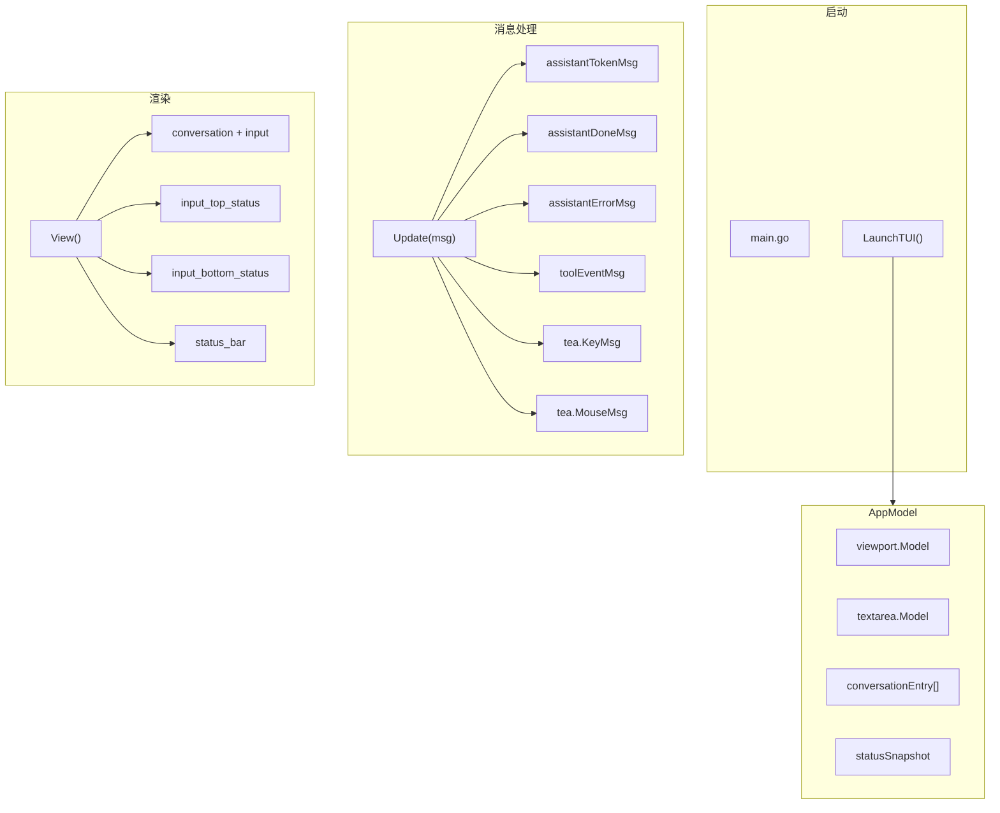

# CLI - 命令行界面

## 架构



## 位置

- `internal/cli/tui.go` - 主 TUI
- `internal/cli/ui.go` - 简单输出（legacy）
- `internal/cli/markdown_stream.go` - Markdown 渲染

## 布局

```
┌─────────────────────────────────────────────────┐
│                                                 │
│  用户输入 / assistant 回复 / thinking / tool    │
│  历史记录由 viewport 展示，支持键盘和鼠标滚轮滚动 │
│                                                 │
│ 5hAgent · model · state idle · tokens ...       │
│ ▄▄▄▄▄▄▄▄▄▄▄▄▄▄▄▄▄▄▄▄▄▄▄▄▄▄▄▄▄▄▄▄▄▄▄▄▄▄▄▄▄▄▄▄▄ │
│ > 输入消息...                                  │
│ ▀▀▀▀▀▀▀▀▀▀▀▀▀▀▀▀▀▀▀▀▀▀▀▀▀▀▀▀▀▀▀▀▀▀▀▀▀▀▀▀▀▀▀▀▀ │
│ session ... · msgs ... · tasks ... · scroll ... │
├─────────────────────────────────────────────────┤
│ ^C exit · enter send · pgup/pgdn scroll · state │
└─────────────────────────────────────────────────┘
```

## 核心类型

### AppModel

```go
type AppModel struct {
    program    *tea.Program
    ag         *agent.Agent
    modelName  string
    agentName  string
    taskList   *task.TaskList
    skillMgr   *skill.Manager
    ctxManager *agentctx.Manager
    messageCtx *agentctx.Context

    viewport  viewport.Model  // 对话区域
    input     textarea.Model // 输入框
    entries   []conversationEntry
}

type conversationEntry struct {
    Role     string // user/assistant/tool/system
    Content  string
    SystemTitle string
    ToolName string
    ToolArgs string
    ToolKey  string
    ToolState string // running/done/error
    ToolOutput string
    ToolOpen bool
}

type statusSnapshot struct {
    Busy            bool
    CurrentState   string
    TokenUsed      int
    TokenLimit     int
    ScrollPercent  int
    ContextMessages int
    ToolCallsTotal int
    EnabledSkills  []string
    TaskTotal      int
    TaskInProgress int
}
```

## 消息类型

| 类型 | 说明 |
|------|------|
| `assistantTokenMsg` | AI 流式输出 token |
| `assistantDoneMsg` | AI 输出完成 |
| `assistantErrorMsg` | AI 执行错误 |
| `toolEventMsg` | 工具调用事件 |
| `spinnerTickMsg` | 动画 tick |
| `tea.MouseMsg` | 鼠标事件，当前用于滚轮滚动历史记录 |

## 命令

| 命令 | 说明 |
|------|------|
| `/skill <args>` | 技能管理 |
| `/task <args>` | 任务管理 |
| `/compress` | 上下文压缩 |
| `/mcp <args>` | MCP 服务器管理 |

## 快捷键

| 键 | 功能 |
|----|------|
| `Enter` | 发送消息 |
| `Ctrl+C` / 双 `Esc` | 退出 |
| `PgUp` / `Ctrl+B` | 上滚 |
| `PgDown` / `Ctrl+F` | 下滚 |
| `↑/↓` 或 `j/k` | 行滚动 |
| 鼠标滚轮 | 上下滚动历史记录 |

## 关键函数

| 函数 | 说明 |
|------|------|
| `LaunchTUI(ctx, ag, model, taskList, skillMgr, ctxManager, messageCtx)` | 启动 TUI |
| `NewAppModel(...)` | 创建模型 |
| `Update(msg)` | 处理消息 |
| `View()` | 渲染界面 |
| `submit()` | 提交输入 |
| `runAgent()` | 运行 Agent |
| `snapshot()` | 生成状态快照 |
| `renderTopStatus()` | 渲染输入框上方高频运行状态 |
| `renderInputFooter()` | 渲染输入框下方低频上下文状态 |

## Markdown 渲染

支持格式：[markdown_stream.go](internal/cli/markdown_stream.go)

- 标题 (`#` → 粗体)
- 代码块 (``` → 高亮背景)
- 行内代码 (`` ` `` → 红色)
- 粗体/斜体
- 列表
- 表格 (`| a | b |` + 分隔行，按终端显示宽度对齐)

## Thinking 渲染

启用 `LLM_THINKING_BUDGET_TOKENS` 后，Claude extended thinking 会通过 `schema.Message.ReasoningContent` 流到 TUI。TUI 使用 `assistantThinkingMsg` 追加或创建独立的 `roleThinking` 条目，并以浅灰色 `thinking` 标签显示；普通 assistant 正文仍走 `assistantTokenMsg`，两者不会混在同一个 conversation entry 中。

## 工具事件集成

```go
// main.go 中设置事件sink
logger.SetToolEventSink(func(event logger.ToolEvent) {
    p.Send(toolEventMsg{event: event})
})
```

工具调用事件会通过 `toolEventMsg` 发送到 TUI，渲染为工具条目。

当前实现中，`logger.ToolEvent` 只负责携带结构化事件：`Kind/Name/Args/Result/Error/Concurrent`。具体 UI 状态由 TUI 管理，避免 logger 决定前端布局。

工具事件渲染规则：

- `call`：插入 running entry，显示 spinner 和参数摘要
- `result`：按 `tool name + args` 找到最近 running entry，原地更新为 `done`
- `error`：原地更新为 `error`
- 参数格式：`[key=value,key2=value2]`
- 完成态使用实心点 `●`
- `Concurrent` 只影响工具调用文本中的 `[并发]` 标记；当前 `RunStream` 调 `exeToolCall(..., false)`，所以按当前源码不会为普通工具调用显示 `[并发]`
- 如果未来恢复多工具并发，TUI 可以通过每个 `ToolEvent` 独立展示工具调用与结果

示例：

```text
⠋ read_file [path=/home/lzq/Proj/5hAgent/README.md,limit=100]
  └ running...

● read_file [path=/home/lzq/Proj/5hAgent/README.md,limit=100]
  └ total lines: 138
    content:
    ...
```

## 相关代码

- [tui.go](../internal/cli/tui.go)
- [ui.go](../internal/cli/ui.go)
- [markdown_stream.go](../internal/cli/markdown_stream.go)
