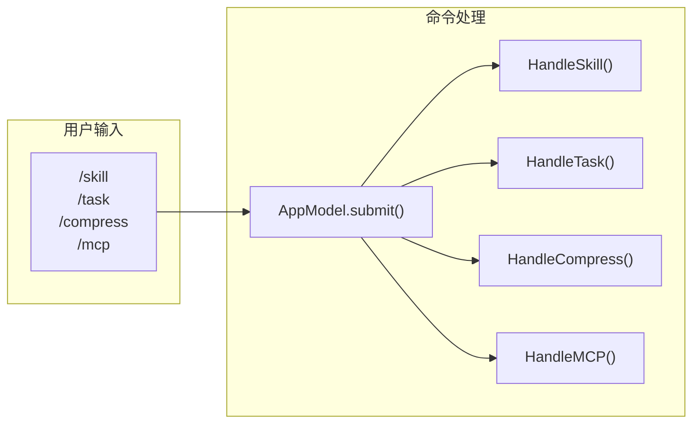

# Commands - 斜杠命令

## 架构



## 位置

- `internal/commands/skill.go` - `/skill`
- `internal/commands/task.go` - `/task`
- `internal/commands/compress.go` - `/compress`
- `internal/commands/mcp.go` - `/mcp`

## 概述

斜杠命令由 TUI 直接解析处理，不经过 LLM。命令处理在 [tui.go:342-407](internal/cli/tui.go)：

```go
func (m *AppModel) submit() tea.Cmd {
    text := strings.TrimSpace(m.input.Value())
    
    if strings.HasPrefix(text, "/skill") {
        result, err := commands.HandleSkill(text, m.skillMgr)
        m.entries = append(m.entries, conversationEntry{Role: roleSystem, Content: result})
        return nil
    }
    
    if strings.HasPrefix(text, "/task") {
        result, err := commands.HandleTask(text, m.taskList)
        // ...
    }
    
    // ...
}
```

## /skill 命令

| 命令 | 说明 |
|------|------|
| `/skill list` | 列出所有技能 |
| `/skill get <name>` | 查看技能正文和来源 |

底层调用 [skill.Manager](../internal/skill/skill.go)。

## /task 命令

| 命令 | 说明 |
|------|------|
| `/task list [status]` | 列出任务 |
| `/task create <id> <title> <description>` | 创建任务 |
| `/task update <id> <status>` | 更新状态 |
| `/task get <id>` | 获取任务详情 |
| `/task delete <id>` | 删除任务 |
| `/task archive <id>` | 归档任务 |
| `/task reopen <id> [status]` | 重新打开 |

底层调用 [task.TaskList](../internal/task/tasklist.go)。

## /compress 命令

| 命令 | 说明 |
|------|------|
| `/compress` | 手动压缩上下文并归档 |

底层调用 [context.Manager.ManualCompress](../internal/context/ctx.go)。

## /mcp 命令

| 命令 | 说明 |
|------|------|
| `/mcp list` | 列出 MCP 服务器 |
| `/mcp add <name> <command> [args...]` | 添加服务器 |
| `/mcp remove <name>` | 删除服务器 |
| `/mcp enable <name>` | 启用服务器 |
| `/mcp disable <name>` | 禁用服务器 |

配置文件：`~/.5hAgent/mcp.json`

## 与 LLM 工具的关系

| CLI 命令 | LLM 工具 | 说明 |
|----------|----------|------|
| `/skill` | `skill.skill` | 功能相同，入口不同 |
| `/task` | `task.task` | 功能相同，入口不同 |
| `/compress` | 无 | 仅 CLI |
| `/mcp` | 无 | 仅 CLI |

- CLI 命令给用户直接操作
- LLM 工具给 Agent 自主调用

## 扩展方式

1. 在 `internal/commands/` 新增命令处理文件
2. 实现 `HandleXxx(...) (string, error)` 函数
3. 在 [tui.go](internal/cli/tui.go) 的 `submit()` 中添加分支
4. 更新本文档

## 相关代码

- [tui.go](../internal/cli/tui.go)
- [skill.go](../internal/commands/skill.go)
- [task.go](../internal/commands/task.go)
- [compress.go](../internal/commands/compress.go)
- [mcp.go](../internal/commands/mcp.go)
