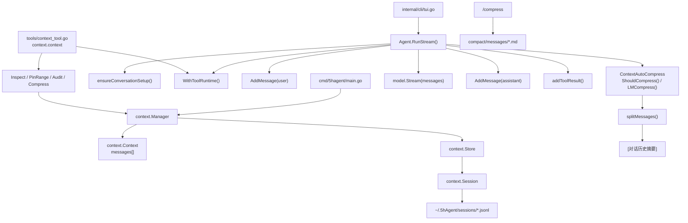

# Context - 上下文管理

## 架构



## 代码位置

| 文件 | 作用 |
|------|------|
| `internal/context/ctx.go` | Context 内存消息管理、自动压缩、手动压缩 |
| `internal/context/session.go` | Session 持久化、JSONL 读写、会话列表 |
| `internal/tools/context_tool.go` | LLM 可调用的上下文 inspect/pin/audit/compress 工具 |
| `internal/agent/agent.go` | ReAct 主循环中读写上下文、触发自动压缩 |
| `internal/commands/compress.go` | `/compress` 命令，手动触发压缩并输出压缩后上下文 |
| `internal/cli/tui.go` | TUI 中处理 `/compress` 和 `/session` 命令 |
| `cmd/5hagent/main.go` | 创建 `Manager`、加载/创建 session、绑定到 Agent |

## 核心类型

### Context

`Context` 是一次 Agent 运行时使用的内存消息容器。

```go
type Context struct {
    messages []*schema.Message
    Session  *Session
    meta     ContextMeta
}
```

- `messages` 是实际发送给 LLM API 的消息列表。
- `Session` 可选；存在时，新增消息会同步追加到持久化会话。
- `meta` 保存运行时 context 管理元数据，当前包括 pinned ranges 和 audit events。
- `messages` 是未导出字段，外部通过 `Manager` 访问。

### Manager

`Manager` 是 Context 的统一入口。

```go
type Manager struct {
    store *Store
}
```

- `NewManager()` 不传目录时只管理内存上下文。
- `NewManager(sessionDir)` 传目录时启用 session 持久化。
- `cmd/5hagent/main.go` 使用 `~/.5hAgent/sessions` 初始化持久化 manager。

### Session

`Session` 是一段可恢复对话的持久化实体。

```go
type Session struct {
    ID        string
    Title     string
    CreatedAt time.Time
    UpdatedAt time.Time
    messages  []*schema.Message
    filePath  string
    dirty     bool
}
```

- `ID` 当前由 UTC 时间生成，格式是 `YYYYMMDDHHMMSS`。
- `Title` 初始为 `New Session`，第一条 user 消息进入时由前 30 个字符生成。
- `messages` 是 session 的内存缓存。
- `dirty` 为 true 时，`saveToFile()` 会重写整个 JSONL 文件。

### CompressResult

```go
type CompressResult struct {
    Before      int
    After       int
    ArchivePath string
}
```

只用于手动压缩 `/compress`，记录压缩前后消息数和归档路径。

### Context 管理元数据

`ContextMeta` 当前只保存在内存中，不写入 session JSONL。

```go
type ContextMeta struct {
    Pinned []ContextRange
    Audit  []ContextEvent
}

type ContextRange struct {
    Start  int
    End    int
    Reason string
}

type ContextEvent struct {
    Op          string
    Range       ContextRange
    BeforeCount int
    AfterCount  int
    ArchivePath string
    CreatedAt   time.Time
}
```

- `ContextRange` 使用包含首尾下标的消息范围。
- `Pinned` 用于标记不应被压缩或替换的消息范围。
- `Audit` 记录 context 管理操作，目前 `PinRange()` 会写入 `pin` 事件。
- 当前 `Compress()` / `LMCompress()` 仍主要保护 system 消息和最近消息；pinned range 已有校验函数，但压缩路径还没有按 pinned range 做细粒度 range 压缩。

`ContextInspect` 是给工具层使用的结构化视图：

```go
type ContextInspect struct {
    MessageCount    int
    EstimatedChars  int
    ProtectedRanges []ContextRange
    Pinned          []ContextRange
    Messages        []MessageInspect
}

type MessageInspect struct {
    Index   int
    Role    string
    Chars   int
    Preview string
    Flags   []string
}
```

## 消息格式

上下文中的消息使用 Eino 的 `*schema.Message`：

```go
&schema.Message{
    Role:    schema.User,
    Content: "...",
}
```

实际使用的 role 包括：

| Role | 来源 |
|------|------|
| `system` | 主系统提示词、启用的 skill、压缩摘要 |
| `user` | 用户输入 |
| `assistant` | LLM 输出；如果有 tool call，即使 content 为空也会加入上下文 |
| `tool` | 工具调用结果 |

压缩摘要会写成一条 system 消息：

```text
[对话历史摘要]
<LLM 生成的摘要内容>
```

## Session 文件格式

Session 默认存储在：

```text
~/.5hAgent/sessions/<session-id>.jsonl
```

JSONL 第一行是 session 元信息，后续每行是一条消息：

```jsonl
{"type":"session","id":"20260501120000","title":"用户消息摘要","created_at":"2026-05-01T12:00:00Z","updated_at":"2026-05-01T12:05:00Z"}
{"role":"system","content":"..."}
{"role":"user","content":"..."}
{"role":"assistant","content":"..."}
{"role":"tool","content":"..."}
```

读文件时：

- `loadFromFile()` 读取 session 元信息和消息。
- `parseRole()` 将字符串映射到 `schema.System`、`schema.User`、`schema.Assistant`、`schema.Tool`。
- 未识别 role 默认按 `schema.User` 处理。

写文件时：

- `Store.Append()` 先追加到 `session.messages`。
- 更新 `UpdatedAt` 和 `dirty`。
- `saveToFile()` 使用 `O_TRUNC` 重写整个 session 文件。
- `Store.ReplaceMessages()` 用于压缩后整体替换 session messages，并重写 JSONL 文件。

## 生命周期

### 启动

`cmd/5hagent/main.go` 负责创建上下文：

1. `utils.GetConfigDir()` 返回 `~/.5hAgent`。
2. `sessionDir := filepath.Join(configDir, "sessions")`。
3. `ctxManager := agentctx.NewManager(sessionDir)`。
4. 如果指定 `--session <id>`，调用 `CreateContext(id)` 恢复该 session。
5. 如果指定 `-c` 或 `--continue`，调用 `GetLatestSessionID()` 恢复最近 session。
6. 否则调用 `CreateContext("")` 创建新 session。
7. `ag.SetCtxManager(ctxManager)` 让 Agent 使用同一个 manager。

### 首轮对话初始化

`Agent.RunStream()` 每次用户输入都会先调用 `ensureConversationSetup()`。

如果当前 context 还没有消息：

1. 写入主 system prompt。
2. 遍历启用的 skill。
3. 每个 skill 作为独立 system 消息写入上下文。

如果 context 已有消息，则不会重复注入 system prompt 和 skill。

### 单轮 Agent 执行

`Agent.RunStream()` 的上下文读写顺序：

1. `AddMessage(user)` 追加用户输入。
2. 如果 `AGENT_CONTEXT_AUTO_COMPRESS=true`，`ShouldCompress()` 判断消息数是否超过阈值。
3. 需要时调用 `LMCompress()`。
4. `GetMessages()` 取出完整消息列表。
5. `model.Stream(messages)` 把完整上下文发给 LLM。
6. 如果 LLM 产生 tool call，先写入 assistant tool-call 消息。
7. 执行工具并写入 tool result 消息。
8. 回到 ReAct 循环继续调用 LLM。
9. 如果没有 tool call，写入最终 assistant 消息并结束本轮。

## Manager 接口

| 方法 | 说明 |
|------|------|
| `NewManager(sessionDir ...string)` | 创建 manager，可选启用持久化 |
| `NewMemoryManagerWithStore(sessionDir)` | 创建默认内存 context，但允许后续显式绑定 session |
| `NewManagerWithStore(store)` | 用已有 store 创建 manager |
| `CreateContext(sessionID)` | 创建或恢复 context |
| `CloneContext(parent)` | 克隆消息列表，用于 sub-agent |
| `GetMessages(ctx)` | 返回当前 context 的全部消息 |
| `AddMessage(ctx, msg)` | 追加消息，存在 session 时同步持久化 |
| `ReplaceMessages(ctx, messages)` | 替换当前 context 消息，存在 session 时同步重写 JSONL |
| `Clear(ctx)` | 清空内存消息，不同步清空 session 文件 |
| `ListSessions()` | 列出持久化 session |
| `SwitchSession(ctx, id)` | 切换到指定 session，返回新 context |
| `GetSessionID(ctx)` | 返回当前 context 关联的 session id |
| `GetLatestSessionID()` | 返回最近更新的 session id |
| `GetStore()` | 返回底层 store |
| `GetSessionTitle(ctx)` | 返回 session title |
| `BindSession(ctx, id)` | 将内存 context 显式绑定并写入 session |
| `SaveSession(ctx)` | 保存已绑定 session |
| `DropSession(ctx)` | 解除 session 绑定，不删除文件 |
| `Inspect(ctx)` | 返回结构化上下文视图，不返回完整消息内容 |
| `PinRange(ctx, range)` | 标记消息范围为 pinned，并记录 audit |
| `Audit(ctx)` | 返回 context 管理操作记录 |
| `ValidateEditableRange(ctx, range)` | 校验范围是否允许被压缩或替换 |
| `ShouldCompress(ctx)` | 判断是否超过自动压缩阈值 |
| `Compress(ctx)` | 固定保留最近消息的简单压缩 |
| `LMCompress(goCtx, ctx, llm, promptDir)` | LLM 摘要压缩，失败时 fallback 到 `Compress()` |
| `ManualCompress(goCtx, ctx, llm, promptDir, archiveDir)` | 手动压缩并写归档 |

## LLM 自主管理上下文工具

`context.context` 将部分上下文管理能力暴露给 LLM：

| action | 作用 | 后端函数 |
| --- | --- | --- |
| `inspect` | 查看消息索引、角色、preview、protected/pinned flags | `Manager.Inspect` |
| `pin` | 保护消息范围，避免后续压缩丢失关键约束 | `Manager.PinRange` |
| `audit` | 查看最近上下文管理事件 | `Manager.Audit` |
| `compress` | 主动触发压缩，`mode=lm` 或 `mode=truncate` | `LMCompress` / `Compress` |

工具不会返回完整历史正文，`inspect` 只给结构化摘要。`compress` 会通过 `ReplaceMessages` 同步内存消息和 session 文件。

### 工具运行时桥接

`context.context` 不持有某个固定 session。每次 `Agent.RunStream()` 处理用户输入时，会先把本轮上下文注入 Go context：

```go
ctx = agentctx.WithToolRuntime(ctx, a.ctxManager, messageCtx)
```

工具执行时读取：

```go
rt, ok := agentctx.ToolRuntimeFrom(ctx)
```

这样同一个工具实例可以服务 TUI session、headless task session 和未来的其他 context，而不会把 context 绑定在全局变量上。

可通过配置关闭自动压缩，测试模型是否会主动调用上下文工具：

```env
AGENT_CONTEXT_AUTO_COMPRESS=false
```

## 压缩策略

当前常量在 `internal/context/ctx.go`：

| 常量 | 值 | 说明 |
|------|----|------|
| `MaxMessages` | `50` | 超过该消息数触发自动压缩 |
| `KeepRecentMessages` | `30` | 压缩后保留最近的非 system 历史消息数 |

### 自动压缩

自动压缩发生在 `RunStream()` 已经加入用户消息之后、调用 LLM 之前。

```go
if a.config.ContextAutoCompress && a.ctxManager.ShouldCompress(messageCtx) {
    before, after, err := a.ctxManager.LMCompress(ctx, messageCtx, a.model, "prompt")
    if err != nil {
        return "", fmt.Errorf("failed to compress context: %w", err)
    }
    logger.DebugTag("CTX", "Context compressed: %d -> %d messages", before, after)
}
```

`LMCompress()` 行为：

1. 如果消息数不超过 `MaxMessages`，不处理。
2. 从 `prompt/compress.md` 加载压缩提示词。
3. 加载失败时 fallback 到 `Compress()`。
4. 调用 `compressWithPrompt()` 生成摘要。
5. LLM 压缩失败时 fallback 到 `Compress()`。
6. 通过 `ReplaceMessages()` 用压缩后的消息列表替换 `ctx.messages`，并同步 session JSONL。

### LLM 摘要压缩

`compressWithPrompt()` 的步骤：

1. `splitMessages()` 将 system 消息和非 system 历史消息分开。
2. 早期历史消息作为 `toCompress`。
3. 最近 `KeepRecentMessages` 条历史消息作为 `toKeep`。
4. 将 `toCompress` 格式化为：`[role]: content`。
5. 调用 LLM 生成摘要。
6. 返回：`systemMsgs + summarySystemMsg + toKeep`。

压缩后，原 system prompt 和 skill system 消息仍保留。

### 简单压缩

`Compress()` 不调用 LLM，只保留最后 `KeepRecentMessages` 条消息：

```go
keepStart := beforeCount - KeepRecentMessages
compressed := ctx.messages[keepStart:]
m.ReplaceMessages(ctx, compressed)
```

注意：简单压缩不区分 role，因此 fallback 情况下可能丢弃早期 system 消息。

### 手动压缩

TUI 输入 `/compress` 会调用：

```go
commands.HandleCompress(..., compactRoot="compact")
```

归档路径：

```text
compact/messages/<YYYYMMDD-HHMMSS>.md
```

归档格式：

```markdown
# Compressed Context Archive

## Summary

<摘要>

## Archived Messages

- role: user
  content: ...
- role: assistant
  content: ...
```

`/compress` 返回内容会包含压缩后的完整 context dump。

## CLI 命令

### 启动参数

```bash
./5hagent --session 20260501120000
./5hagent -c
./5hagent --continue
```

- `--session <id>` 恢复指定 session。
- `-c` / `--continue` 恢复最近更新的 session。
- 未指定时创建新 session。

### TUI 命令

```text
/session
/session list
/session ls
/session new
/session <id>
/compress
```

- `/session` 显示当前 session id 和 title。
- `/session list` 或 `/session ls` 列出 session。
- `/session new` 创建新 session 并清空 TUI 展示 entries。
- `/session <id>` 切换到指定 session。
- `/compress` 对当前内存 context 做手动压缩。

## 当前实现边界

- 自动压缩只按消息数量触发，不按 token 数触发。
- `LMCompress()` 的 archive 只在手动 `/compress` 中写入；自动压缩不写归档。
- 压缩会通过 `ReplaceMessages()` 重写当前 session 文件。
- `Clear(ctx)` 只清空内存，不清空 session 文件。
- `CloneContext()` 只复制消息 slice，不复制 session 关联。
- `BindSession/SaveSession/DropSession` 是 Agent Systemd `sys.session.*` 的底座；默认内存 context 不会自动落盘。
- `Compress()` fallback 不保护 system 消息。
- 压缩摘要是普通 system 消息，没有结构化元数据标记来源、范围或 archive id。
- pinned range 和 audit event 目前只在内存中维护，不随 session 恢复。
- 还没有重要事实、工具日志等更细分的上下文层级。
- 没有 context token 预算统计，现有 token usage 来自模型响应 metadata 或 agent token budget。

## context 工具后续设计

当前已落地的 LLM 工具是单一入口 `context.context`，通过 `action` 区分 `inspect/pin/audit/compress`。下面记录的是后续把范围摘要、归档和更细保护规则做完整时的设计方向，不代表当前源码已经全部实现。

### 目标

让 LLM 通过工具参与上下文治理，但不允许它任意 CRUD 原始消息。

目标不是让 LLM “看到上下文”。每次调用 LLM API 时，本来就会发送当前完整 `messages`。`context.*` 的价值是提供结构化索引、成本信息、可定位 range、压缩操作和审计记录，让 LLM 能更可靠地决定哪些内容应该保留、摘要或归档。

### 设计原则

- Runtime 保留最终约束，LLM 只通过工具请求受控操作。
- 永远保护 system prompt、启用 skill、当前用户消息和最近 N 条消息。
- 优先压缩 tool 输出、旧实现日志、重复报错和已完成阶段的细节。
- 所有破坏性操作必须可审计，最好可追溯到 archive。
- context 管理工具的结果应尽量短，避免管理上下文本身继续污染上下文。
- 第一版只做 inspect、pin、summarize，不做自由删除和任意改写。

### 推荐能力

#### `context.context action=inspect`

返回上下文结构化视图，不返回完整内容。

示例输出：

```json
{
  "message_count": 73,
  "estimated_chars": 185000,
  "protected_ranges": ["0..3", "68..72"],
  "compressible_ranges": [
    {"range":"8..35","reason":"old tool outputs","estimated_chars":72000},
    {"range":"36..51","reason":"completed implementation discussion","estimated_chars":41000}
  ],
  "messages": [
    {"index":0,"role":"system","flags":["protected"],"chars":8200,"preview":"You are..."},
    {"index":12,"role":"tool","flags":["compressible"],"chars":18000,"preview":"go test output..."}
  ]
}
```

用途：

- 给 LLM 一个稳定的 message index。
- 暴露哪些 range 可压缩、哪些受保护。
- 显示字符数或 token 估算，帮助选择高收益压缩目标。

#### `context.context action=pin`

标记消息或 range 不允许自动压缩。

输入示例：

```json
{"action":"pin","start":5,"end":7,"reason":"user requirements"}
```

第一版可以只在内存维护 pin 信息，不必改变 session JSONL 格式。后续如果需要跨 session 恢复，再设计持久化格式。

#### 后续能力：范围摘要

将指定 range 压缩为摘要消息，并归档原始消息。

输入示例：

```json
{
  "range": "8..35",
  "focus": "保留用户要求、文件路径、失败原因和最终结论，省略重复日志"
}
```

约束：

- range 不能包含 protected 或 pinned 消息。
- range 不能包含最近 N 条消息。
- 输出摘要应写成结构化 system 消息。
- 原文写入 archive，摘要中保留 archive path 或 archive id。

摘要消息建议格式：

```text
[对话历史摘要]
source_range: 8..35
archive: compact/messages/20260508-120000.md

<摘要内容>
```

#### `context.context action=audit`

返回最近上下文管理操作。

示例输出：

```json
{
  "events": [
    {"op":"summarize_range","range":"8..35","before":28,"after":1,"archive":"compact/messages/20260508-120000.md"},
    {"op":"pin","range":"5..7","reason":"user requirements"}
  ]
}
```

用途：

- 让 LLM 知道当前上下文已经被编辑过。
- 方便用户 debug 为什么某些历史不在当前 prompt 里。

### 暂不建议近期实现的能力

| 能力 | 暂缓原因 |
|------|----------|
| `delete_range` | 容易误删关键约束；可先通过 summarize 实现降噪 |
| `replace` | 任意改写历史会破坏可追溯性 |
| `write` | 让 LLM 注入任意消息会混淆真实用户输入和模型记忆 |
| `unpin` | 需要更明确的权限策略，否则可能绕过保护 |

### 和现有实现的集成点

最小改动路径：

1. 在 `internal/context/ctx.go` 增加 range 压缩能力。
2. 在 `Context` 上增加内存级 metadata，例如 pinned ranges 和 audit events。
3. 扩展 `internal/tools/context_tool.go` 的 action。
4. 在 `tools.RegisterContextTool()` 中维持单一 `context.context` 工具入口。
5. 在 `Agent.RunStream()` 的自动压缩前，优先使用 metadata 避免压缩 pinned/protected 消息。
6. 保留现有 `LMCompress()` 作为 fallback。

### 数据模型建议

当前已经在 `Context` 上落地了内存级 metadata，metadata 不写入 JSONL：

```go
type Context struct {
    messages []*schema.Message
    Session  *Session
    meta     ContextMeta
}

type ContextMeta struct {
    Pinned []ContextRange
    Audit  []ContextEvent
}

type ContextRange struct {
    Start  int
    End    int
    Reason string
}

type ContextEvent struct {
    Op          string
    Range       ContextRange
    BeforeCount int
    AfterCount  int
    ArchivePath string
    CreatedAt   time.Time
}
```

已落地的 manager 底座：

- `Inspect(ctx)` 返回消息索引、role、字符数、preview 和 flags。
- `PinRange(ctx, range)` 写入 pinned range，并追加 `pin` audit event。
- `Audit(ctx)` 返回 audit event 副本。
- `ValidateEditableRange(ctx, range)` 拒绝越界、system、recent 和 pinned 范围。

如果后续需要跨 session 恢复，再考虑：

- 在 JSONL 增加 `type:"context_meta"` 行。
- 或单独写 `~/.5hAgent/sessions/<id>.context.json`。

### 压缩保护规则

建议硬编码第一版规则：

- index 0..systemEnd 保护：主 system prompt 和 skill messages 不可压缩。
- 最近 `KeepRecentMessages` 条历史消息保护。
- 当前 turn 新加入的 user 消息保护。
- pinned range 保护。
- assistant tool-call 消息和对应 tool result 应作为一组处理，避免留下孤儿 tool result。

### 推荐迭代顺序

1. 已完成 `inspect`，只读，无行为风险。
2. 已完成 `pin` 和 `audit` 的内存 metadata。
3. 已完成整段 context `compress`，支持 `lm/truncate`。
4. 下一步补压缩保护规则，让 pinned range 真正影响 `LMCompress()` / `Compress()` 的可编辑范围。
5. 再实现 range 级摘要，复用现有 `compressWithPrompt()` 的 prompt 和 archive 写入逻辑。

## 相关代码

- [`internal/context/ctx.go`](../internal/context/ctx.go)
- [`internal/context/session.go`](../internal/context/session.go)
- [`internal/agent/agent.go`](../internal/agent/agent.go)
- [`internal/commands/compress.go`](../internal/commands/compress.go)
- [`internal/cli/tui.go`](../internal/cli/tui.go)
- [`cmd/5hagent/main.go`](../cmd/5hagent/main.go)
