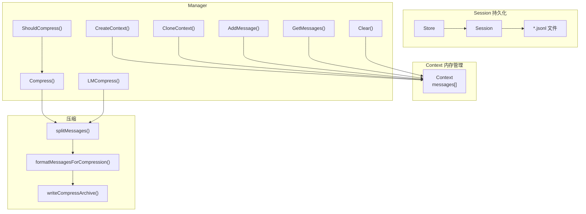

# Context - 上下文管理

## 架构



## 位置

- `internal/context/ctx.go` - Context 内存管理
- `internal/context/session.go` - Session 持久化

## Session 持久化

### 核心类型

```go
// Session 代表一次完整的对话会话
type Session struct {
    ID        string             // 唯一标识符 (格式: YYYYMMDDHHMMSS)
    Title     string             // 会话标题（从第一条用户消息生成）
    CreatedAt time.Time          // 创建时间
    UpdatedAt time.Time          // 最后更新时间
    messages  []*schema.Message  // 消息历史（内存缓存）
    filePath  string             // JSONL 文件路径
    dirty     bool               // 是否有未保存的修改
}

// Store 管理多个 Session 的持久化存储
type Store struct {
    dir   string              // 存储目录
    cache map[string]*Session // 内存缓存
}
```

### JSONL 文件格式

```
{"type":"session","id":"20260501120000","title":"用户消息摘要...","created_at":"...","updated_at":"..."}
{"role":"user","content":"用户消息内容"}
{"role":"assistant","content":"助手回复"}
{"role":"tool","content":"工具调用结果"}
...
```

### Store 接口

| 方法 | 说明 |
|------|------|
| `NewStore(dir)` | 创建或打开会话存储 |
| `GetOrCreate(id)` | 获取或创建 Session（空 id 生成新会话） |
| `List()` | 列出所有会话（按更新时间倒序） |
| `Delete(id)` | 删除会话 |
| `Append(session, msg)` | 追加消息并持久化 |
| `GetMessages(session)` | 获取会话消息 |
| `LoadMessages(session)` | 从文件加载消息 |

### Session 生命周期

```
创建 → 运行 → 持久化（每条消息） → 恢复（下次启动）
   ↓         ↓
 生成ID    生成Title（首条用户消息）
```

### 存储位置

默认：`~/.5hagent/sessions/`

## 核心类型

```go
type Context struct {
    messages []*schema.Message  // 消息列表
}

type Manager struct{}  // 无状态管理器

type CompressResult struct {
    Before      int    // 压缩前消息数
    After       int    // 压缩后消息数
    ArchivePath string // 归档文件路径
}
```

## 常量

| 常量 | 值 | 说明 |
|------|-----|------|
| `MaxMessages` | 50 | 触发压缩的阈值 |
| `KeepRecentMessages` | 30 | 压缩后保留的最近消息数 |

## Manager 接口

| 方法 | 说明 |
|------|------|
| `NewManager()` | 创建无状态 manager |
| `CreateContext()` | 创建空上下文 |
| `CloneContext(parent)` | 克隆父上下文 |
| `GetMessages(ctx)` | 获取所有消息 |
| `AddMessage(ctx, msg)` | 追加消息 |
| `Clear(ctx)` | 清空消息 |
| `ShouldCompress(ctx)` | 检查是否需要压缩 |
| `Compress(ctx)` | 简单截断压缩 |
| `LMCompress(ctx, llm, promptDir)` | LLM 压缩（摘要替换旧消息） |
| `ManualCompress(ctx, llm, promptDir, archiveDir)` | 手动压缩并归档 |

## 压缩流程

### 简单压缩

```go
func (m *Manager) Compress(ctx *Context) (int, int, error) {
    if len(ctx.messages) <= MaxMessages {
        return len(ctx.messages), len(ctx.messages), nil
    }
    keepStart := len(ctx.messages) - KeepRecentMessages
    ctx.messages = ctx.messages[keepStart:]
    return beforeCount, len(ctx.messages), nil
}
```

### LLM 压缩

```go
func (m *Manager) LMCompress(ctx context.Context, ctx *Context, llm model.ToolCallingChatModel, promptDir string) (int, int, error) {
    compressPrompt, _ := utils.Load(promptDir, "compress")
    compressed, _, _, err := m.compressWithPrompt(ctx, ctx, llm, compressPrompt)
    ctx.messages = compressed
    return before, len(ctx.messages), nil
}
```

流程：
1. 分离 system messages 和 history messages
2. 保留最近的 KeepRecentMessages 条历史消息
3. 将早期消息格式化为压缩 prompt
4. 调用 LLM 生成摘要
5. 用摘要消息替换早期消息

### 消息分离

```go
func splitMessages(messages []*schema.Message) (systemMsgs, historyMsgs []*schema.Message) {
    for _, msg := range messages {
        if msg.Role == schema.System {
            systemMsgs = append(systemMsgs, msg)
        } else {
            historyMsgs = append(historyMsgs, msg)
        }
    }
}
```

## 与 Agent 的集成

Agent.RunStream 中的压缩检查（[agent.go:233-239](internal/agent/agent.go)）：

```go
if a.ctxManager.ShouldCompress(messageCtx) {
    before, after, err := a.ctxManager.LMCompress(ctx, messageCtx, a.model, "prompt")
    logger.DebugTag("CTX", "Context compressed: %d -> %d messages", before, after)
}
```

## 消息格式

压缩后的摘要消息格式：

```text
[对话历史摘要]
<LLM 生成的摘要内容>
```

归档文件格式（[ctx.go:220-238](internal/context/ctx.go)）：

```markdown
# Compressed Context Archive

## Summary
<摘要>

## Archived Messages
- role: user
  content: ...
- role: assistant
  content: ...
```

## 当前实现边界

- 不区分 system/user/assistant/tool 消息的重要性
- 不保留工具调用的中间结果
- 不做持久化分层存储
- 简单压缩不做 token 级别的预算控制

## 相关代码

- [ctx.go](../internal/context/ctx.go)
- [session.go](../internal/context/session.go)
- [agent.go](../internal/agent/agent.go)
- [compress.go](../internal/commands/compress.go)
