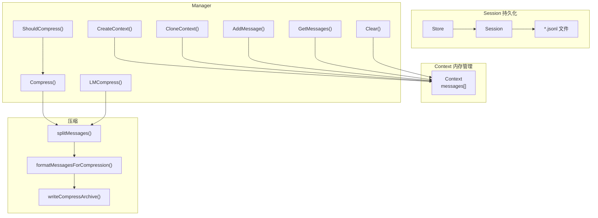

# Context - 上下文管理

## 架构



## 位置

- `internal/context/ctx.go` - Context 内存管理
- `internal/context/session.go` - Session 持久化

## Session 持久化

### 核心类型

```go
// Session 代表一次完整的对话会话
type Session struct {
    ID        string             // 唯一标识符 (格式: YYYYMMDDHHMMSS)
    Title     string             // 会话标题（从第一条用户消息生成）
    CreatedAt time.Time          // 创建时间
    UpdatedAt time.Time          // 最后更新时间
    messages  []*schema.Message  // 消息历史（内存缓存）
    filePath  string             // JSONL 文件路径
    dirty     bool               // 是否有未保存的修改
}

// Store 管理多个 Session 的持久化存储
type Store struct {
    dir   string              // 存储目录
    cache map[string]*Session // 内存缓存
}
```

### JSONL 文件格式

```
{"type":"session","id":"20260501120000","title":"用户消息摘要...","created_at":"...","updated_at":"..."}
{"role":"user","content":"用户消息内容"}
{"role":"assistant","content":"助手回复"}
{"role":"tool","content":"工具调用结果"}
...
```

### Store 实现

**创建 Store** ([session.go:49-57](internal/context/session.go))

```go
func NewStore(dir string) (*Store, error) {
    if err := os.MkdirAll(dir, 0755); err != nil {
        return nil, fmt.Errorf("create session dir: %w", err)
    }
    return &Store{
        dir:   dir,
        cache: make(map[string]*Session),
    }, nil
}
```

**获取或创建 Session** ([session.go:64-95](internal/context/session.go))

```go
func (s *Store) GetOrCreate(id string) (*Session, error) {
    if id == "" {
        id = generateSessionID()  // 生成新 ID
    }

    // 1. 先查缓存
    if session, ok := s.cache[id]; ok {
        return session, nil
    }

    // 2. 尝试从文件加载
    filePath := s.sessionFilePath(id)
    if data, err := os.ReadFile(filePath); err == nil {
        session, err := s.loadFromFile(filePath, data)
        if err == nil {
            s.cache[id] = session
            return session, nil
        }
    }

    // 3. 创建新会话
    session := &Session{
        ID:        id,
        Title:     "New Session",
        CreatedAt: time.Now().UTC(),
        UpdatedAt: time.Now().UTC(),
        messages:  make([]*schema.Message, 0),
        filePath:  filePath,
    }
    s.cache[id] = session
    return session, nil
}
```

**持久化消息** ([session.go:163-174](internal/context/session.go))

```go
func (s *Store) Append(session *Session, msg *schema.Message) error {
    session.messages = append(session.messages, msg)
    session.UpdatedAt = time.Now().UTC()
    session.dirty = true

    // 如果是第一条用户消息，生成标题
    if session.Title == "New Session" && msg.Role == schema.User {
        session.Title = generateTitle(msg.Content)
    }

    return s.saveToFile(session)
}
```

**写入文件** ([session.go:207-251](internal/context/session.go))

```go
func (s *Store) saveToFile(session *Session) error {
    if !session.dirty {
        return nil
    }

    var entries []sessionFileEntry

    // 添加会话头
    entries = append(entries, sessionFileEntry{
        Type:      "session",
        ID:        session.ID,
        Title:     session.Title,
        CreatedAt: session.CreatedAt.Format(time.RFC3339),
        UpdatedAt: session.UpdatedAt.Format(time.RFC3339),
    })

    // 添加消息
    for _, msg := range session.messages {
        entry := sessionFileEntry{
            Role:    string(msg.Role),
            Content: msg.Content,
        }
        entries = append(entries, entry)
    }

    // 写入 JSONL 文件
    file, err := os.OpenFile(session.filePath, os.O_CREATE|os.O_WRONLY|os.O_TRUNC, 0644)
    if err != nil {
        return fmt.Errorf("open session file: %w", err)
    }
    defer file.Close()

    for _, entry := range entries {
        line, err := json.Marshal(entry)
        if err != nil {
            return fmt.Errorf("marshal entry: %w", err)
        }
        if _, err := file.Write(append(line, '\n')); err != nil {
            return fmt.Errorf("write entry: %w", err)
        }
    }

    session.dirty = false
    return nil
}
```

### Store 接口

| 方法 | 说明 |
|------|------|
| `NewStore(dir)` | 创建或打开会话存储 |
| `GetOrCreate(id)` | 获取或创建 Session（空 id 生成新会话） |
| `List()` | 列出所有会话（按更新时间倒序） |
| `Delete(id)` | 删除会话 |
| `Append(session, msg)` | 追加消息并持久化 |
| `GetMessages(session)` | 获取会话消息 |
| `LoadMessages(session)` | 从文件加载消息 |

### Session 生命周期

```
创建 → 运行 → 持久化（每条消息） → 恢复（下次启动）
   ↓         ↓
 生成ID    生成Title（首条用户消息）
```

### 存储位置

默认：`~/.5hagent/sessions/`

## Manager 实现

### 创建 Manager 和 Context

**NewManager** ([ctx.go:51-57](internal/context/ctx.go))

```go
func NewManager(sessionDir ...string) *Manager {
    var store *Store
    if len(sessionDir) > 0 && sessionDir[0] != "" {
        store, _ = NewStore(sessionDir[0])  // 可选启用持久化
    }
    return &Manager{store: store}
}
```

**CreateContext** ([ctx.go:74-94](internal/context/ctx.go))

```go
func (m *Manager) CreateContext(sessionID string) (*Context, error) {
    ctx := &Context{
        messages: make([]*schema.Message, 0),
    }

    if m.store != nil {
        session, err := m.store.GetOrCreate(sessionID)
        if err != nil {
            return nil, err
        }
        ctx.Session = session

        // 从 Session 加载已有消息
        messages, err := m.store.LoadMessages(session)
        if err == nil && len(messages) > 0 {
            ctx.messages = messages
        }
    }

    return ctx, nil
}
```

### 消息管理

**AddMessage** ([ctx.go:125-136](internal/context/ctx.go))

```go
func (m *Manager) AddMessage(ctx *Context, msg *schema.Message) error {
    ctx.messages = append(ctx.messages, msg)

    // 持久化到 Session
    if m.store != nil && ctx.Session != nil {
        if err := m.store.Append(ctx.Session, msg); err != nil {
            return fmt.Errorf("persist message: %w", err)
        }
    }

    return nil
}
```

## CLI 集成

### main.go 中的参数处理

```go
var continueLast bool

func main() {
    rootCmd.Flags().BoolVarP(&continueLast, "continue", "c", false, "Resume from the last session")
    rootCmd.Flags().StringVar(&sessionID, "session", "", "Resume from existing session ID")
}

func runInteractive(cmd *cobra.Command, args []string) {
    // ...

    // 处理 -c/--continue 参数：自动获取最新会话
    if continueLast && sessionID == "" {
        sessions, err := ctxManager.ListSessions()
        if err != nil || len(sessions) == 0 {
            logger.InfoTag("SESSION", "No previous session found, creating new one")
            continueLast = false
        } else {
            sessionID = sessions[0].ID
            logger.InfoTag("SESSION", "Auto-resume last session: %s", sessionID)
        }
    }
}
```

### CLI 使用

```bash
./5hagent -c              # 恢复上次会话
./5hagent --continue     # 同上
./5hagent --session xxx   # 恢复指定会话
```

## 核心类型

```go
type Context struct {
    messages []*schema.Message
    Session  *Session // 关联的持久化会话（可选）
}

type Manager struct {
    store *Store // 会话存储
}

type CompressResult struct {
    Before      int    // 压缩前消息数
    After       int    // 压缩后消息数
    ArchivePath string // 归档文件路径
}
```

## 常量

| 常量 | 值 | 说明 |
|------|-----|------|
| `MaxMessages` | 50 | 触发压缩的阈值 |
| `KeepRecentMessages` | 30 | 压缩后保留的最近消息数 |

## Manager 接口

| 方法 | 说明 |
|------|------|
| `NewManager()` | 创建 manager（可指定会话目录） |
| `CreateContext()` | 创建空上下文 |
| `CloneContext(parent)` | 克隆父上下文 |
| `GetMessages(ctx)` | 获取所有消息 |
| `AddMessage(ctx, msg)` | 追加消息 |
| `Clear(ctx)` | 清空消息 |
| `ListSessions()` | 列出所有会话 |
| `SwitchSession(ctx, id)` | 切换到指定会话 |
| `ShouldCompress(ctx)` | 检查是否需要压缩 |
| `Compress(ctx)` | 简单截断压缩 |
| `LMCompress(ctx, llm, promptDir)` | LLM 压缩（摘要替换旧消息） |
| `ManualCompress(ctx, llm, promptDir, archiveDir)` | 手动压缩并归档 |

## 压缩流程

### 简单压缩

```go
func (m *Manager) Compress(ctx *Context) (int, int, error) {
    beforeCount := len(ctx.messages)

    if beforeCount <= MaxMessages {
        return beforeCount, beforeCount, nil
    }

    keepStart := beforeCount - KeepRecentMessages
    ctx.messages = ctx.messages[keepStart:]

    return beforeCount, len(ctx.messages), nil
}
```

### LLM 压缩

```go
func (m *Manager) LMCompress(goCtx context.Context, ctx *Context, llm model.ToolCallingChatModel, promptDir string) (int, int, error) {
    before := len(ctx.messages)
    if before <= MaxMessages {
        return before, before, nil
    }

    compressPrompt, err := utils.Load(promptDir, "compress")
    if err != nil {
        return m.Compress(ctx)
    }

    compressed, _, _, err := m.compressWithPrompt(goCtx, ctx, llm, compressPrompt)
    if err != nil {
        return m.Compress(ctx)
    }
    ctx.messages = compressed

    return before, len(ctx.messages), nil
}
```

流程：

1. 分离 system messages 和 history messages
2. 保留最近的 KeepRecentMessages 条历史消息
3. 将早期消息格式化为压缩 prompt
4. 调用 LLM 生成摘要
5. 用摘要消息替换早期消息

### 消息分离

```go
func splitMessages(messages []*schema.Message) (systemMsgs, historyMsgs []*schema.Message) {
    for _, msg := range messages {
        if msg.Role == schema.System {
            systemMsgs = append(systemMsgs, msg)
        } else {
            historyMsgs = append(historyMsgs, msg)
        }
    }
    return systemMsgs, historyMsgs
}
```

## 与 Agent 的集成

Agent.RunStream 中的压缩检查：

```go
if a.ctxManager.ShouldCompress(messageCtx) {
    before, after, err := a.ctxManager.LMCompress(ctx, messageCtx, a.model, "prompt")
    logger.DebugTag("CTX", "Context compressed: %d -> %d messages", before, after)
}
```

## 消息格式

压缩后的摘要消息格式：

```text
[对话历史摘要]
<LLM 生成的摘要内容>
```

归档文件格式：

```markdown
# Compressed Context Archive

## Summary
<摘要>

## Archived Messages
- role: user
  content: ...
- role: assistant
  content: ...
```

## 当前实现边界

- 不区分 system/user/assistant/tool 消息的重要性
- 不保留工具调用的中间结果
- 不做持久化分层存储
- 简单压缩不做 token 级别的预算控制
- Session 加载时只还原 role 为 user（简化实现）

## 相关代码

- [ctx.go](../internal/context/ctx.go)
- [session.go](../internal/context/session.go)
- [main.go](../cmd/5hagent/main.go)
- [agent.go](../internal/agent/agent.go)
- [compress.go](../internal/commands/compress.go)
