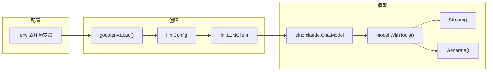

# LLM - 大语言模型客户端

## 架构



## 位置

- `internal/llm/client.go`
- `internal/llm/client_test.go`

## 核心类型

### Config

```go
type Config struct {
    APIKey    string  // API Key
    BaseURL   string  // Base URL
    Model     string  // 模型名称
    MaxTokens int     // 最大 token 数
}
```

### LLMClient

```go
type LLMClient struct {
    config *Config
    model  model.ToolCallingChatModel
}
```

## 配置方式

### 环境变量

| 变量 | 说明 | 默认值 |
|------|------|--------|
| `CLAUDE_API_KEY` | API Key | - |
| `CLAUDE_BASE_URL` | Base URL | `https://api.anthropic.com` |
| `CLAUDE_MODEL` | 模型名 | `claude-sonnet-4-6` |
| `CLAUDE_MAX_TOKENS` | 最大 token | `4096` |

### .env 文件

```bash
CLAUDE_API_KEY=your_api_key
CLAUDE_BASE_URL=https://api.anthropic.com
CLAUDE_MODEL=claude-sonnet-4-6
```

## 创建流程

```go
// 方式 1：从环境变量
client, err := llm.NewClientFromEnv(ctx, ".env")

// 方式 2：直接创建
client, err := llm.NewClient(ctx, &llm.Config{
    APIKey:    "...",
    BaseURL:   "...",
    Model:     "claude-sonnet-4-6",
    MaxTokens: 4096,
})
```

## 使用方式

```go
// 获取模型
model := client.GetModel()

// 绑定工具
modelWithTools, err := model.WithTools(toolInfos)

// 流式调用
reader, err := modelWithTools.Stream(ctx, messages)
for {
    chunk, err := reader.Recv()
    if err == io.EOF { break }
    // 处理 chunk
}

// 非流式调用
resp, err := modelWithTools.Generate(ctx, messages)
```

## 与 Agent 的集成

[main.go](cmd/5hagent/main.go)：

```go
// 创建客户端
client, err := llm.NewClient(ctx, &llm.Config{
    APIKey:    appConfig.LLM.APIKey,
    BaseURL:   appConfig.LLM.BaseURL,
    Model:     appConfig.LLM.Model,
    MaxTokens: appConfig.LLM.MaxTokens,
})

// 绑定工具
modelWithTools, err := client.GetModel().WithTools(toolInfos)

// 设置到 Agent
ag.SetModel(modelWithTools)
```

## LLM 压缩

LLM 也用于上下文压缩：

```go
// Agent.RunStream 中
if a.ctxManager.ShouldCompress(messageCtx) {
    a.ctxManager.LMCompress(ctx, messageCtx, a.model, "prompt")
}
```

## 相关代码

- [client.go](../internal/llm/client.go)
- [client_test.go](../internal/llm/client_test.go)
- [main.go](../cmd/5hagent/main.go)
