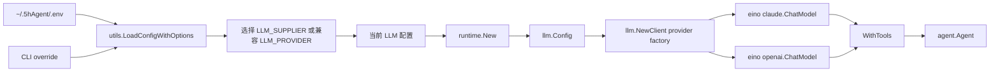

# LLM - 大语言模型客户端

> 由 GPT-5.5 于 2026-06-23 阅读 `internal/llm/client.go`、`internal/utils/utils.go`、`internal/runtime/runtime.go` 后更新。
> 覆盖范围：LLM provider 配置、Claude/OpenAI-compatible 模型初始化、Runtime 与 Agent 的接线。

## 摘要

LLM 模块负责把 `~/.5hAgent/.env` 中当前 supplier 配置转换成 Eino 的 `model.ToolCallingChatModel`。推荐用 `LLM_SUPPLIER` 保存多套供应商配置；`LLM_<SUPPLIER>_FORMAT=openai|claude` 只表示接口格式。旧版 `LLM_PROVIDER` + `LLM_<PROVIDER>_*` 仍兼容。

## 架构



## 位置

- [`internal/llm/client.go`](../internal/llm/client.go)：按接口格式创建 Eino 模型。
- [`internal/utils/utils.go`](../internal/utils/utils.go)：读取 supplier 或兼容 provider-specific 配置并校验当前生效配置。
- [`internal/runtime/runtime.go`](../internal/runtime/runtime.go)：把当前配置传给 `llm.NewClient`，绑定工具后注入 Agent。

## 核心类型

### Config

```go
type Config struct {
    Provider             string // 接口格式：claude / openai
    APIKey               string // API Key；Ollama OpenAI-compatible 本地模式可填 dummy
    BaseURL              string // 供应商 endpoint
    Model                string // 模型名称
    MaxTokens            int    // 最大生成 token
    ThinkingBudgetTokens int    // Claude extended thinking 预算；OpenAI 忽略
}
```

### LLMClient

```go
type LLMClient struct {
    config *Config
    model  model.ToolCallingChatModel
}
```

## 配置方式

### Supplier 环境变量

推荐按真实供应商保存多套配置。Supplier 名会转成大写下划线形式：`openrouter` 对应 `LLM_OPENROUTER_*`，`moonshot-ai` 对应 `LLM_MOONSHOT_AI_*`。

| 变量 | 说明 | 默认值 |
|------|------|--------|
| `LLM_SUPPLIER` | 当前默认供应商名 | - |
| `LLM_<SUPPLIER>_FORMAT` | 当前供应商的接口格式，支持 `claude` / `openai` | 必填 |
| `LLM_<SUPPLIER>_API_KEY` | 当前供应商的 API Key | Claude format 必填；OpenAI-compatible 按上游要求 |
| `LLM_<SUPPLIER>_BASE_URL` | 当前供应商的 Base URL | format 默认值 |
| `LLM_<SUPPLIER>_MODEL` | 当前供应商的模型名 | 必填 |
| `LLM_<SUPPLIER>_MAX_TOKENS` | 当前供应商最大生成 token | `4096` |
| `LLM_<SUPPLIER>_THINKING_BUDGET_TOKENS` | Claude extended thinking 预算 | `0` |

### Provider-specific 兼容环境变量

| 变量 | 说明 | 默认值 |
|------|------|--------|
| `LLM_PROVIDER` | 当前接口格式，支持 `claude` / `openai` | `claude` |
| `LLM_CLAUDE_API_KEY` | Claude API Key | - |
| `LLM_CLAUDE_BASE_URL` | Claude Base URL | `https://api.anthropic.com` |
| `LLM_CLAUDE_MODEL` | Claude 模型名 | `claude-sonnet-4-6` |
| `LLM_CLAUDE_MAX_TOKENS` | Claude 最大输出 token | `4096` |
| `LLM_CLAUDE_THINKING_BUDGET_TOKENS` | Claude extended thinking 预算 | `0` |
| `LLM_OPENAI_API_KEY` | OpenAI-compatible API Key；本地 Ollama 可填 `dummy` | - |
| `LLM_OPENAI_BASE_URL` | OpenAI-compatible Base URL | `https://api.openai.com/v1` |
| `LLM_OPENAI_MODEL` | OpenAI-compatible 模型名，可填任意上游支持的模型 | 必填 |
| `LLM_OPENAI_MAX_TOKENS` | OpenAI-compatible 最大生成 token | `4096` |
| `LLM_OPENAI_THINKING_BUDGET_TOKENS` | 保留字段；OpenAI provider 忽略 | `0` |

### 接口格式对比

| Format | API key | Base URL 示例 | Model 示例 | Thinking |
| --- | --- | --- | --- | --- |
| `claude` | 必填 | `https://api.anthropic.com` | `claude-sonnet-4-6` | 支持 |
| `openai` | 远端按需；本地可 dummy | `http://localhost:11434/v1` | `qwen3:14b` | 忽略 |

### 多供应商配置示例

```env
LLM_SUPPLIER=openrouter

LLM_OPENROUTER_FORMAT=openai
LLM_OPENROUTER_API_KEY=your_api_key
LLM_OPENROUTER_BASE_URL=https://openrouter.ai/api/v1
LLM_OPENROUTER_MODEL=openrouter/owl-alpha
LLM_OPENROUTER_MAX_TOKENS=4096

LLM_ANTHROPIC_FORMAT=claude
LLM_ANTHROPIC_API_KEY=your_api_key
LLM_ANTHROPIC_BASE_URL=https://api.anthropic.com
LLM_ANTHROPIC_MODEL=claude-sonnet-4-6
LLM_ANTHROPIC_MAX_TOKENS=4096
LLM_ANTHROPIC_THINKING_BUDGET_TOKENS=0
```

临时切到另一个供应商：

```bash
5hagent --llm-supplier anthropic run
```

也可以绕过默认配置，只临时切接口格式或模型：

```bash
5hagent --llm-format openai --llm-model openrouter/owl-alpha run
```

旧版 provider-specific 配置仍可直接使用：

```env
LLM_PROVIDER=openai
LLM_OPENAI_BASE_URL=http://localhost:11434/v1
LLM_OPENAI_MODEL=qwen3:14b
LLM_OPENAI_API_KEY=dummy
```

换 Ollama 模型只改：

```env
LLM_OPENAI_MODEL=hf.co/bartowski/Qwen_Qwen3.6-27B-GGUF:Q3_K_M
```

## 创建流程

主程序真实入口是 [`runtime.New`](../internal/runtime/runtime.go)：

```go
appConfig, err := utils.LoadConfigWithOptions(utils.LoadConfigOptions{
    LLMSupplier: opts.LLMSupplier,
    LLMFormat:   opts.LLMFormat,
    LLMModel:    opts.LLMModel,
})
client, err := llm.NewClient(ctx, &llm.Config{
    Provider:             appConfig.LLM.Provider,
    APIKey:               appConfig.LLM.APIKey,
    BaseURL:              appConfig.LLM.BaseURL,
    Model:                appConfig.LLM.Model,
    MaxTokens:            appConfig.LLM.MaxTokens,
    ThinkingBudgetTokens: appConfig.LLM.ThinkingBudgetTokens,
})

modelWithTools, err := client.GetModel().WithTools(toolInfos)
ag.SetModel(modelWithTools)
```

`llm.NewClientFromEnv` 是包级 legacy/simple helper；主程序配置入口以 `utils.LoadConfig` 为准。

## Thinking 输出

Claude extended thinking 通过 Eino Claude 的 `claude.Thinking` 配置启用。启用后，流式响应中的 thinking delta 会进入 `schema.Message.ReasoningContent`，TUI 将其渲染为独立的浅色 `thinking` 条目。

OpenAI format 不使用 thinking budget。本地模型是否会稳定触发工具调用取决于具体模型能力，建议先用只读任务验证 `WithTools`、工具调用和报告落盘。

## LLM 压缩

LLM 也用于上下文压缩：

```go
// Agent.RunStream 中
if a.ctxManager.ShouldCompress(messageCtx) {
    a.ctxManager.LMCompress(ctx, messageCtx, a.model, "prompt")
}
```

## 相关代码

- [client.go](../internal/llm/client.go)
- [utils.go](../internal/utils/utils.go)
- [runtime.go](../internal/runtime/runtime.go)
