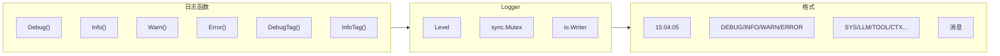

# Logger - 日志模块

## 架构



## 位置

- `internal/logger/logger.go`
- `internal/logger/color.go`
- `internal/logger/toolprint.go`

## 核心类型

```go
type Level int

const (
    DEBUG Level = iota
    INFO
    WARN
    ERROR
)

type Logger struct {
    level  Level
    output io.Writer
    mu     sync.Mutex
}
```

## 日志级别

| 级别 | 说明 | 用途 |
|------|------|------|
| DEBUG | 调试信息 | 开发调试 |
| INFO | 一般信息 | 正常运行 |
| WARN | 警告信息 | 潜在问题 |
| ERROR | 错误信息 | 错误发生 |

## 日志函数

| 函数 | 说明 |
|------|------|
| `SetLevel(level)` | 设置全局日志级别 |
| `SetOutput(w)` | 设置输出目标 |
| `Debug(format, args...)` | DEBUG 日志 |
| `Info(format, args...)` | INFO 日志 |
| `Warn(format, args...)` | WARN 日志 |
| `Error(format, args...)` | ERROR 日志 |
| `DebugTag(tag, format, args...)` | 带标签 DEBUG |
| `InfoTag(tag, format, args...)` | 带标签 INFO |
| `WarnTag(tag, format, args...)` | 带标签 WARN |
| `ErrorTag(tag, format, args...)` | 带标签 ERROR |
| `TruncateString(s, maxLen)` | 截断字符串 |

## 输出格式

```
[15:04:05][DEBUG ][SYS   ] System ready
[15:04:05][INFO  ][LLM   ] Calling Stream
[15:04:05][WARN  ][TOOL  ] Not found: xxx
[15:04:05][ERROR ][MCP   ] Failed to start server
```

格式：`[时间][级别][标签] 消息`

- 时间：固定 8 字符
- 级别：固定 5 字符
- 标签：固定 6 字符

## 标签分类

| 标签 | 说明 |
|------|------|
| SYS | 系统初始化 |
| LLM | LLM 调用 |
| REACT | ReAct 循环 |
| STREAM | 流式输出 |
| TOOL | 工具执行 |
| CTX | 上下文管理 |
| USER | 用户输入 |
| AGENT | Agent 核心 |
| SKILL | 技能管理 |
| MCP | MCP 服务器 |
| DEBUG | 调试信息 |

## 颜色方案

| 级别 | 颜色 |
|------|------|
| DEBUG | 蓝色 |
| INFO | 绿色 |
| WARN | 黄色 |
| ERROR | 红色（粗体） |

## 工具事件

工具调用通过事件机制发送到 TUI：

```go
type ToolEvent struct {
    Kind    string // call/result/error
    Name    string
    Text    string
    Args    string
    Result  string
    Error   error
}
```

设置事件接收器：
```go
logger.SetToolEventSink(func(event ToolEvent) {
    p.Send(toolEventMsg{event: event})
})
```

## 使用示例

```go
// 设置调试模式
logger.SetLevel(logger.DEBUG)

// 输出日志
logger.InfoTag("SYS", "Agent initialized")
logger.DebugTag("TOOL", "Execute: %s", toolName)
logger.ErrorTag("LLM", "Stream failed: %v", err)

// 截断长字符串
truncated := logger.TruncateString(longString, 40)
// 返回: "前面...后面"
```

## 禁用颜色

```bash
export NO_COLOR=1
# 或
TERM=dumb ./5hagent
```

## 集成点

| 文件 | 说明 |
|------|------|
| [main.go:55-56](../cmd/5hagent/main.go) | 设置调试级别 |
| [agent.go:248](../internal/agent/agent.go) | ReAct 循环轮次 |
| [agent.go:256-259](../internal/agent/agent.go) | 消息上下文详情 |
| [tool_use.go](../internal/agent/tool_use.go) | 工具执行流程 |

## 相关代码

- [logger.go](../internal/logger/logger.go)
- [color.go](../internal/logger/color.go)
- [toolprint.go](../internal/logger/toolprint.go)
