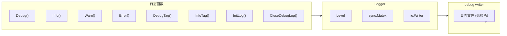

# Logger - 日志模块

## 架构



三层关注点分离：
- **日志文件**：logger 的唯一输出位置，无颜色纯文本，Agent 可用 `grep` 提取
- **stderr/stdout**：TUI 专用，Bubble Tea 渲染界面，不混入 logger 输出

## 位置

- `internal/logger/logger.go`
- `internal/logger/color.go`
- `internal/logger/toolprint.go`

## 核心类型

```go
type Level int

const (
    DEBUG Level = iota
    INFO
    WARN
    ERROR
)

type Logger struct {
    level  Level
    output io.Writer
    mu     sync.Mutex
}
```

## 日志文件

启动时自动创建独立日志文件：

- 路径：`~/.5hAgent/logs/5hagent-YYYYMMDD-HHMMSS.log`
- 每次启动新建一个文件，不覆盖
- 自动清理：只保留最近 30 个，超过即删除最旧的
- 文件内容为无颜色纯文本，适合 Agent 读取
- 默认级别为 `INFO`；`--debug` 只把级别提升到 `DEBUG`，不改变输出通道

## 日志级别

| 级别 | 说明 | 用途 |
|------|------|------|
| DEBUG | 调试信息 | 开发调试 |
| INFO | 一般信息 | 正常运行 |
| WARN | 警告信息 | 潜在问题 |
| ERROR | 错误信息 | 错误发生 |

## 日志函数

| 函数 | 说明 |
|------|------|
| `SetLevel(level)` | 设置全局日志级别 |
| `InitLog()` | 初始化日志文件，返回路径 |
| `InitDebugLog()` | 兼容入口，等同于 `InitLog()` |
| `CloseDebugLog()` | 关闭日志文件，恢复静默输出 |
| `Debug(format, args...)` | DEBUG 日志 |
| `Info(format, args...)` | INFO 日志 |
| `Warn(format, args...)` | WARN 日志 |
| `Error(format, args...)` | ERROR 日志 |
| `DebugTag(tag, format, args...)` | 带标签 DEBUG |
| `InfoTag(tag, format, args...)` | 带标签 INFO |
| `WarnTag(tag, format, args...)` | 带标签 WARN |
| `ErrorTag(tag, format, args...)` | 带标签 ERROR |
| `TruncateString(s, maxLen)` | 截断字符串 |

## 输出格式

```
[15:04:05][DEBUG ][SYS   ] System ready
[15:04:05][INFO  ][LLM   ] Calling Stream
[15:04:05][WARN  ][TOOL  ] Not found: xxx
[15:04:05][ERROR ][MCP   ] Failed to start server
```

格式：`[时间][级别][标签] 消息`

- 时间：固定 8 字符
- 级别：固定 5 字符
- 标签：固定 6 字符

## 标签分类

| 标签 | 说明 |
|------|------|
| SYS | 系统初始化 |
| LLM | LLM 调用 |
| REACT | ReAct 循环 |
| STREAM | 流式输出 |
| TOOL | 工具执行 |
| CTX | 上下文管理 |
| USER | 用户输入 |
| AGENT | Agent 核心 |
| SKILL | 技能管理 |
| MCP | MCP 服务器 |
| DEBUG | 调试信息 |

## 颜色方案

| 级别 | 颜色 |
|------|------|
| DEBUG | 蓝色 |
| INFO | 绿色 |
| WARN | 黄色 |
| ERROR | 红色（粗体） |

## 工具事件

工具调用通过事件机制发送到 TUI：

```go
type ToolEvent struct {
    Kind    string // call/result/error
    Name    string
    Text    string
    Args    string
    Result  string
    Error   error
}
```

设置事件接收器：
```go
logger.SetToolEventSink(func(event ToolEvent) {
    p.Send(toolEventMsg{event: event})
})
```

## 使用示例

```go
// 启动时初始化文件日志；--debug 只需额外 SetLevel(DEBUG)
logFile, err := logger.InitLog()
if err != nil {
    panic(err)
}
logger.InfoTag("SYS", "Log initialized: %s", logFile)

// 输出日志
logger.InfoTag("SYS", "Agent initialized")
logger.DebugTag("TOOL", "Execute: %s", toolName)
logger.ErrorTag("LLM", "Stream failed: %v", err)

// 截断长字符串
truncated := logger.TruncateString(longString, 40)
// 返回: "前面...后面"
```

## 禁用颜色

```bash
export NO_COLOR=1
# 或
TERM=dumb ./5hagent
```

## Agent 读取日志

本项目的 logger 始终只写文件，避免污染 TUI：

```
日志文件 (纯文本)   → ~/.5hAgent/logs/，Agent 可 grep
TUI/stdout/stderr     → TUI 或 headless work log，不承载 logger 文件日志
```

### 文件结构

每次启动生成一个带时间戳的日志文件：`~/.5hAgent/logs/5hagent-YYYYMMDD-HHMMSS.log`，只保留最近 30 个。

### 日志级别与通道

| 级别 | 输出位置 | 触发条件 |
|------|---------|---------|
| DEBUG | 日志文件 | `./5hagent --debug` |
| INFO | 日志文件 | 默认 |
| WARN | 日志文件 | 默认 |
| ERROR | 日志文件 | 默认 |

工具事件（call/result/error）不走 logger 文件日志，走 `ToolEventSink` 通道：

- TUI 模式：进入 Bubble Tea 界面显示。
- Headless 模式：进入 runtime work log，默认同时写 stdout 和项目 `.5hagent/agents/<agent-name>/logs/<timestamp>-<task-id>.md`。
- Headless `--quiet`：压制 stdout，只保留 report 路径和错误；项目内 Agent 工作日志仍然写入。

### Agent Debug 流程

```bash
# 1. 启动；main.go 会初始化日志文件
./5hagent --debug

# 2. 复现问题，观察日志文件内容
cat ~/.5hAgent/logs/$(ls -t ~/.5hAgent/logs/ | head -1)

# 3. 按 tag 过滤关键信息
grep '\[LLM'      ~/.5hAgent/logs/5hagent-*.log   # LLM 请求/响应
grep '\[TOOL'     ~/.5hAgent/logs/5hagent-*.log   # 工具调用
grep '\[CTX'      ~/.5hAgent/logs/5hagent-*.log   # 上下文压缩
grep '\[SKILL'    ~/.5hAgent/logs/5hagent-*.log   # Skill 加载

# 4. 提取完整的 ReAct 轮次（一次用户输入 → LLM → 工具 → 结果 → LLM）
grep -A200 '\[LLM\]\[request\]' ~/.5hAgent/logs/5hagent-*.log | head -100

# 5. 提取某个工具的全部调用链（call + args + result）
grep -B2 -A10 'tool_use.*tool_name' ~/.5hAgent/logs/5hagent-*.log

# 6. 实时 tail（观察当前运行）
tail -f ~/.5hAgent/logs/5hagent-*.log
```

### 关键 DebugTag 标签

在代码中搜索 `logger.DebugTag` 可找到所有带 tag 的日志点：

- `LLM[request]` / `LLM[response]` — 模型输入输出
- `TOOL[call]` / `TOOL[result]` — 工具调用
- `CTX[compress]` — 上下文压缩前后
- `SKILL[load]` — Skill 加载
- `AGENT[loop]` — ReAct 循环状态

### 添加新日志点

```go
// 使用 DebugTag / InfoTag 添加带标签日志，便于 grep 过滤
logger.DebugTag("MYTAG", "processing item: id=%d", id)

// 格式：时间 [DEBUG] [MYTAG ] 内容
// 输出：12:34:56 [DEBUG] [MYTAG ] processing item: id=42
```

## 集成点

| 文件 | 说明 |
|------|------|
| [main.go](../cmd/5hagent/main.go) | 启动时 `InitLog`，`--debug` 时提升日志级别 |
| [agent.go](../internal/agent/agent.go) | ReAct 循环轮次 |
| [callbacks.go](../internal/agent/callbacks.go) | LLM/工具回调，调用 DebugTag |
| [tool_use.go](../internal/agent/tool_use.go) | 工具执行流程 |

## 相关代码

- [logger.go](../internal/logger/logger.go)
- [color.go](../internal/logger/color.go)
- [toolprint.go](../internal/logger/toolprint.go)
