# Logger - 日志模块

## 架构

```mermaid
flowchart LR
    subgraph Logger["Logger"]
        level["Level"]
        mu["sync.Mutex"]
        output["io.Writer (teeWriter)"]
    end

    subgraph teeWriter["teeWriter"]
        w1["stdout (带颜色)"]
        w2["debug 文件 (无颜色)"]
    end

    subgraph Functions["日志函数"]
        debug["Debug()"]
        info["Info()"]
        warn["Warn()"]
        error["Error()"]
        debugtag["DebugTag()"]
        infotag["InfoTag()"]
        initdebug["InitDebugLog()"]
        closedebug["CloseDebugLog()"]
    end

    Functions --> Logger
    Logger --> teeWriter
    teeWriter --> w1
    teeWriter --> w2
```



三层关注点分离：
- **stdout**：带颜色的可读输出，面向人类
- **debug 文件**：无颜色的纯文本，Agent 可用 `grep` 提取
- **TUI**：通过 `ToolEventSink` 通道获取工具事件，完全独立

## 位置

- `internal/logger/logger.go`
- `internal/logger/color.go`
- `internal/logger/toolprint.go`

## 核心类型

```go
type Level int

const (
    DEBUG Level = iota
    INFO
    WARN
    ERROR
)

type Logger struct {
    level  Level
    output io.Writer // 已封装为 teeWriter
    mu     sync.Mutex
}

type teeWriter struct {
    w1, w2 io.Writer
}
```

## Debug 日志文件

debug 模式启动时自动创建独立日志文件：

- 路径：`~/.5hAgent/logs/5hagent-debug-YYYYMMDD-HHMMSS.log`
- 每次启动新建一个文件，不覆盖
- 自动清理：只保留最近 30 个，超过即删除最旧的
- 文件内容为无颜色纯文本，适合 Agent 读取

## 日志级别

| 级别 | 说明 | 用途 |
|------|------|------|
| DEBUG | 调试信息 | 开发调试 |
| INFO | 一般信息 | 正常运行 |
| WARN | 警告信息 | 潜在问题 |
| ERROR | 错误信息 | 错误发生 |

## 日志函数

| 函数 | 说明 |
|------|------|
| `SetLevel(level)` | 设置全局日志级别 |
| `InitDebugLog()` | 初始化 debug 日志文件，返回路径 |
| `CloseDebugLog()` | 关闭 debug 日志，恢复 stdout |
| `Debug(format, args...)` | DEBUG 日志 |
| `Info(format, args...)` | INFO 日志 |
| `Warn(format, args...)` | WARN 日志 |
| `Error(format, args...)` | ERROR 日志 |
| `DebugTag(tag, format, args...)` | 带标签 DEBUG |
| `InfoTag(tag, format, args...)` | 带标签 INFO |
| `WarnTag(tag, format, args...)` | 带标签 WARN |
| `ErrorTag(tag, format, args...)` | 带标签 ERROR |
| `TruncateString(s, maxLen)` | 截断字符串 |

## 输出格式

```
[15:04:05][DEBUG ][SYS   ] System ready
[15:04:05][INFO  ][LLM   ] Calling Stream
[15:04:05][WARN  ][TOOL  ] Not found: xxx
[15:04:05][ERROR ][MCP   ] Failed to start server
```

格式：`[时间][级别][标签] 消息`

- 时间：固定 8 字符
- 级别：固定 5 字符
- 标签：固定 6 字符

## 标签分类

| 标签 | 说明 |
|------|------|
| SYS | 系统初始化 |
| LLM | LLM 调用 |
| REACT | ReAct 循环 |
| STREAM | 流式输出 |
| TOOL | 工具执行 |
| CTX | 上下文管理 |
| USER | 用户输入 |
| AGENT | Agent 核心 |
| SKILL | 技能管理 |
| MCP | MCP 服务器 |
| DEBUG | 调试信息 |

## 颜色方案

| 级别 | 颜色 |
|------|------|
| DEBUG | 蓝色 |
| INFO | 绿色 |
| WARN | 黄色 |
| ERROR | 红色（粗体） |

## 工具事件

工具调用通过事件机制发送到 TUI：

```go
type ToolEvent struct {
    Kind    string // call/result/error
    Name    string
    Text    string
    Args    string
    Result  string
    Error   error
}
```

设置事件接收器：
```go
logger.SetToolEventSink(func(event ToolEvent) {
    p.Send(toolEventMsg{event: event})
})
```

## 使用示例

```go
// 启动 debug 模式（推荐方式：InitDebugLog 会自动 SetLevel(DEBUG)）
logFile, err := logger.InitDebugLog()
if err != nil {
    panic(err)
}
logger.InfoTag("SYS", "Debug log: %s", logFile)

// 输出日志
logger.InfoTag("SYS", "Agent initialized")
logger.DebugTag("TOOL", "Execute: %s", toolName)
logger.ErrorTag("LLM", "Stream failed: %v", err)

// 截断长字符串
truncated := logger.TruncateString(longString, 40)
// 返回: "前面...后面"
```

## 禁用颜色

```bash
export NO_COLOR=1
# 或
TERM=dumb ./5hagent
```

## Agent 读取日志

```bash
# 查看最新日志文件
tail -f ~/.5hAgent/logs/5hagent-debug-*.log

# 提取 LLM 调用记录
grep '\[LLM' ~/.5hAgent/logs/5hagent-debug-*.log

# 提取工具调用记录
grep '\[TOOL' ~/.5hAgent/logs/5hagent-debug-*.log

# 查看完整一次会话的日志
ls -t ~/.5hAgent/logs/ | head -1 | xargs cat
```

## 集成点

| 文件 | 说明 |
|------|------|
| [main.go](../cmd/5hagent/main.go) | 启动时 InitDebugLog，输出日志路径 |
| [agent.go](../internal/agent/agent.go) | ReAct 循环轮次 |
| [callbacks.go](../internal/agent/callbacks.go) | LLM/工具回调，调用 DebugTag |
| [tool_use.go](../internal/agent/tool_use.go) | 工具执行流程 |

## 相关代码

- [logger.go](../internal/logger/logger.go)
- [color.go](../internal/logger/color.go)
- [toolprint.go](../internal/logger/toolprint.go)
