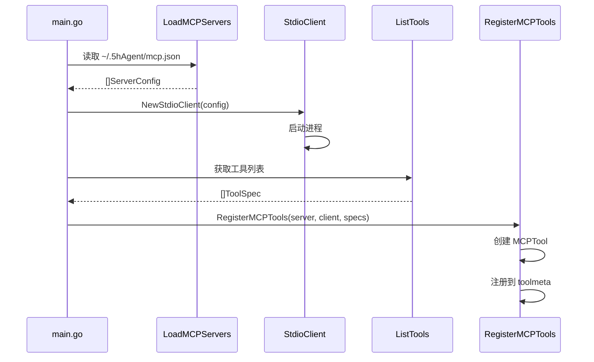

# MCP - Model Context Protocol

## 架构

```mermaid
flowchart TB
    subgraph Config["配置"]
        mcp_json["~/.5hAgent/mcp.json"]
    end

    subgraph Server["MCP 服务器"]
        load["LoadMCPServers()"]
        stdio["mcp.StdioClient"]
        process["进程管理"]
    end

    subgraph Registry["工具注册"]
        list["ListTools()"]
        specs["mcp.ToolSpec[]"]
        register["RegisterMCPTools()"]
        mcp_tool["mcp.*"]
    end

    subgraph Execute["执行"]
        agent["Agent"]
        invoke["MCPTool.InvokableRun()"]
        call["client.CallTool()"]
    end

    mcp_json --> load
    load --> stdio
    stdio --> process
    process --> list
    list --> specs
    specs --> register
    register --> mcp_tool
    agent --> invoke
    invoke --> call
```

## 位置

- `internal/mcp/mcp.go` - 协议类型
- `internal/mcp/client_stdio.go` - StdioClient 实现
- `internal/tools/mcp_tool.go` - 工具封装
- `internal/commands/mcp.go` - `/mcp` 命令

## 核心类型

### mcp.ServerConfig

MCP 服务器启动配置（[mcp.go:16-22](internal/mcp/mcp.go)）：

```go
type ServerConfig struct {
    Name           string            // 服务器名称
    Command        string            // 启动命令
    Args           []string          // 命令参数
    Env            map[string]string // 环境变量
    StartupTimeout time.Duration     // 启动超时
}
```

### mcp.ToolSpec

工具元数据（[mcp.go:24-28](internal/mcp/mcp.go)）：

```go
type ToolSpec struct {
    Name        string // 工具名
    Description string // 描述
    ReadOnly    bool   // 是否只读
}
```

### mcp.Client

传输层接口（[mcp.go:30-32](internal/mcp/mcp.go)）：

```go
type Client interface {
    CallTool(ctx context.Context, toolName string, arguments string) (string, error)
}
```

## 配置

配置文件：`~/.5hAgent/mcp.json`

```json
{
  "servers": [
    {
      "name": "filesystem",
      "command": "npx",
      "args": ["-y", "@modelcontextprotocol/server-filesystem", "/tmp"],
      "enabled": true
    }
  ]
}
```

## 注册流程



## 工具名格式

```
mcp.{serverName}.{toolName}
例：mcp.filesystem.list_directory
```

`mcp.FullToolName(serverName, toolName)` 拼接全名。

## 工具分类

| Category | 来源 | 示例 |
|----------|------|------|
| base | 内置文件工具 | base.read_file |
| task | TaskList | task.task |
| skill | Skill 系统 | skill.skill |
| mcp | MCP Server | mcp.filesystem.list_directory |

## 执行路径

```
Agent.exeToolsPar() → exeToolCall() → MCPTool.InvokableRun() → client.CallTool()
```

## /mcp 命令

| 命令 | 说明 |
|------|------|
| `/mcp list` | 列出服务器 |
| `/mcp add <name> <command> [args...]` | 添加 |
| `/mcp remove <name>` | 删除 |
| `/mcp enable <name>` | 启用 |
| `/mcp disable <name>` | 禁用 |

> 注意：运行时修改配置需要重启生效

## 常用 MCP 服务器

| 服务器 | 安装 | 用途 |
|--------|------|------|
| filesystem | `npx -y @modelcontextprotocol/server-filesystem <path>` | 文件操作 |
| brave-search | `npx -y @modelcontextprotocol/server-brave-search` | 搜索引擎 |
| github | `npx -y @modelcontextprotocol/server-github` | GitHub API |

## 错误处理

MCP 工具执行失败时返回统一提示：

```
check the remote tool arguments and server-specific requirements before retrying.
```

## 相关代码

- [mcp.go](../internal/mcp/mcp.go)
- [client_stdio.go](../internal/mcp/client_stdio.go)
- [mcp_tool.go](../internal/tools/mcp_tool.go)
- [commands/mcp.go](../internal/commands/mcp.go)
