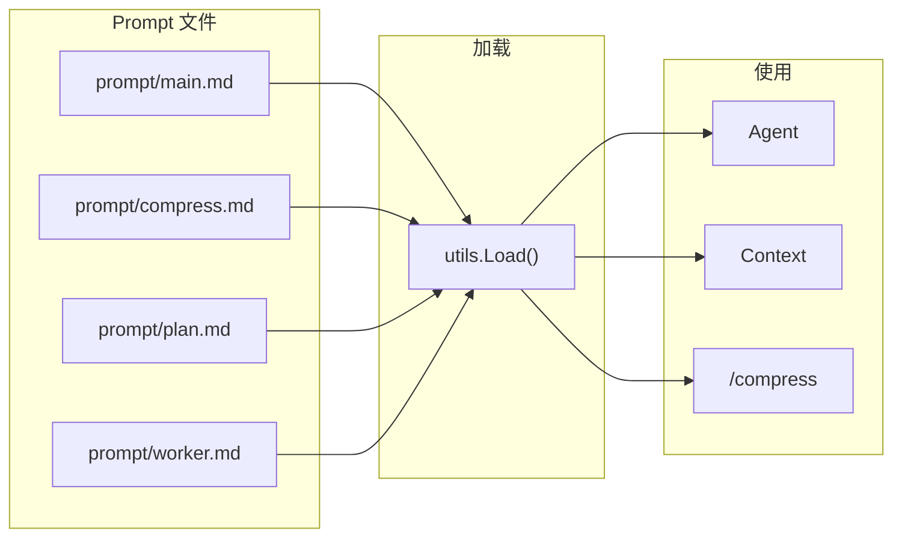

# Prompt - 提示词系统

## 架构



## 位置

- `internal/utils/utils.go` - 加载器
- `prompt/*.md` - Prompt 文件

## utils.Load

```go
func Load(dir, name string) (string, error) {
    data, err := os.ReadFile(filepath.Join(dir, name+".md"))
    if err != nil {
        return "", fmt.Errorf("prompt %q not found: %w", name, err)
    }
    return strings.TrimSpace(string(data)), nil
}
```

用法：`utils.Load("prompt", "main")` → 读取 `prompt/main.md`

## 当前 Prompt 文件

| 文件 | 用途 | 调用点 |
|------|------|--------|
| `prompt/main.md` | Agent 主 prompt | `main.go` |
| `prompt/compress.md` | 上下文压缩 prompt | `ctx.go` |
| `prompt/plan.md` | 规划 prompt | 待实现 |
| `prompt/worker.md` | Worker prompt | 待实现 |

## 使用方式

### 加载主 Prompt

[main.go:90-95](cmd/5hagent/main.go)：

```go
systemPrompt, err := utils.Load("prompt", "main")
if err != nil {
    cli.PrintError(fmt.Errorf("failed to get system prompt: %w", err))
    os.Exit(1)
}
```

### 加载压缩 Prompt

[ctx.go:139-142](internal/context/ctx.go)：

```go
compressPrompt, err := utils.Load(promptDir, "compress")
if err != nil {
    return m.Compress(ctx)  // 降级到简单截断
}
```

## 设计边界

当前设计刻意保持简单：

- 不递归扫描目录
- 不解析 frontmatter
- 不做变量替换
- 不做缓存
- 找不到文件直接返回错误

## Prompt 模板约定

1. 文件放在 `prompt/` 目录
2. 文件名 = 调用名 + `.md`
3. 内容为纯 Markdown
4. 可包含 LLM 指令、示例、约束等

## 相关代码

- [utils.go](../internal/utils/utils.go)
- [main.go](../cmd/5hagent/main.go)
- [ctx.go](../internal/context/ctx.go)
