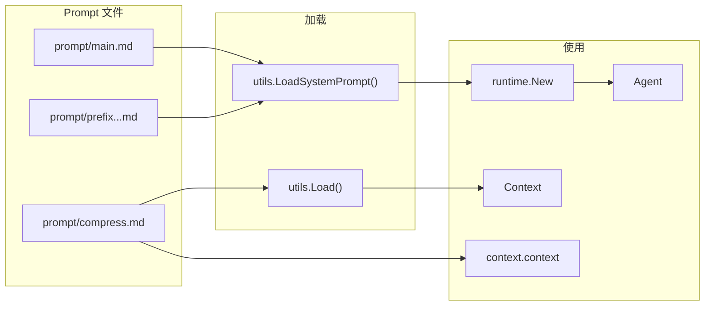

# Prompt - 提示词系统

## 架构



## 位置

- `internal/utils/utils.go` - Prompt 加载器与模型前缀命名
- `internal/runtime/runtime.go` - 主 system prompt 加载点
- `prompt/*.md` - Prompt 模板文件，安装后复制到 `~/.5hAgent/prompt/`

## 核心函数

| 函数 | 作用 |
| --- | --- |
| `utils.Load` | 严格读取 `<dir>/<name>.md`，不存在则报错 |
| `utils.LoadSystemPrompt` | 读取 `main.md`，如果存在模型 prefix 则叠加在前面 |
| `utils.ModelPrefixPromptName` | 根据 provider/model 生成 `prefix.<provider>.<model-slug>` |

## 模型前缀

`main.md` 是全局 Agent system prompt。模型定制内容放在可选文件：

```text
prefix.<provider>.<model-slug>.md
```

`model-slug` 规则：小写，字母数字和 `-` 保留，其他字符折叠为 `-`。

示例：

```text
LLM_PROVIDER=openai
LLM_OPENAI_MODEL=qwen3:14b
=> prefix.openai.qwen3-14b.md

LLM_PROVIDER=openai
LLM_OPENAI_MODEL=hf.co/bartowski/Qwen_Qwen3.6-27B-GGUF:Q3_K_M
=> prefix.openai.hf-co-bartowski-qwen-qwen3-6-27b-gguf-q3-k-m.md
```

加载结果：

```text
<模型 prefix 内容>

<main.md 内容>
```

如果 prefix 文件不存在，则只使用 `main.md`。prefix 修改只影响新建会话；已有 session 中已经注入的 system message 不会自动替换。

## 当前 Prompt 文件

| 文件 | 用途 | 调用点 |
|------|------|--------|
| `prompt/main.md` | Agent 主 prompt | `runtime.New` |
| `prompt/prefix.<provider>.<model>.md` | 可选模型前缀 | `runtime.New` |
| `prompt/compress.md` | 上下文压缩 prompt | `ctx.go`，`context.context action=compress mode=lm` |
| `prompt/plan.md` | 规划 prompt | 待实现 |
| `prompt/worker.md` | Worker prompt | 待实现 |

## 设计边界

- 不递归扫描目录。
- 不解析 frontmatter。
- 不做变量替换。
- 不做缓存。
- `main.md` 找不到会报错；模型 prefix 找不到会回退。

## 相关代码

- [utils.go](../internal/utils/utils.go)
- [runtime.go](../internal/runtime/runtime.go)
- [ctx.go](../internal/context/ctx.go)
