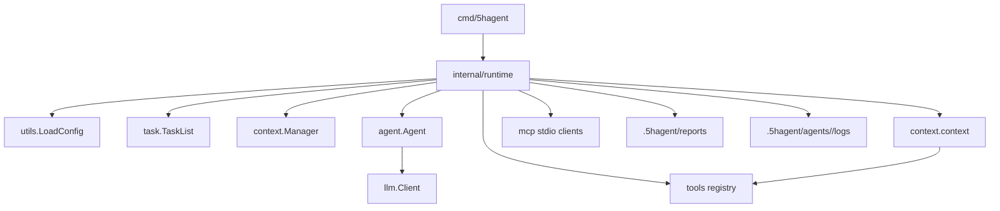

# runtime 模块说明

> 由 GPT-5.5 于 2026-06-23 阅读 `cmd/5hagent/main.go`、`internal/runtime/runtime.go`、`internal/agent/agent.go`、`internal/tools/registry.go`、`internal/tools/context_tool.go` 后更新。
> 覆盖范围：共享运行时初始化、TUI 启动、无头任务执行、工具绑定、报告写入。

## 摘要

`internal/runtime` 是 5hAgent baseline 的核心胶水层：它把配置、日志、任务文件、session、LLM、Agent、工具注册、上下文工具和 MCP 启动收束到一个 `Runtime` 对象。`cmd/5hagent` 只负责解析命令行并选择 TUI 或无头运行。



## 职责边界

- 负责：一次进程内所有核心对象的初始化和释放。
- 负责：无头模式下从 `.5hagent/task.md` 选择任务，并写 `.5hagent/reports/<task-id>.md`。
- 负责：无头模式下按 Agent 名称写 `.5hagent/agents/<agent-name>/logs/<timestamp>-<task-id>.md` 工作日志。
- 不负责：具体 ReAct 循环、工具执行细节、TUI 渲染。

## 关键文件

| 文件 | 作用 |
| --- | --- |
| [`internal/runtime/runtime.go`](../internal/runtime/runtime.go) | Runtime 初始化、MCP 生命周期、任务执行和报告写入 |
| [`cmd/5hagent/main.go`](../cmd/5hagent/main.go) | CLI 薄入口，默认 TUI，`run` 子命令无头执行 |
| [`internal/task/tasklist.go`](../internal/task/tasklist.go) | Markdown 任务真源和状态流转 |
| [`internal/agent/agent.go`](../internal/agent/agent.go) | `RunStream` ReAct 主循环 |

## 关键函数

| 函数 | 位置 | 作用 | 关键调用 |
| --- | --- | --- | --- |
| `runtime.New` | [`runtime.go`](../internal/runtime/runtime.go) | 初始化共享运行时 | `utils.LoadConfig` -> `task.NewTaskList` -> `agent.NewAgent` -> `tools.NewRegistry().Init` |
| `Runtime.RunTaskOnce` | [`runtime.go`](../internal/runtime/runtime.go) | 执行一个文件任务并写报告 | `selectTask` -> `Agent.RunStream` -> `TaskList.UpdateTaskStatus` -> `writeReport` |
| `Runtime.RunTasksUntilDone` | [`runtime.go`](../internal/runtime/runtime.go) | 连续执行 task.md 中的可运行任务 | `selectTask` -> `RunTaskOnce` -> 重新读取 task.md |
| `Runtime.RunProcess` | [`runtime.go`](../internal/runtime/runtime.go) | 作为 Agent Systemd runner 执行单个 AgentProcess | 注入 `PromptSpec` -> `WithSystemRuntime` -> `Agent.RunStream` -> `writeProcessReport` |
| `NewTaskFileEventSource` | [`event_source_task.go`](../internal/runtime/event_source_task.go) | 把 task 文件变化转换成 `task.created` 事件 | `FileEventSource.Next` -> `TaskList.ListTasksByStatus` -> `TaskSpecBuilder` |
| `runTUI` | [`main.go`](../cmd/5hagent/main.go) | 启动 TUI 前端 | `runtime.New` -> `cli.LaunchTUI` |
| `runHeadless` | [`main.go`](../cmd/5hagent/main.go) | 启动无头任务执行 | `runtime.New` -> `Runtime.RunTaskOnce` |
| `runDaemon` | [`main.go`](../cmd/5hagent/main.go) | 启动 Agent Systemd 任务监督循环 | `NewInMemory` -> `systemd.New` -> `NewTaskFileEventSource` -> `AgentSystemd.Run` |
| `headlessWorkLog` | [`worklog.go`](../internal/runtime/worklog.go) | 无头模式正常工作日志 | `logger.PushToolEventSink` -> stdout + `.5hagent/agents/<agent>/logs` |

## 初始化顺序

`runtime.New` 的顺序很关键，因为工具定义必须在 `WithTools` 之前收齐：

1. `utils.LoadConfigWithOptions()` 读取 `~/.5hAgent/.env`、进程环境变量和 CLI LLM 覆盖项。
2. 初始化 logger、任务文件、context manager 和默认 message context；默认绑定 session，`runtime.NewInMemory` 默认不绑定 session 但保留 store 供显式持久化；`Options.ProjectDir` 可显式指定 Project 数据目录。
3. `llm.NewClient()` 创建未绑定工具的 provider model。
4. `utils.LoadSystemPrompt()` 加载 `main.md` 和可选模型 prefix。
5. `agent.NewAgent(nil, nil, config)` 创建 Agent，并传入 `ContextAutoCompress` 和当前 Project 的 `.5hagent` 数据目录。
6. `tools.NewRegistry().Init(taskList, skillMgr)` 注册 base/task/skill/sys 工具并重置工具元数据。
7. `toolRegistry.RegisterContextTool(client.GetModel(), promptDir)` 注册 `context.context`。
8. `startMCPServers(ctx, toolRegistry)` 启动 MCP stdio server 并注册远端工具到当前 runtime registry。
9. 遍历 `toolRegistry.All()` 生成 `schema.ToolInfo`。
10. `client.GetModel().WithTools(toolInfos)` 绑定工具。
11. `ag.SetModel(modelWithTools)` 和 `ag.SetTools(allTools)` 完成 Agent 注入。

`context.context` 需要未绑定工具的原始 model 来做 `mode=lm` 压缩，避免压缩调用本身再触发工具调用。

## 无头执行流程

1. 用户或外部程序写入 `.5hagent/task.md`。
2. 执行 `5hagent run`。
3. `Runtime.RunTaskOnce` 优先选择 `in_progress` 任务，没有则选择第一个 `pending` 任务。
4. `pending` 任务先标记为 `in_progress`。
5. Agent 根据任务描述运行 ReAct 循环。
6. 成功写为 `completed`，失败写为 `failed`。
7. Markdown 报告写入 `.5hagent/reports/<task-id>.md`。

TUI 中的 `/run` 会调用 `Runtime.RunTasksUntilDone`。它不创建新的 daemon 或调度器，只是在每个 ReAct 循环结束、`RunTaskOnce` 已写回任务状态后重新检查 `.5hagent/task.md`，继续执行下一个 `in_progress` / `pending` 任务；没有可运行任务时退出。

`taskPrompt()` 会把任务真源路径、任务 ID、标题、状态和描述写进用户消息，便于 LLM 先读取必要文件再执行。

## Agent Systemd 适配

`Runtime.RunProcess(ctx, proc, ipc)` 是 `systemd.ProcessRunner` 的执行层适配器：

1. 为当前进程创建新的内存 message context。
2. 把 `PromptSpec.System` 和每个 `SkillRef{Name, Description}` 写入 system message。
3. 用 `agentctx.WithSystemRuntime` 注入当前 `ProcessID` 和结构化 IPC 实现，供 `sys.ipc` 工具使用。
4. 调用 `Agent.RunStream` 执行进程退出条件。
5. 写 `.5hagent/reports/<pid>.md` 和 `.5hagent/agents/<pid>/logs/`，并回填 `AgentProcess.ReportPath/WorkLogPath`。

`runtime.NewTaskFileEventSource` 属于 runtime 适配层，不在 `internal/systemd` 主包里。它复用已有 `TaskList`，把 `.5hagent/task.md` 的变化转换成 `task.created` 事件；payload 使用 `systemd.TaskCreatedPayload`，其中 `ProcessSpec` 由调用方提供的 `TaskSpecBuilder` 生成，`task_id/task_title/file_event` 保留给调度审计。

`5hagent daemon` 是当前最小接通入口：启动时先把已有 `pending/in_progress` 任务投递一次，然后用 `TaskFileEventSource` 监听文件变化；`--poll` 控制 task 文件和 timer 的轮询间隔。

### Headless 工作日志

`5hagent run` 默认开启正常工作日志，输出到 stdout，并同时写入项目目录：

```text
.5hagent/agents/<agent-name>/logs/<timestamp>-<task-id>.md
```

日志目录按 `AGENT_NAME` 分层；如果配置或启动了多个 Agent，它们会落到不同的 agent 子目录。单次日志文件记录：

- 任务 ID 和标题
- assistant 流式文本
- 工具调用、工具结果和工具错误摘要
- 最终 `status: completed/failed`

这层日志面向无头运行的可观察性，接近 TUI 中看到的工作过程。`--debug` 仍只控制更详细的全局文件日志级别。脚本场景可使用：

```bash
5hagent run --quiet
```

`--quiet` 会压制终端 assistant token 和工具事件，只保留 `report: <path>` 与错误输出；项目 `.5hagent/agents/<agent-name>/logs/` 里的工作日志仍然写入。

## 配置传递

Runtime 将 `.env` 中的配置拆成两个方向：

| 配置 | 传入位置 | 用途 |
| --- | --- | --- |
| `LLM_MODEL=provider/model` | `utils.LoadConfigWithOptions` | 选择 provider 配置块和上游模型名 |
| `LLM_<PROVIDER>_FORMAT` | `llm.NewClient` | 选择 provider 使用的 `claude` 或 `openai` 接口格式 |
| `LLM_<PROVIDER>_API_KEY` / `BASE_URL` | `llm.NewClient` | 当前 provider 的访问凭据和 API 地址 |
| `AGENT_NAME` | `agent.Config.Name` | Agent 名称 |
| `AGENT_MAX_TOTAL_TOKENS` | `agent.Config.MaxTotalTokens` | 整场会话 token budget |
| `AGENT_REPEAT_TOOL_LIMIT` | `agent.Config.RepeatToolLimit` | 相同工具调用重复 warn 阈值 |
| `AGENT_CONTEXT_AUTO_COMPRESS` | `agent.Config.ContextAutoCompress` | 是否在 `RunStream` 中自动触发压缩 |
| `--debug` | `agent.Config.Debug` | Runtime logger 和 Agent debug 输出 |
| `--model` / `--llm-format` / `--llm-model` | `utils.LoadConfigWithOptions` | 临时切换当前 provider/model、接口格式或模型，不改写 `.env` |
| `run --quiet` | `RunOptions.WorkLog=false` | 关闭终端工作日志，保留项目内 work log 文件 |

## 副作用

- 会创建或更新 Project 目录下 `.5hagent/task.md`、`.5hagent/reports/`、`.5hagent/agents/<agent-name>/logs/` 和项目 skills；未设置 `ProjectDir` 时使用当前工作目录。
- 会写日志到 `~/.5hAgent` 下的日志文件。
- 默认会读写 `~/.5hAgent/sessions/*.jsonl`；`runtime.NewInMemory` 创建的 Runtime 默认只使用内存 context，调用 `sys.session.create/save` 后才写入 session。
- 如果配置了 MCP，会启动 stdio 子进程；`Runtime.Close` 负责关闭。
