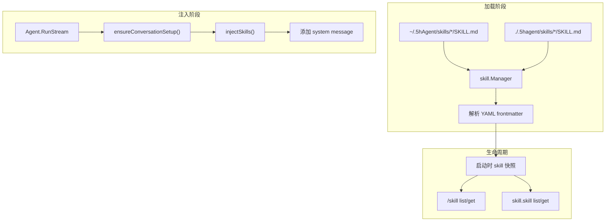

# Skill - 技能系统

## 架构



Skill 更接近 Agent 进程的启动配置：每个 Agent 创建时加载一次 skill 集合，生命周期内不再通过工具动态启用或禁用。无头 runtime 下，一个 `5hagent run` 可以看作一次 Agent 进程启动。

## 位置

- `internal/skill/skill.go` - 技能加载器
- `internal/agent/agent.go` - 注入逻辑
- `internal/tools/skill_tool.go` - 只读查看工具
- `internal/commands/skill.go` - CLI 命令

## 核心类型

```go
type Skill struct {
    Name        string  // 技能名称
    Description string  // 技能描述
    Version     string  // 版本号
    Tools      string  // 所需工具
    Content    string  // Markdown 内容（运行时）
    Enabled    bool    // 启动加载状态
    Scope      string  // global 或 project
    Path       string  // SKILL.md 路径
}

type Source struct {
    Scope string  // global 或 project
    Dir   string  // skills 根目录
}

type Manager struct {
    skills    map[string]*Skill  // 启动时加载出的技能快照
    skillDirs []Source           // 按顺序加载，后者覆盖前者
}
```

## Manager 接口

| 方法 | 说明 |
|------|------|
| `NewManager(skillsDir)` | 兼容旧单目录调用 |
| `NewManagerFromDirs(sources...)` | 创建多来源技能管理器 |
| `LoadSkills()` | 按来源顺序加载所有 SKILL.md |
| `GetSkill(name)` | 获取单个技能 |
| `ListSkills()` | 列出所有技能 |

## SKILL.md 格式

```markdown
---
name: my-skill
description: Use when user asks to "..."
version: 1.0.0
tools: Read, Grep
---

# My Skill

Skill content...
```

## 目录结构

```
~/.5hAgent/
└── skills/                 # 全局 skills，所有项目共享
    └── using-superpowers/
        └── SKILL.md

<project>/.5hagent/
└── skills/                 # 项目 skills，只对当前工作目录生效
    └── systematic-debugging/
        └── SKILL.md
```

加载顺序是 `global -> project`。同名 skill 由项目目录覆盖全局目录，这样项目可以收紧或替换全局工作流。

## 加载流程

```go
skillMgr := skill.NewManagerFromDirs(
    skill.Source{Scope: "global", Dir: filepath.Join(configDir, "skills")},
    skill.Source{Scope: "project", Dir: filepath.Join(projectDataDir, "skills")},
)
skillMgr.LoadSkills()
```

`projectDataDir` 由 runtime 传入；设置 `runtime.Options.ProjectDir` 时，它指向该 Project 下的 `.5hagent`，不会依赖进程当前工作目录。

```go
func (m *Manager) LoadSkills() error {
    for _, source := range m.skillDirs {
        m.loadDir(source) // 后加载的同名 skill 覆盖前面的
    }
}
```

## 注入流程

首次对话时：

```go
func (a *Agent) ensureConversationSetup(messageCtx) error {
    messages, _ := a.ctxManager.GetMessages(messageCtx)
    if len(messages) > 0 {
        return nil  // 非首次对话，跳过
    }

    // 注入 system prompt
    a.ctxManager.AddMessage(messageCtx, systemMsg)

    // 注入 skills
    a.injectSkills(messageCtx)
}

func (a *Agent) injectSkills(messageCtx) error {
    for _, skill := range a.skillManager.ListSkills() {
        if skill.Enabled {
            msg := &schema.Message{
                Role:    schema.System,
                Content: fmt.Sprintf("# Skill: %s\n\n%s", skill.Name, skill.Content),
            }
            a.ctxManager.AddMessage(messageCtx, msg)
        }
    }
}
```

消息顺序：

```
system: <主 system prompt>
system: # Skill: using-superpowers
system: # Skill: writing-plans
user:   ...
```

## 查看方式

### CLI 命令

```bash
/skill list                    # 列出所有技能
/skill get brainstorming      # 查看技能正文和来源
```

### LLM 工具

Agent 可以查看本进程已加载的 skill，但不能动态修改 skill 集合：

```json
{ "action": "list" }
{ "action": "get", "skill": "brainstorming" }
```

## 添加新 Skill

1. 全局 skill 创建到 `~/.5hAgent/skills/<name>/`
2. 项目 skill 创建到 `./.5hagent/skills/<name>/`
2. 新建 `SKILL.md`
3. 填写 YAML frontmatter 和正文
4. 重启 Agent；已运行的 Agent 不会热加载新 skill

## 当前实现边界

- skill 集合在 Agent 创建时固定，不支持运行期 enable/disable
- 只在首次对话时注入到上下文
- loader 只读取每个 skill 目录下的 `SKILL.md`
- `tools` frontmatter 当前只记录元信息，不参与工具授权

## 相关代码

- [skill.go](../internal/skill/skill.go)
- [agent.go](../internal/agent/agent.go)
- [skill_tool.go](../internal/tools/skill_tool.go)
- [commands/skill.go](../internal/commands/skill.go)
