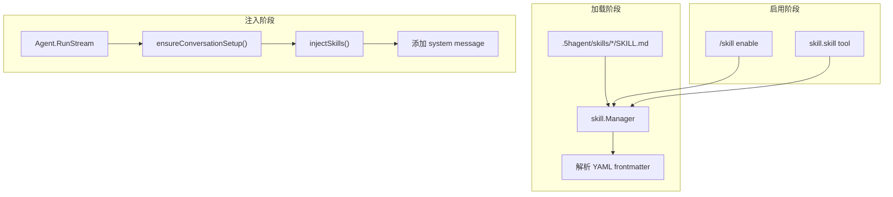

# Skill - 技能系统

## 架构



## 位置

- `internal/skill/skill.go` - 技能加载器
- `internal/agent/agent.go` - 注入逻辑
- `internal/tools/skill_tool.go` - 工具封装
- `internal/commands/skill.go` - CLI 命令

## 核心类型

```go
type Skill struct {
    Name        string  // 技能名称
    Description string  // 技能描述
    Version     string  // 版本号
    Tools      string  // 所需工具
    Content    string  // Markdown 内容（运行时）
    Enabled    bool    // 是否启用
}

type Manager struct {
    skills    map[string]*Skill  // 技能映射
    skillsDir string              // 技能目录
}
```

## Manager 接口

| 方法 | 说明 |
|------|------|
| `NewManager(skillsDir)` | 创建技能管理器 |
| `LoadSkills()` | 加载目录下所有 SKILL.md |
| `GetSkill(name)` | 获取单个技能 |
| `ListSkills()` | 列出所有技能 |
| `EnableSkill(name)` | 启用技能 |
| `DisableSkill(name)` | 禁用技能 |

## SKILL.md 格式

```markdown
---
name: my-skill
description: Use when user asks to "..."
version: 1.0.0
tools: Read, Grep
---

# My Skill

Skill content...
```

## 目录结构

```
.5hagent/
└── skills/
    ├── using-superpowers/
    │   └── SKILL.md
    ├── brainstorming/
    │   └── SKILL.md
    └── ...
```

## 加载流程

```go
func (m *Manager) LoadSkills() error {
    entries, _ := os.ReadDir(m.skillsDir)
    for _, entry := range entries {
        if !entry.IsDir() {
            continue
        }
        skillPath := filepath.Join(m.skillsDir, entry.Name(), "SKILL.md")
        skill, _ := m.loadSkillFile(skillPath)
        m.skills[skill.Name] = skill
    }
}
```

## 注入流程

首次对话时（[agent.go:445-466](internal/agent/agent.go)）：

```go
func (a *Agent) ensureConversationSetup(messageCtx) error {
    messages, _ := a.ctxManager.GetMessages(messageCtx)
    if len(messages) > 0 {
        return nil  // 非首次对话，跳过
    }

    // 注入 system prompt
    a.ctxManager.AddMessage(messageCtx, systemMsg)

    // 注入 skills
    a.injectSkills(messageCtx)
}

func (a *Agent) injectSkills(messageCtx) error {
    for _, skill := range a.skillManager.ListSkills() {
        if skill.Enabled {
            msg := &schema.Message{
                Role:    schema.System,
                Content: fmt.Sprintf("# Skill: %s\n\n%s", skill.Name, skill.Content),
            }
            a.ctxManager.AddMessage(messageCtx, msg)
        }
    }
}
```

消息顺序：

```
system: <主 system prompt>
system: # Skill: using-superpowers
system: # Skill: writing-plans
user:   ...
```

## 启用方式

### CLI 命令

```bash
/skill list                    # 列出所有技能
/skill enable brainstorming   # 启用
/skill disable brainstorming  # 禁用
```

### LLM 工具

Agent 可以自主启用/禁用技能：

```json
{ "skill": "brainstorming", "action": "enable" }
{ "skill": "brainstorming", "action": "disable" }
```

## 添加新 Skill

1. 创建目录 `.5hagent/skills/<name>/`
2. 新建 `SKILL.md`
3. 填写 YAML frontmatter 和正文
4. 重启程序

## 当前实现边界

- skill 状态是运行时内存，没有独立持久化
- 只在首次对话时注入
- loader 只读取 `SKILL.md`

## 相关代码

- [skill.go](../internal/skill/skill.go)
- [agent.go](../internal/agent/agent.go)
- [skill_tool.go](../internal/tools/skill_tool.go)
- [commands/skill.go](../internal/commands/skill.go)
