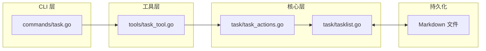

# Task - 任务管理

## 架构



## 位置

- `internal/task/tasklist.go` - 任务列表核心
- `internal/task/task_actions.go` - 操作分发
- `internal/tools/task_tool.go` - Eino Tool 封装
- `internal/commands/task.go` - CLI `/task` 命令

## 核心类型

### Task

```go
type Task struct {
    ID           string     // 任务唯一标识
    Title        string     // 任务标题
    Description  string     // 任务描述
    Summary      string     // 摘要（归档时生成）
    HistoryPath  string     // 历史文件路径
    RestoredFrom string     // 从历史恢复的路径
    Status       TaskStatus // 状态
    CreatedAt    time.Time  // 创建时间
    UpdatedAt    time.Time  // 更新时间
}
```

### TaskStatus

```go
const (
    StatusPending    TaskStatus = "pending"      // 待处理
    StatusInProgress TaskStatus = "in_progress" // 进行中
    StatusBlocked    TaskStatus = "blocked"     // 阻塞
    StatusCompleted  TaskStatus = "completed"    // 已完成
    StatusArchived   TaskStatus = "archived"     // 已归档
    StatusFailed     TaskStatus = "failed"       // 失败
)
```

### TaskActionRequest

```go
type TaskActionRequest struct {
    Action      string // create/update/get/list/delete/archive/reopen
    ID          string
    Title       string
    Description string
    Status      string
}
```

## TaskList 接口

| 方法                           | 说明                       |
| ------------------------------ | -------------------------- |
| `NewTaskList(path)`            | 创建任务列表，加载并持久化 |
| `CreateTask(id, title, desc)`  | 创建新任务                 |
| `UpdateTaskStatus(id, status)` | 更新任务状态               |
| `GetTask(id)`                  | 获取单个任务               |
| `ListTasks()`                  | 列出所有任务               |
| `ListTasksByStatus(status)`    | 按状态筛选任务             |
| `DeleteTask(id)`               | 删除任务                   |
| `ArchiveTask(id)`              | 归档已完成任务             |
| `ReopenTask(id, status)`       | 重新打开归档任务           |
| `GetProgress()`                | 获取任务统计               |

## 工具调用格式

Agent 通过 `task.task` 工具调用任务管理：

```json
// 创建任务
{ "action": "create", "id": "task-1", "title": "实现功能", "description": "描述" }

// 更新状态
{ "action": "update", "id": "task-1", "status": "in_progress" }

// 获取任务
{ "action": "get", "id": "task-1" }

// 列出任务
{ "action": "list" }
{ "action": "list", "status": "in_progress" }

// 删除任务
{ "action": "delete", "id": "task-1" }

// 归档任务
{ "action": "archive", "id": "task-1" }

// 重新打开
{ "action": "reopen", "id": "task-1" }
{ "action": "reopen", "id": "task-1", "status": "in_progress" }
```

## CLI 命令

| 命令                                      | 说明         |
| ----------------------------------------- | ------------ |
| `/task list [status]`                     | 列出任务     |
| `/task create <id> <title> <description>` | 创建任务     |
| `/task update <id> <status>`              | 更新状态     |
| `/task get <id>`                          | 获取任务详情 |
| `/task delete <id>`                       | 删除任务     |
| `/task archive <id>`                      | 归档任务     |
| `/task reopen <id> [status]`              | 重新打开     |

## 持久化格式

Task 存储在 `./.5hagent/task.md`（项目启动目录），使用 Markdown 区块标记：

```markdown
# Shared Task List

<!-- 5hagent:tasks:start -->

## Shared Tasks

### task-1 | 实现功能

- status: in_progress
- description: 描述
- created_at: 2026-04-30T00:00:00Z
- updated_at: 2026-04-30T00:00:00Z

<!-- 5hagent:tasks:end -->
```

归档任务存储在 `./5hagent/history/` 目录。

## 只读判断

`task.task` 工具根据 action 参数判断是否只读：

| Action    | 只读 | 说明     |
| --------- | ---- | -------- |
| `get`     | ✓    | 并发执行 |
| `list`    | ✓    | 并发执行 |
| `create`  | ✗    | 串行执行 |
| `update`  | ✗    | 串行执行 |
| `delete`  | ✗    | 串行执行 |
| `archive` | ✗    | 串行执行 |
| `reopen`  | ✗    | 串行执行 |

## 相关代码

- [tasklist.go](../internal/task/tasklist.go)
- [task_actions.go](../internal/task/task_actions.go)
- [task_tool.go](../internal/tools/task_tool.go)
- [commands/task.go](../internal/commands/task.go)
