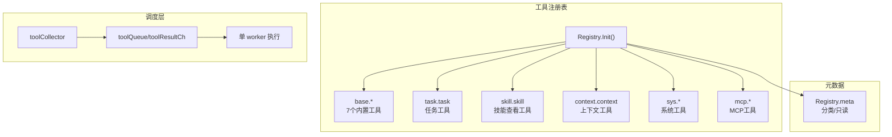

# Tools - 工具系统

## 架构



## 位置

- `internal/tools/registry.go` - 工具注册表
- `internal/agent/tool_use.go` - 工具调度
- `internal/toolmeta/toolmeta.go` - 工具元数据

## 已注册工具

| 工具名 | 文件 | 类型 | 说明 |
|--------|------|------|------|
| `base.read_file` | `read_file.go` | 只读 | 读取文件内容，支持 offset/limit |
| `base.write_file` | `write_file.go` | 写 | 创建或覆盖文件，自动创建父目录 |
| `base.edit` | `edit.go` | 写 | 精确字符串替换 |
| `base.glob` | `glob.go` | 只读 | 文件模式匹配（* 和 **） |
| `base.grep` | `grep.go` | 只读 | 文本搜索，支持正则 |
| `base.list_dir` | `list_dir.go` | 只读 | 列目录（递归/非递归） |
| `base.exec_shell` | `exec_shell.go` | 写 | 执行 shell 命令 |
| `task.task` | `task_tool.go` | 混合 | 统一任务管理入口 |
| `skill.skill` | `skill_tool.go` | 只读 | 查看启动时加载的技能 |
| `context.context` | `context_tool.go` | 混合 | inspect/pin/audit/compress 当前上下文 |
| `sys.ipc` | `ipc_tool.go` | 写 | Agent 进程间短消息收发 |
| `mcp.<server>.<tool>` | `mcp_tool.go` | 取决于远端 | MCP Server 提供的工具 |

## 注册顺序

本地基础工具、task 工具、skill 工具和 sys 工具由 `Registry.Init(taskList, skillMgr)` 注册。包级 `InitRegistry` 仍代理默认 registry，保留旧入口兼容。`context.context` 需要 LLM model 和 prompt 目录，因此由 runtime 在 `Init` 之后调用 `toolRegistry.RegisterContextTool(llm, promptDir)` 注册。MCP 工具最后由 `toolRegistry.RegisterMCPTools(server, client, specs)` 追加。

入口函数（[registry.go](../internal/tools/registry.go)）：

```go
func (r *Registry) Init(taskList *task.TaskList, skillMgr *skill.Manager) error {
    // 注册 base 工具
    tools := []struct {
        meta toolmeta.Meta
        fn   func() (tool.BaseTool, error)
    }{
        {meta: toolmeta.Meta{..., FullName: "base.read_file"}, fn: func() (tool.BaseTool, error) { return NewReadFileTool(r.workspaceRoot) }},
        {meta: toolmeta.Meta{..., FullName: "base.write_file"}, fn: func() (tool.BaseTool, error) { return NewWriteFileTool(r.workspaceRoot) }},
        // ...
    }
    for _, t := range tools {
        tool, err := t.fn()
        r.tools = append(r.tools, tool)
        r.registerMeta(t.meta)
    }

    // 注册 task 工具
    r.tools = append(r.tools, &TaskTool{taskList: taskList})
    r.registerMeta(toolmeta.Meta{..., FullName: "task.task"})

    // 注册 skill 工具
    r.tools = append(r.tools, &SkillTool{mgr: skillMgr})
    r.registerMeta(toolmeta.Meta{..., FullName: "skill.skill"})

    // 注册系统工具
    r.tools = append(r.tools, NewIPCTool())
}

func (r *Registry) RegisterContextTool(llm model.ToolCallingChatModel, promptDir string) {
    r.tools = append(r.tools, NewContextTool(llm, promptDir))
    r.registerMeta(toolmeta.Meta{..., FullName: "context.context"})
}
```

## 关键函数

| 函数 | 说明 |
|------|------|
| `NewRegistry()` | 创建 runtime 独立工具注册表 |
| `(*Registry).Init(taskList, skillMgr)` | 初始化注册表 |
| `(*Registry).RegisterContextTool(llm, promptDir)` | 注册 LLM 可调用的上下文工具 |
| `(*Registry).All()` | 获取当前 runtime 所有工具 |
| `(*Registry).Get(name)` | 按名称查找工具 |
| `(*Registry).RegisterMCPTools(server, client, specs)` | 注册 MCP 工具 |

## 工具实现类型

## LLM 工具描述规范

所有发给 LLM 的工具描述应包含：

- 明确说明“Always send JSON object arguments”
- 列出必填字段和可选字段
- 对枚举字段提供 `Enum`，例如 task action/status、skill action
- 给出可直接模仿的 JSON 示例
- 错误提示中写明实际收到的参数，便于 LLM 自我修正

`task.task` 的关键约束：

- `create` 必须带 `id/title/description`
- “完成任务”不是 `finish/done/complete` action，而是 `{"action":"update","id":"...","status":"completed"}`
- `action` 只允许 `create/update/get/list/delete/archive/reopen`

`skill.skill` 的关键约束：

- `action` 只能是 `list/get`，默认 `list`
- `get` 时 `skill` 必填，必须是精确 skill 名称
- skill 集合在 Agent 启动时固定，运行期不能启用或禁用

`context.context` 的关键约束：

- `action` 只能是 `inspect/pin/audit/compress`
- `inspect` 只返回索引、角色、preview 和 flags，不返回完整历史
- `pin` 必须带 `start/end/reason`
- `compress` 支持 `mode=lm` 或 `mode=truncate`
- 工具执行依赖 `Agent.RunStream()` 注入的 `ToolRuntime`；脱离 Agent 当前上下文直接调用会返回 `context runtime not found`

`sys.ipc` 的关键约束：

- `action` 只能是 `send/recv`
- `send` 必须带 `to`，且 `summary/artifact` 至少一个非空
- `recv` 只接收当前 Agent process 的消息
- 不共享 context，只传短消息或 artifact 路径
- 工具执行依赖 runtime 注入 `ProcessID/IPC`，IPC 消息协议是 `internal/ipctypes.Message`

Session 边界：

- `internal/context.Manager` 仍保留 `BindSession/SaveSession/DropSession`，供 runtime/TUI/headless 内部使用。
- `sys.session` 不再注册为 LLM 可见工具，避免 AgentProcess 再定义一套独立的“持久化落盘”语义。
- 后续如要恢复显式 session 操作，应先重新设计 Runtime session 与 daemon process 生命周期的唯一职责边界。

Project 路径边界：

- `list_dir` / `glob` / `grep` 的空 path 会使用当前 runtime 的 workspace root。
- `exec_shell` 默认在当前 runtime 的 workspace root 下执行。
- 未设置 `runtime.Options.ProjectDir` 时，workspace root 仍是进程当前工作目录。
- 所有 base 文件工具都保留绝对路径优先；相对路径会基于当前 runtime 的 workspace root。

### context.context

位置：[context_tool.go](../internal/tools/context_tool.go)

`context.context` 是 `tool.InvokableTool`，自己解析 JSON 参数并按 action 分发：

| action | 调用 | 输出 |
| --- | --- | --- |
| `inspect` | `rt.Manager.Inspect(rt.Context)` | `ContextInspect` JSON |
| `pin` | `rt.Manager.PinRange(rt.Context, range)` | `{\"ok\":true,\"action\":\"pin\",\"range\":...}` |
| `audit` | `rt.Manager.Audit(rt.Context)` | 最近最多 20 条 audit events |
| `compress` | `LMCompress()` 或 `Compress()` | `before/after/mode/ok` |

这个工具返回短 JSON，不返回完整消息正文。`inspect` 的 preview 会截断，目的是让 LLM 能定位 message index，而不是把原始上下文再复制一遍。

### EnhancedInvokableTool

框架自动解码 JSON 到 Go struct（[read_file.go](internal/tools/read_file.go)）：

```go
func NewReadFileTool() (tool.BaseTool, error) {
    return utils.InferEnhancedTool(
        "base.read_file",
        "Reads file content...",
        func(ctx context.Context, input ReadFileInput) (*schema.ToolResult, error) {
            // input 已经是解析好的 Go struct
            data, err := os.ReadFile(input.Path)
            return &schema.ToolResult{
                Parts: []*schema.ToolPart{{Type: schema.ToolPartTypeText, Text: string(data)}},
            }, nil
        },
    )
}

type ReadFileInput struct {
    Path   string `json:"path"`
    Offset int    `json:"offset,omitempty"`
    Limit  int    `json:"limit,omitempty"`
}
```

### InvokableTool

工具自己解析 JSON（[task_tool.go](internal/tools/task_tool.go)）：

```go
func (t *TaskTool) Info(ctx context.Context) (*schema.ToolInfo, error) {
    return &schema.ToolInfo{
        Name: "task",
        Desc: "Manage tasks...",
        ParamsOneOf: schema.NewParamsOneOfByParams(...),
    }, nil
}

func (t *TaskTool) InvokableRun(ctx context.Context, args string) (string, error) {
    var input struct {
        Action string `json:"action"`
        ID     string `json:"id,omitempty"`
    }
    if err := json.Unmarshal([]byte(args), &input); err != nil {
        return "", err
    }
    // 手动解析并执行
}
```

### MCP Tool Schema 转换

MCP 工具来自外部 server，schema 由 `mcp.ToolSpec.InputSchema` 提供，再通过 `parseInputSchema()` 转换为 Eino `ParameterInfo`。

当前转换兼容常见 OpenAPI JSON Schema 形态：

- 顶层省略 `type` 但包含 `properties` 时按 `object` 处理
- `type` 可以是字符串，也可以是数组，如 `["object", "null"]`
- `integer` 映射为 Eino 的 `number`
- `const` 映射为单值 `Enum`
- 嵌套 object 会递归转换 `SubParams`

这对 Notion 这类 OpenAPI MCP 很重要，否则 LLM 会看不到必填嵌套参数，首次调用容易漏参。

## 工具调用接口适配

Agent 层统一调用（[tool_use.go:251-270](internal/agent/tool_use.go)）：

```go
func (a *Agent) invokeTool(ctx, t, tc) (string, error) {
    if enhanced, ok := t.(tool.EnhancedInvokableTool); ok {
        toolArg := &schema.ToolArgument{Text: tc.Function.Arguments}
        result, err := enhanced.InvokableRun(ctx, toolArg)
        return formatToolResult(result), nil
    }

    if invokable, ok := t.(tool.InvokableTool); ok {
        return invokable.InvokableRun(ctx, tc.Function.Arguments)
    }
}
```

## 当前执行策略

当前源码没有按只读/写工具拆分并发执行队列。`RunStream` 会启动一个工具 worker goroutine，从 `toolQueue` 逐个取 `toolRequest` 调 `Agent.exeToolCall()`，因此多个工具调用在该 worker 内仍是串行执行。

已经具备的并发是：LLM stream 读取与工具 worker 执行可以重叠。当流式响应中某个 ToolCall 的 `id/name/arguments` 已合并完整且参数是合法 JSON 时，会立即送入 `toolQueue`，无需等待 LLM 整个响应结束。

```text
LLM stream reader
  -> toolCollector 合并 ToolCall 分片
  -> toolQueue
  -> 单个 tool worker goroutine
     -> Agent.exeToolCall
     -> Agent.invokeTool
```

`toolmeta.Meta.ReadOnly` 目前由 `tools.Registry` 实例保存，用于记录工具元数据和展示，不参与 `RunStream` 的并发调度。`task.task get/list` 也没有在当前执行路径中被单独判定为可并发。

TUI 的 `[并发]` 标记只来自 `logger.PrintToolCall(name, args, concurrent)` 的 `concurrent` 参数。当前 `RunStream` 调用 `exeToolCall(..., false)`，所以按当前源码执行时不应显示 `[并发]`。

## 添加新工具

1. 在 `internal/tools/` 创建实现文件
2. 定义输入输出结构体
3. 实现 `NewXxxTool()` 工厂函数
4. 在 `Registry.Init()` 中注册
5. 更新对应的 `toolmeta.Meta.ReadOnly` 如需要

示例（[exec_shell.go](internal/tools/exec_shell.go)）：

```go
type ExecShellInput struct {
    Command string `json:"command" jsonschema:"required,description=Shell command to execute"`
}

func NewExecShellTool() (tool.BaseTool, error) {
    return utils.InferEnhancedTool(
        "base.exec_shell",
        "Executes a shell command...",
        func(ctx context.Context, input ExecShellInput) (*schema.ToolResult, error) {
            cmd := exec.CommandContext(ctx, "sh", "-c", input.Command)
            output, err := cmd.CombinedOutput()
            return &schema.ToolResult{
                Parts: []*schema.ToolPart{{Type: schema.ToolPartTypeText, Text: string(output)}},
            }, err
        },
    )
}
```

## 相关代码

- [registry.go](../internal/tools/registry.go)
- [task_tool.go](../internal/tools/task_tool.go)
- [skill_tool.go](../internal/tools/skill_tool.go)
- [mcp_tool.go](../internal/tools/mcp_tool.go)
- [tool_use.go](../internal/agent/tool_use.go)
- [toolmeta.go](../internal/toolmeta/toolmeta.go)
