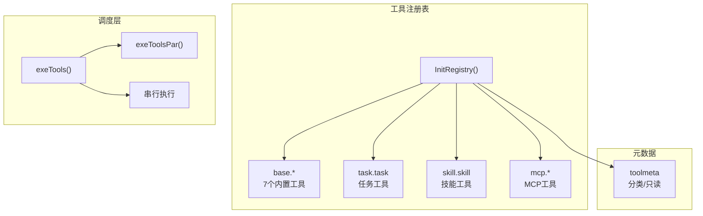

# Tools - 工具系统

## 架构



## 位置

- `internal/tools/registry.go` - 工具注册表
- `internal/agent/tool_use.go` - 工具调度
- `internal/toolmeta/toolmeta.go` - 工具元数据

## 已注册工具

| 工具名 | 文件 | 类型 | 说明 |
|--------|------|------|------|
| `base.read_file` | `read_file.go` | 只读 | 读取文件内容，支持 offset/limit |
| `base.write_file` | `write_file.go` | 写 | 创建或覆盖文件，自动创建父目录 |
| `base.edit` | `edit.go` | 写 | 精确字符串替换 |
| `base.glob` | `glob.go` | 只读 | 文件模式匹配（* 和 **） |
| `base.grep` | `grep.go` | 只读 | 文本搜索，支持正则 |
| `base.list_dir` | `list_dir.go` | 只读 | 列目录（递归/非递归） |
| `base.exec_shell` | `exec_shell.go` | 写 | 执行 shell 命令 |
| `task.task` | `task_tool.go` | 混合 | 统一任务管理入口 |
| `skill.skill` | `skill_tool.go` | 写 | 启用或禁用技能 |
| `mcp.list_tools` | `mcp_list_tools.go` | 只读 | 列出 MCP 服务器及工具 |
| `mcp.<server>.<tool>` | `mcp_tool.go` | 取决于远端 | MCP Server 提供的工具 |

## InitRegistry

入口函数（[registry.go:23-66](internal/tools/registry.go)）：

```go
func InitRegistry(taskList *task.TaskList, skillMgr *skill.Manager) error {
    // 注册 base 工具
    tools := []struct {
        meta toolmeta.Meta
        fn   func() (tool.BaseTool, error)
    }{
        {meta: toolmeta.Meta{..., FullName: "base.read_file"}, fn: NewReadFileTool},
        {meta: toolmeta.Meta{..., FullName: "base.write_file"}, fn: NewWriteFileTool},
        // ...
    }
    for _, t := range tools {
        tool, err := t.fn()
        registry = append(registry, tool)
        toolmeta.Register(t.meta)
    }

    // 注册 task 工具
    registry = append(registry, &TaskTool{taskList: taskList})
    toolmeta.Register(toolmeta.Meta{..., FullName: "task.task"})

    // 注册 skill 工具
    registry = append(registry, &SkillTool{mgr: skillMgr})
    toolmeta.Register(toolmeta.Meta{..., FullName: "skill.skill"})
}
```

## 关键函数

| 函数 | 说明 |
|------|------|
| `InitRegistry(taskList, skillMgr)` | 初始化注册表 |
| `GetAllTools()` | 获取所有工具 |
| `GetToolByName(name)` | 按名称查找工具 |
| `RegisterMCPTools(server, client, specs)` | 注册 MCP 工具 |

## 工具实现类型

## LLM 工具描述规范

所有发给 LLM 的工具描述应包含：

- 明确说明“Always send JSON object arguments”
- 列出必填字段和可选字段
- 对枚举字段提供 `Enum`，例如 task action/status、skill action
- 给出可直接模仿的 JSON 示例
- 错误提示中写明实际收到的参数，便于 LLM 自我修正

`task.task` 的关键约束：

- `create` 必须带 `id/title/description`
- “完成任务”不是 `finish/done/complete` action，而是 `{"action":"update","id":"...","status":"completed"}`
- `action` 只允许 `create/update/get/list/delete/archive/reopen`

`skill.skill` 的关键约束：

- `skill` 必填，必须是精确 skill 名称
- `action` 只能是 `enable/disable`，默认 `enable`

### EnhancedInvokableTool

框架自动解码 JSON 到 Go struct（[read_file.go](internal/tools/read_file.go)）：

```go
func NewReadFileTool() (tool.BaseTool, error) {
    return utils.InferEnhancedTool(
        "base.read_file",
        "Reads file content...",
        func(ctx context.Context, input ReadFileInput) (*schema.ToolResult, error) {
            // input 已经是解析好的 Go struct
            data, err := os.ReadFile(input.Path)
            return &schema.ToolResult{
                Parts: []*schema.ToolPart{{Type: schema.ToolPartTypeText, Text: string(data)}},
            }, nil
        },
    )
}

type ReadFileInput struct {
    Path   string `json:"path"`
    Offset int    `json:"offset,omitempty"`
    Limit  int    `json:"limit,omitempty"`
}
```

### InvokableTool

工具自己解析 JSON（[task_tool.go](internal/tools/task_tool.go)）：

```go
func (t *TaskTool) Info(ctx context.Context) (*schema.ToolInfo, error) {
    return &schema.ToolInfo{
        Name: "task",
        Desc: "Manage tasks...",
        ParamsOneOf: schema.NewParamsOneOfByParams(...),
    }, nil
}

func (t *TaskTool) InvokableRun(ctx context.Context, args string) (string, error) {
    var input struct {
        Action string `json:"action"`
        ID     string `json:"id,omitempty"`
    }
    if err := json.Unmarshal([]byte(args), &input); err != nil {
        return "", err
    }
    // 手动解析并执行
}
```

### MCP Tool Schema 转换

MCP 工具来自外部 server，schema 由 `mcp.ToolSpec.InputSchema` 提供，再通过 `parseInputSchema()` 转换为 Eino `ParameterInfo`。

当前转换兼容常见 OpenAPI JSON Schema 形态：

- 顶层省略 `type` 但包含 `properties` 时按 `object` 处理
- `type` 可以是字符串，也可以是数组，如 `["object", "null"]`
- `integer` 映射为 Eino 的 `number`
- `const` 映射为单值 `Enum`
- 嵌套 object 会递归转换 `SubParams`

这对 Notion 这类 OpenAPI MCP 很重要，否则 LLM 会看不到必填嵌套参数，首次调用容易漏参。

## 工具调用接口适配

Agent 层统一调用（[tool_use.go:251-270](internal/agent/tool_use.go)）：

```go
func (a *Agent) invokeTool(ctx, t, tc) (string, error) {
    if enhanced, ok := t.(tool.EnhancedInvokableTool); ok {
        toolArg := &schema.ToolArgument{Text: tc.Function.Arguments}
        result, err := enhanced.InvokableRun(ctx, toolArg)
        return formatToolResult(result), nil
    }

    if invokable, ok := t.(tool.InvokableTool); ok {
        return invokable.InvokableRun(ctx, tc.Function.Arguments)
    }
}
```

## 并发执行策略

| 分类 | 工具 | 策略 |
|------|------|------|
| 只读 | `base.read_file`, `base.glob`, `base.grep`, `base.list_dir` | 并发 |
| 写 | `base.write_file`, `base.edit`, `base.exec_shell` | 串行 |
| 任务只读 | `task.task get/list` | 并发 |
| 任务写 | `task.task create/update/delete/archive/reopen` | 串行 |
| 技能 | `skill.skill` | 串行 |
| MCP | 取决于远端定义 | 按 `ReadOnly` 标记 |

## 只读判断逻辑

```go
func isReadOnly(tc schema.ToolCall) bool {
    // 第一层：toolmeta 注册表
    if toolmeta.IsReadOnly(tc.Function.Name) {
        return true
    }

    // 第二层：task.task 根据 action 判断
    if tc.Function.Name == "task.task" || tc.Function.Name == "task" {
        var input struct{ Action string `json:"action"` }
        if err := json.Unmarshal([]byte(tc.Function.Arguments), &input); err != nil {
            return false
        }
        return input.Action == "get" || input.Action == "list"
    }

    return false
}
```

## 添加新工具

1. 在 `internal/tools/` 创建实现文件
2. 定义输入输出结构体
3. 实现 `NewXxxTool()` 工厂函数
4. 在 `InitRegistry()` 中注册
5. 更新 `toolmeta.Meta.ReadOnly` 如需要

示例（[exec_shell.go](internal/tools/exec_shell.go)）：

```go
type ExecShellInput struct {
    Command string `json:"command" jsonschema:"required,description=Shell command to execute"`
}

func NewExecShellTool() (tool.BaseTool, error) {
    return utils.InferEnhancedTool(
        "base.exec_shell",
        "Executes a shell command...",
        func(ctx context.Context, input ExecShellInput) (*schema.ToolResult, error) {
            cmd := exec.CommandContext(ctx, "sh", "-c", input.Command)
            output, err := cmd.CombinedOutput()
            return &schema.ToolResult{
                Parts: []*schema.ToolPart{{Type: schema.ToolPartTypeText, Text: string(output)}},
            }, err
        },
    )
}
```

## 相关代码

- [registry.go](../internal/tools/registry.go)
- [task_tool.go](../internal/tools/task_tool.go)
- [skill_tool.go](../internal/tools/skill_tool.go)
- [mcp_tool.go](../internal/tools/mcp_tool.go)
- [mcp_list_tools.go](../internal/tools/mcp_list_tools.go)
- [tool_use.go](../internal/agent/tool_use.go)
- [toolmeta.go](../internal/toolmeta/toolmeta.go)
