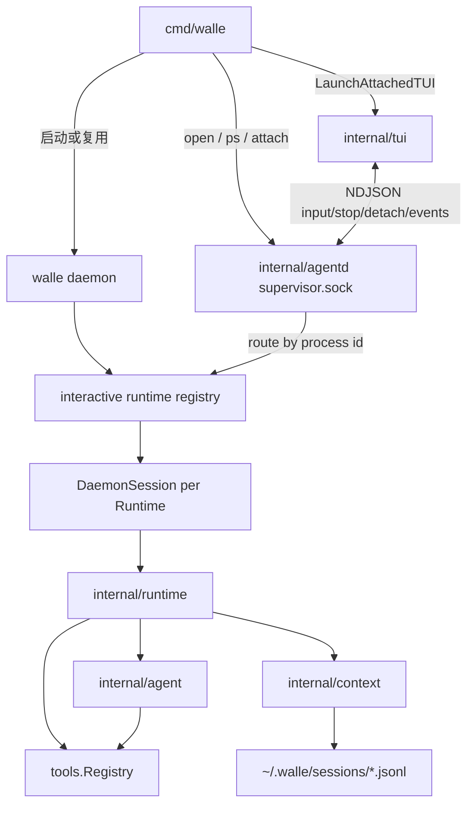

# walle 架构拓扑

> 由 Claude Fable 5 于 2026-08-26 根据 `.spec/diagrams/walle-architecture-topology.json` 与当前模块文档收敛。
> 覆盖范围：默认入口、daemon open/attach、Runtime 装配、Agent 执行、持久化边界。

本页是面向读者的拓扑导读，不再维护第二份 JSON/Mermaid 事实源。架构图事实源集中在 [`.spec/diagrams/walle-architecture-topology.json`](../.spec/diagrams/walle-architecture-topology.json)，图源集中在 [`.spec/diagrams/`](../.spec/diagrams/)。

## 主链路

## 当前事实

1. 默认 `walle` 先确保用户级 `~/.walle/run/supervisor.sock` 可用，再发送 `open` 请求；默认请求为当前 workspace 创建新的 interactive Runtime。
2. `walle -c` / `--continue` 才表示续接当前 workspace 最近 Runtime 或最近 session。
3. `walle daemon` 是 supervisor：监听 control socket，并按 `open` 请求托管多个 Runtime；它不应启动即固定创建一个 `interactive` Runtime。
4. TUI 是 client：只处理输入、渲染、远端事件和本地 `/detach`、`/stop`。
5. DaemonSession 是单 Runtime 的 interactive adapter：处理 slash command、事件历史、订阅者和当前 run cancel。
6. Runtime 是装配层和模型状态真源：持有 Context、LLM、Agent、Tools、Skill 和通用 process runner。
7. Agent 只执行 ReAct：读写 Context、调用绑定模型、执行工具、写回 assistant/tool result。

## 持久化边界

| 路径 | 内容 |
| --- | --- |
| `~/.walle/.env` / `~/.walle/settings.json` | 用户配置 |
| `~/.walle/prompt/*.md` | prompt |
| `~/.walle/sessions/*.jsonl` | message session |
| `~/.walle/run/supervisor.sock` | daemon 控制 socket |
| `<project>/.walle/reports/*.md` | 通用 process report |
| `<project>/.walle/agents/*/logs/*.md` | 通用 process worklog |

## 不再维护的重复源

`doc/topology.json` 和 `doc/topology.mmd` 已删除。后续更新拓扑时：

1. 先改代码。
2. 再更新 `.spec/diagrams/walle-architecture-topology.json` 和相关 Mermaid 图。
3. 最后只在本页同步读者需要的摘要。
